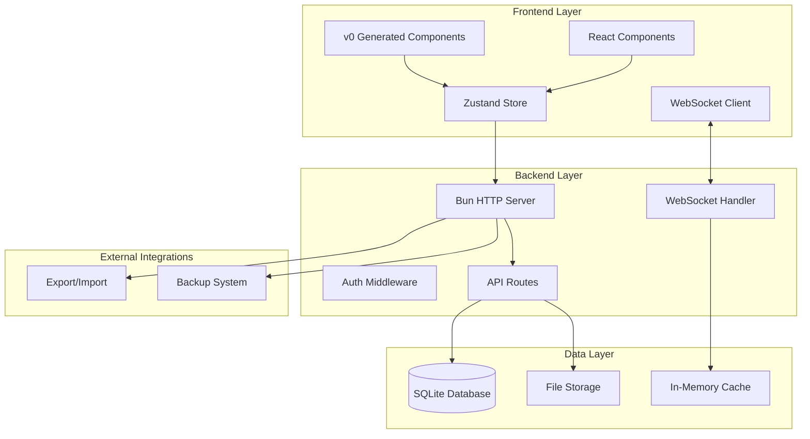
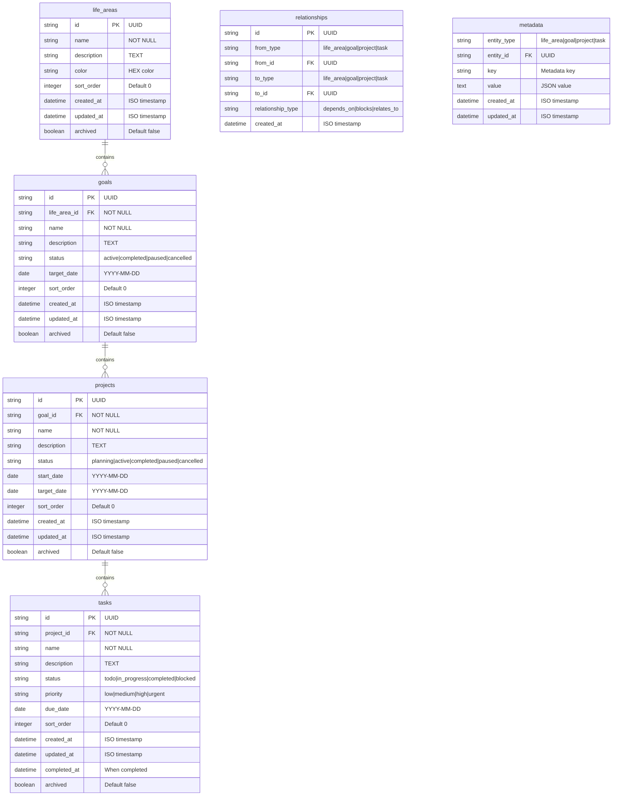

> **Generated by**: Claude 4 (Anthropic) - AI-Assisted Architecture Planning  
> **Generated on**: December 29, 2025  
> **Purpose**: Comprehensive architectural blueprint for locally-hosted second brain application

# EvorBrain - Second Brain Application Planning Document

## 🎯 Project Overview

**Project Name**: EvorBrain  
**Type**: Locally-hosted Second Brain Application  
**Core Feature**: Hierarchical Task Management (Life Areas → Goals → Projects → Tasks)  
**Target User**: Single user with future multi-user extensibility  
**Development Approach**: Rapid iteration with v0 for frontend prototyping  

### Key Requirements
- ✅ Hierarchical structure: Life Areas → Goals → Projects → Tasks
- ✅ Local data storage with SQLite
- ✅ RESTful API for CRUD operations
- ✅ Real-time data synchronization across browser tabs
- ✅ Cross-hierarchy relationship querying
- ✅ Time-based sorting with future algorithm support
- ✅ File system organization for scalability
- ✅ Data export/import capabilities
- ✅ Performance optimization for large datasets
- ✅ Future-ready authentication architecture
- ✅ Responsive design optimized for v0 generation
- ✅ Modular component architecture
- ✅ Integration points for future features

## 🏗️ System Architecture

### Architecture Overview

```mermaid
graph TB
    subgraph "Frontend Layer"
        V0[v0 Generated Components]
        React[React Components]
        WS_Client[WebSocket Client]
        Store[Zustand Store]
    end
    
    subgraph "Backend Layer"
        API[Bun HTTP Server]
        WS[WebSocket Handler]
        Auth[Auth Middleware]
        Routes[API Routes]
    end
    
    subgraph "Data Layer"
        SQLite[(SQLite Database)]
        FileSystem[File Storage]
        Cache[In-Memory Cache]
    end
    
    subgraph "External Integrations"
        Export[Export/Import]
        Backup[Backup System]
    end
    
    V0 --> Store
    React --> Store
    Store --> API
    WS_Client <--> WS
    API --> Routes
    Routes --> SQLite
    Routes --> FileSystem
    WS --> Cache
    API --> Export
    API --> Backup
```

## 📚 Technology Stack

### Backend Stack
- **Runtime**: Bun 1.0+ (TypeScript-native, fast startup, built-in SQLite)
- **Web Framework**: Bun native HTTP server + Hono.js for routing
- **Database**: SQLite with Better-SQLite3 driver
- **Real-time**: Native WebSocket support in Bun
- **Validation**: Zod for runtime type validation
- **Testing**: Bun test runner

**Rationale**: Bun provides excellent performance, native TypeScript support, and simplified tooling. SQLite ensures zero-config local storage with excellent performance for single-user applications.

### Frontend Stack
- **Framework**: React 18 with TypeScript
- **Build Tool**: Vite (Bun compatible)
- **Styling**: Tailwind CSS (v0 optimized)
- **State Management**: Zustand (lightweight, TypeScript-first)
- **Data Fetching**: TanStack Query (React Query)
- **Real-time**: Native WebSocket API
- **UI Components**: Shadcn/ui (v0 preferred, excellent TypeScript support)
- **Icons**: Lucide React

**Rationale**: React + TypeScript provides excellent v0 compatibility. Zustand offers simpler state management than Redux. TanStack Query handles server state elegantly with caching and synchronization.

### Development Tools
- **Package Manager**: Bun (faster than npm/yarn)
- **Type Checking**: TypeScript strict mode
- **Linting**: ESLint with TypeScript rules
- **Formatting**: Prettier
- **Git Hooks**: Husky + lint-staged

## 🗄️ Database Design

### Schema Structure

```mermaid
erDiagram
    life_areas ||--o{ goals : contains
    goals ||--o{ projects : contains
    projects ||--o{ tasks : contains
    
    life_areas {
        string id PK "UUID"
        string name "NOT NULL"
        string description "TEXT"
        string color "HEX color"
        integer sort_order "Default 0"
        datetime created_at "ISO timestamp"
        datetime updated_at "ISO timestamp"
        boolean archived "Default false"
    }
    
    goals {
        string id PK "UUID"
        string life_area_id FK "NOT NULL"
        string name "NOT NULL"
        string description "TEXT"
        string status "active|completed|paused|cancelled"
        date target_date "YYYY-MM-DD"
        integer sort_order "Default 0"
        datetime created_at "ISO timestamp"
        datetime updated_at "ISO timestamp"
        boolean archived "Default false"
    }
    
    projects {
        string id PK "UUID"
        string goal_id FK "NOT NULL"
        string name "NOT NULL"
        string description "TEXT"
        string status "planning|active|completed|paused|cancelled"
        date start_date "YYYY-MM-DD"
        date target_date "YYYY-MM-DD"
        integer sort_order "Default 0"
        datetime created_at "ISO timestamp"
        datetime updated_at "ISO timestamp"
        boolean archived "Default false"
    }
    
    tasks {
        string id PK "UUID"
        string project_id FK "NOT NULL"
        string name "NOT NULL"
        string description "TEXT"
        string status "todo|in_progress|completed|blocked"
        string priority "low|medium|high|urgent"
        date due_date "YYYY-MM-DD"
        integer sort_order "Default 0"
        datetime created_at "ISO timestamp"
        datetime updated_at "ISO timestamp"
        datetime completed_at "When completed"
        boolean archived "Default false"
    }
    
    relationships {
        string id PK "UUID"
        string from_type "life_area|goal|project|task"
        string from_id FK "UUID"
        string to_type "life_area|goal|project|task"
        string to_id FK "UUID"
        string relationship_type "depends_on|blocks|relates_to"
        datetime created_at "ISO timestamp"
    }
    
    metadata {
        string entity_type "life_area|goal|project|task"
        string entity_id FK "UUID"
        string key "Metadata key"
        text value "JSON value"
        datetime created_at "ISO timestamp"
        datetime updated_at "ISO timestamp"
    }
```

### Database Indexes
```sql
-- Performance indexes
CREATE INDEX idx_goals_life_area_id ON goals(life_area_id);
CREATE INDEX idx_projects_goal_id ON projects(goal_id);
CREATE INDEX idx_tasks_project_id ON tasks(project_id);
CREATE INDEX idx_status_queries ON tasks(status, due_date);
CREATE INDEX idx_sort_order ON tasks(project_id, sort_order);
CREATE INDEX idx_relationships_from ON relationships(from_type, from_id);
CREATE INDEX idx_relationships_to ON relationships(to_type, to_id);
CREATE INDEX idx_metadata_entity ON metadata(entity_type, entity_id);
```

## 🌐 API Architecture

### RESTful API Structure
```typescript
// Base URL: http://localhost:3000/api

// Life Areas
GET    /api/life-areas                    # List all life areas
POST   /api/life-areas                    # Create life area
GET    /api/life-areas/:id               # Get specific life area
PUT    /api/life-areas/:id               # Update life area
DELETE /api/life-areas/:id               # Archive life area

// Goals
GET    /api/goals                        # List all goals
GET    /api/goals/by-life-area/:id       # Goals for specific life area
POST   /api/goals                        # Create goal
GET    /api/goals/:id                    # Get specific goal
PUT    /api/goals/:id                    # Update goal
DELETE /api/goals/:id                    # Archive goal

// Projects
GET    /api/projects                     # List all projects
GET    /api/projects/by-goal/:id         # Projects for specific goal
POST   /api/projects                     # Create project
GET    /api/projects/:id                 # Get specific project
PUT    /api/projects/:id                 # Update project
DELETE /api/projects/:id                 # Archive project

// Tasks
GET    /api/tasks                        # List all tasks
GET    /api/tasks/by-project/:id         # Tasks for specific project
POST   /api/tasks                        # Create task
GET    /api/tasks/:id                    # Get specific task
PUT    /api/tasks/:id                    # Update task
DELETE /api/tasks/:id                    # Archive task

// Hierarchy Operations
GET    /api/hierarchy/:type/:id/children # Get direct children
GET    /api/hierarchy/:type/:id/tree     # Get full subtree
POST   /api/hierarchy/reorder            # Reorder items
GET    /api/hierarchy/search?q=:query    # Cross-hierarchy search

// Data Management
GET    /api/export?format=:format        # Export data (json|csv)
POST   /api/import                       # Import data
POST   /api/backup                       # Create backup
GET    /api/backup/list                  # List backups
POST   /api/backup/restore/:id           # Restore backup

// WebSocket
WS     /ws                               # Real-time updates
```

### API Response Format
```typescript
type ApiResponse<T> = {
  success: boolean;
  data?: T;
  error?: {
    message: string;
    code: string;
    details?: any;
  };
  timestamp: string;
};

type PaginatedResponse<T> = ApiResponse<{
  items: T[];
  pagination: {
    page: number;
    limit: number;
    total: number;
    hasNext: boolean;
    hasPrev: boolean;
  };
}>;
```

## 🎨 Frontend Architecture

### File Structure
```
frontend/
├── src/
│   ├── components/
│   │   ├── ui/                 # Shadcn/ui base components
│   │   ├── hierarchy/          # Life areas, goals, projects, tasks
│   │   │   ├── LifeAreaCard.tsx
│   │   │   ├── GoalsList.tsx
│   │   │   ├── ProjectBoard.tsx
│   │   │   └── TaskItem.tsx
│   │   ├── layout/             # App shell, navigation
│   │   │   ├── AppShell.tsx
│   │   │   ├── Sidebar.tsx
│   │   │   └── Header.tsx
│   │   ├── forms/              # Reusable form components
│   │   │   ├── EntityForm.tsx
│   │   │   └── QuickAdd.tsx
│   │   └── common/             # Shared components
│   │       ├── SearchBar.tsx
│   │       └── StatusBadge.tsx
│   ├── hooks/
│   │   ├── useHierarchy.ts     # Hierarchy data operations
│   │   ├── useWebSocket.ts     # Real-time connection
│   │   ├── useLocalStorage.ts  # Offline persistence
│   │   └── useKeyboardShortcuts.ts
│   ├── stores/
│   │   ├── hierarchyStore.ts   # Main application state
│   │   ├── uiStore.ts          # UI state (modals, selected items)
│   │   └── wsStore.ts          # WebSocket connection state
│   ├── types/
│   │   ├── hierarchy.ts        # Core type definitions
│   │   ├── api.ts              # API request/response types
│   │   └── ui.ts               # UI-specific types
│   ├── utils/
│   │   ├── api.ts              # API client with error handling
│   │   ├── validation.ts       # Zod schemas for client validation
│   │   ├── formatting.ts       # Date, text formatting
│   │   └── websocket.ts        # WebSocket utility functions
│   ├── v0-components/          # v0 generated components
│   │   └── [generated-files]
│   ├── pages/
│   │   ├── Dashboard.tsx       # Main overview
│   │   ├── LifeArea.tsx        # Life area detail view
│   │   ├── Project.tsx         # Project kanban board
│   │   └── Settings.tsx        # Application settings
│   ├── App.tsx
│   └── main.tsx
├── public/
├── package.json
└── vite.config.ts
```

### State Management
- **Zustand Store**: Global application state with persistence
- **TanStack Query**: Server state with optimistic updates
- **Local Storage**: User preferences and offline support
- **WebSocket Store**: Real-time event coordination

## ⚡ Real-time Synchronization

### WebSocket Event Types
```typescript
type WebSocketMessage = 
  | { type: 'item_created'; payload: HierarchyItem & { entityType: string } }
  | { type: 'item_updated'; payload: HierarchyItem & { entityType: string } }
  | { type: 'item_deleted'; payload: { id: string; entityType: string } }
  | { type: 'status_changed'; payload: { id: string; entityType: string; status: string } }
  | { type: 'reorder'; payload: { parentId: string; entityType: string; newOrder: string[] } }
  | { type: 'connection_status'; payload: { connected: boolean; clientCount: number } };
```

### Implementation Strategy
- **Auto-reconnection**: Exponential backoff with max delay
- **Event Broadcasting**: Server notifies all connected clients
- **Optimistic Updates**: UI updates immediately, reverts on error
- **Conflict Resolution**: Last-write-wins with timestamp comparison
- **Heartbeat**: Ping/pong to maintain connection health

## 🚀 Performance Optimization

### Database Performance
- **Prepared Statements**: All queries use prepared statements
- **Connection Pooling**: Better-SQLite3 with connection management
- **Indexes**: Strategic indexes on frequently queried columns
- **Query Optimization**: Efficient JOIN queries for hierarchy traversal
- **Lazy Loading**: Paginated results for large datasets

### Frontend Performance
- **Code Splitting**: Route-based and component-based splitting
- **Virtual Scrolling**: For large task lists
- **React.memo**: Prevent unnecessary re-renders
- **Debounced Search**: Reduce API calls during typing
- **Image Optimization**: Future file attachment optimization

### Caching Strategy
- **Browser Cache**: Static assets with versioning
- **TanStack Query**: Intelligent server state caching
- **Service Worker**: Offline support (Phase 4)
- **Memory Cache**: Frequently accessed metadata

## 🔒 Security Implementation

### Current Phase (Single User)
- **Input Validation**: Zod schemas on client and server
- **SQL Injection Prevention**: Prepared statements only
- **XSS Prevention**: React's built-in protection + CSP headers
- **CORS Configuration**: Restricted to localhost during development
- **Rate Limiting**: Basic request throttling

### Future Phase (Multi-User Ready)
- **Authentication Framework**: JWT token-based
- **Authorization**: Role-based access control (RBAC)
- **Password Security**: bcrypt hashing with salt
- **Session Management**: Secure token storage and rotation
- **Data Isolation**: User-scoped queries with middleware

## 🔮 Extensibility Architecture

### Plugin System (Future)
```typescript
interface Plugin {
  name: string;
  version: string;
  dependencies?: string[];
  initialize(app: Application): Promise<void>;
  routes?: RouteDefinition[];
  components?: ComponentDefinition[];
  hooks?: HookDefinition[];
}
```

### Extension Points
- **Metadata System**: Custom fields via metadata table
- **Relationship System**: Cross-entity relationships for knowledge graphs
- **Event System**: Plugin hooks for custom business logic
- **Component Slots**: UI extension points with React Portals
- **API Middleware**: Custom request/response processing

### Planned Feature Integration
- **Note-taking**: Markdown editor with entity linking
- **File Attachments**: Local file storage with metadata indexing
- **Full-text Search**: SQLite FTS5 extension for content search
- **Knowledge Graphs**: Relationship visualization with D3.js
- **Calendar Integration**: Due date sync with external calendars
- **Export Formats**: Multiple format support (JSON, CSV, Markdown, PDF)

## 📁 Project File Organization

```
evorbrain/
├── frontend/                 # React frontend application
│   ├── src/                 # Source code
│   ├── public/              # Static assets
│   ├── dist/                # Build output
│   ├── package.json         # Frontend dependencies
│   └── vite.config.ts       # Build configuration
├── backend/                  # Bun backend API
│   ├── src/
│   │   ├── routes/          # API route handlers
│   │   ├── models/          # Database models and schemas
│   │   ├── services/        # Business logic layer
│   │   ├── middleware/      # Request middleware
│   │   ├── utils/           # Utility functions
│   │   ├── types/           # TypeScript type definitions
│   │   └── websocket/       # WebSocket handlers
│   ├── database/
│   │   ├── migrations/      # SQLite schema migrations
│   │   ├── seeds/           # Test/demo data
│   │   └── evorbrain.db     # SQLite database file
│   ├── uploads/             # File storage (future)
│   ├── backups/             # Automated backups
│   ├── logs/                # Application logs
│   ├── package.json         # Backend dependencies
│   └── tsconfig.json        # TypeScript configuration
├── shared/                   # Shared code between frontend/backend
│   ├── types/               # Common TypeScript types
│   ├── validation/          # Shared Zod schemas
│   └── constants/           # Application constants
├── docs/                     # Project documentation
│   ├── api.md               # API documentation
│   ├── deployment.md        # Deployment guide
│   └── development.md       # Development setup
├── scripts/                  # Build and utility scripts
│   ├── setup.js             # Initial project setup
│   ├── migrate.js           # Database migration runner
│   └── backup.js            # Backup utility
├── .env.example             # Environment variable template
├── .gitignore               # Git ignore rules
├── README.md                # Project overview
├── PLANNING.md              # This document
└── TASKS.md                 # Implementation task breakdown
```

## 🎯 Success Metrics

### Technical Metrics
- **Performance**: Page load time < 1s, API response time < 100ms
- **Reliability**: 99.9% uptime, zero data loss
- **Scalability**: Handle 10,000+ tasks without performance degradation
- **Maintainability**: < 2 hours for feature additions, comprehensive test coverage

### User Experience Metrics
- **Usability**: Intuitive hierarchy navigation, efficient task creation
- **Responsiveness**: Real-time updates across browser tabs
- **Offline Support**: Basic functionality without internet (Phase 4)
- **Data Safety**: Automated backups, export capabilities

## 📋 Risk Mitigation

### Technical Risks
- **Database Corruption**: Regular automated backups + export capabilities
- **Performance Degradation**: Monitoring + optimization checkpoints
- **WebSocket Connection Issues**: Robust reconnection + fallback to polling
- **Data Loss**: Transaction-based operations + backup verification

### Development Risks
- **Scope Creep**: Phased development approach with clear MVP
- **Technology Learning Curve**: Start with familiar patterns, iterate
- **v0 Integration Complexity**: Modular component architecture
- **Testing Complexity**: Test-driven development from Phase 1

## 🔄 Development Workflow

### Version Control Strategy
- **Main Branch**: Production-ready code
- **Develop Branch**: Integration branch for features
- **Feature Branches**: Individual feature development
- **Release Branches**: Release preparation and bug fixes

### Code Quality Standards
- **TypeScript Strict Mode**: Zero `any` types in production code
- **Test Coverage**: Minimum 80% coverage for critical paths
- **Code Review**: All changes require review before merge
- **Automated Testing**: Unit, integration, and E2E tests

This planning document serves as the blueprint for implementing EvorBrain. Each section provides detailed guidance for the development phases while maintaining flexibility for future enhancements and extensions.