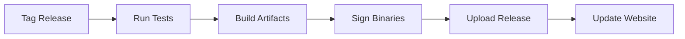

# EvorBrain Technical Planning

This document outlines the technical architecture decisions, design rationale, and implementation strategies for EvorBrain.

## Architecture Overview

EvorBrain follows a hybrid architecture combining the best of desktop and web technologies:

```
┌─────────────────────────────────────────────────────────┐
│                    User Interface                       │
│                 (React + TypeScript)                    │
├─────────────────────────────────────────────────────────┤
│                   State Management                      │
│                 (Zustand + Jotai)                       │
├─────────────────────────────────────────────────────────┤
│                    Tauri Bridge                         │
│                   (IPC Commands)                        │
├─────────────────────────────────────────────────────────┤
│                   Rust Backend                          │
│              (Business Logic + SQLite)                  │
├─────────────────────────────────────────────────────────┤
│                   File System                           │
│               (Markdown + YAML)                         │
└─────────────────────────────────────────────────────────┘
```

## Core Design Decisions

### 1. Technology Stack Rationale

**Tauri over Electron**

- Smaller bundle size (10MB vs 150MB)
- Better performance and memory usage
- Native system integration
- Rust security guarantees

**React + TypeScript**

- Strong typing for large codebase
- Excellent ecosystem and tooling
- Component reusability
- Easy onboarding for contributors

**Zustand + Jotai**

- Zustand: Simple, performant for hierarchical data
- Jotai: Atomic state for complex relationships
- Both have minimal boilerplate
- TypeScript-first design

**SQLite with FTS5**

- Fast full-text search
- No separate database server
- Reliable and battle-tested
- Perfect for desktop applications

### 2. Data Architecture

#### Entity Hierarchy

```
Life Area
├── Goal
│   ├── Project
│   │   └── Task
│   └── Task (standalone)
└── Task (standalone)
```

#### Storage Strategy

- **Primary Storage**: Markdown files with YAML frontmatter
- **Index**: SQLite database for search and relationships
- **Search**: SQLite FTS5 for full-text search capabilities
- **Cache**: In-memory state for performance
- **Sync**: File system as source of truth

For detailed data model and search implementation, see [docs/data-model.md](docs/data-model.md)

#### File Structure

```
data/
├── areas/
│   └── {id}-{slug}.md
├── goals/
│   └── {id}-{slug}.md
├── projects/
│   └── {id}-{slug}.md
├── tasks/
│   └── {id}-{slug}.md
├── attachments/
│   └── {id}/
└── evorbrain.db
```

### 3. State Management Architecture

#### Global State (Zustand)

```typescript
interface AppState {
  areas: Map<string, Area>;
  goals: Map<string, Goal>;
  projects: Map<string, Project>;
  tasks: Map<string, Task>;

  // Actions
  loadEntity: (type, id) => Promise<void>;
  saveEntity: (type, entity) => Promise<void>;
  deleteEntity: (type, id) => Promise<void>;
}
```

#### Relational State (Jotai)

```typescript
// Atoms for relationships
const tasksByProjectAtom = atom((get) => {
  const tasks = get(tasksAtom);
  return groupBy(tasks, 'projectId');
});

const backlinksAtom = atom((get) => {
  // Calculate backlinks between entities
});
```

### 4. Plugin Architecture

#### Design Principles

- **Isolation**: Plugins run in separate contexts
- **Permissions**: Explicit capability declarations
- **Communication**: Message-based IPC
- **Lifecycle**: Clear initialization and cleanup

#### Plugin Manifest

```json
{
  "id": "com.example.plugin",
  "name": "Example Plugin",
  "version": "1.0.0",
  "permissions": ["read", "write", "ui"],
  "main": "dist/index.js",
  "ui": "dist/ui.js"
}
```

#### Extension Points

1. **UI Extensions**: Custom views and panels
2. **Command Extensions**: New commands for palette
3. **Data Extensions**: Custom entity types
4. **Action Extensions**: Hooks into CRUD operations

### 5. Performance Strategy

#### Optimization Techniques

1. **Virtual Scrolling**: For large lists
2. **Lazy Loading**: Load data on demand
3. **Debouncing**: For search and saves
4. **Memoization**: For expensive computations
5. **Web Workers**: For background processing

#### Performance Budgets

```yaml
startup_time: < 2s
file_operation: < 100ms
search_operation: < 500ms
ui_interaction: 60fps
memory_usage: < 200MB
```

#### Monitoring

- Performance marks for critical paths
- Memory profiling in development
- User timing API for real measurements

### 6. Security Architecture

#### Threat Model

1. **Local File Access**: Sandboxed to data directory
2. **Plugin Execution**: Isolated contexts
3. **IPC Communication**: Validated commands
4. **External Resources**: No network by default

#### Security Measures

- Content Security Policy (CSP)
- Input sanitization
- Path traversal prevention
- Plugin permission system

### 7. Feature-Sliced Design Implementation

#### Layer Structure

```
src/
├── app/              # Application initialization
├── processes/        # Business processes
├── pages/           # Page components
├── widgets/         # Complex UI blocks
├── features/        # User interactions
├── entities/        # Business entities
└── shared/          # Shared code
```

#### Slice Organization

```
features/
├── create-task/
│   ├── ui/
│   ├── model/
│   └── api/
├── search/
│   ├── ui/
│   ├── model/
│   └── api/
```

## Implementation Strategies

### 1. Development Workflow

#### Git Strategy

- **Main Branch**: Always deployable
- **Feature Branches**: One per feature
- **Release Branches**: For release preparation
- **Hotfix Branches**: For critical fixes

#### Code Review Process

1. Create feature branch
2. Implement changes
3. Write/update tests
4. Create pull request
5. Automated checks
6. Peer review
7. Merge to main

### 2. Testing Strategy

#### Testing Pyramid

```
         E2E Tests
        /    5%    \
       /            \
      Integration Tests
     /      25%       \
    /                  \
   Unit Tests (70%)
```

#### Test Categories

- **Unit**: Business logic, utilities
- **Integration**: IPC, file operations
- **E2E**: User workflows
- **Performance**: Critical paths
- **Visual**: UI regression

### 3. Build and Release

#### Build Pipeline

1. **Development**: Hot reload, source maps
2. **Staging**: Optimized, debug symbols
3. **Production**: Minified, signed

#### Release Process


```mermaid
graph LR
    A[Tag Release] --> B[Run Tests]
    B --> C[Build Artifacts]
    C --> D[Sign Binaries]
    D --> E[Upload Release]
    E --> F[Update Website]
```

### 4. Migration Strategy

#### From Other Tools

1. **Obsidian**: Direct markdown import
2. **Notion**: Export to markdown, transform
3. **Roam**: JSON export, conversion
4. **Generic**: CSV import wizard

#### Data Transformation Pipeline

```typescript
interface MigrationPipeline {
  extract: (source: Source) => RawData;
  transform: (data: RawData) => Entity[];
  validate: (entities: Entity[]) => ValidationResult;
  load: (entities: Entity[]) => Promise<void>;
}
```

### 5. Scalability Considerations

#### Current Limits

- 10,000 files comfortably
- 100,000 with optimization
- 1,000,000 theoretical maximum

#### Scaling Strategies

1. **Indexing**: Incremental updates
2. **Pagination**: Virtual scrolling
3. **Caching**: LRU cache for files
4. **Sharding**: Split large datasets

## Technical Debt Management

### Acceptable Debt

- Quick prototypes for user feedback
- Temporary workarounds with tickets
- Performance optimizations deferred

### Unacceptable Debt

- Security vulnerabilities
- Data corruption risks
- Accessibility violations
- Missing tests for critical paths

## Decision Records

### ADR-001: Markdown as Primary Storage

**Status**: Accepted  
**Context**: Need portable, future-proof storage  
**Decision**: Use markdown files with YAML frontmatter  
**Consequences**: Slightly complex parsing, excellent portability

### ADR-002: Tauri for Desktop Framework

**Status**: Accepted  
**Context**: Need performant, secure desktop app  
**Decision**: Use Tauri instead of Electron  
**Consequences**: Smaller bundle, Rust learning curve

### ADR-003: Monorepo Structure

**Status**: Accepted  
**Context**: Multiple packages, shared code  
**Decision**: Use pnpm workspaces  
**Consequences**: Better code sharing, complex setup

### ADR-004: Feature-Sliced Design

**Status**: Accepted  
**Context**: Need scalable frontend architecture  
**Decision**: Implement FSD methodology  
**Consequences**: Clear structure, learning curve

### ADR-005: Mantine UI + Tailwind CSS

**Status**: Accepted  
**Context**: Need consistent UI components and styling flexibility  
**Decision**: Use Mantine v7 for components, Tailwind for utilities  
**Consequences**: Rich component library, flexible styling, slightly larger bundle

### ADR-006: React Router v7 for Navigation

**Status**: Accepted  
**Context**: Need client-side routing for desktop application  
**Decision**: Use React Router v7 with lazy loading and type safety  
**Consequences**: Modern routing patterns, code splitting support, future compatibility

### ADR-007: SQLite FTS5 for Search

**Status**: Accepted  
**Context**: Need fast, accurate full-text search across all entities  
**Decision**: Use SQLite FTS5 extension for search indexing  
**Consequences**: Fast search performance, complex query support, minimal setup

### ADR-008: Comprehensive IPC Command Structure

**Status**: Accepted  
**Context**: Need robust communication between frontend and backend  
**Decision**: Implement full CRUD operations for all entities via Tauri commands  
**Consequences**: Type-safe IPC, consistent error handling, async operations

## Risk Analysis

### Technical Risks

| Risk                    | Probability | Impact   | Mitigation                        |
| ----------------------- | ----------- | -------- | --------------------------------- |
| Tauri breaking changes  | Medium      | High     | Pin versions, extensive testing   |
| Performance degradation | Medium      | Medium   | Continuous profiling, benchmarks  |
| Data corruption         | Low         | Critical | Backups, validation, transactions |
| Plugin security issues  | Medium      | High     | Sandboxing, permissions, review   |

### Mitigation Strategies

1. **Version Pinning**: Lock critical dependencies
2. **Extensive Testing**: Automated test suite
3. **Gradual Rollout**: Beta testing program
4. **Monitoring**: Error tracking, analytics

## Future Considerations

### Potential Pivots

1. **Web-first**: If desktop adoption low
2. **Mobile-first**: If mobile demand high
3. **Cloud sync**: If users demand it
4. **AI features**: If becomes standard

### Technology Evolution

- **React Server Components**: When stable
- **WebAssembly**: For performance critical
- **Native modules**: For OS integration
- **Edge computing**: For sync features

---

This planning document is a living document and will evolve as the project develops. All major technical decisions should be documented here with appropriate ADRs (Architecture Decision Records).
