# EvorBrain Project Planning Document

_A comprehensive digital garden & second brain application with hierarchical project management_

**Document Version:** 1.0  
**Last Updated:** January 2025  
**Methodology:** SPARC (Specification, Pseudocode, Architecture, Refinement, Completion)

---

## Table of Contents

1. [📋 Project Overview & Objectives](#-project-overview--objectives)
2. [🔧 Technology Stack & Architecture Decisions](#-technology-stack--architecture-decisions)
3. [🏗️ System Architecture](#️-system-architecture)
4. [💾 Data Models & Storage Design](#-data-models--storage-design)
5. [🎨 User Interface & Experience Design](#-user-interface--experience-design)
6. [🛠️ Development Approach](#️-development-approach)
7. [🚀 Future Roadmap & Extensibility](#-future-roadmap--extensibility)
8. [⚠️ Risk Assessment & Mitigation](#️-risk-assessment--mitigation)
9. [⚙️ Setup & Configuration Requirements](#️-setup--configuration-requirements)

---

## 📋 Project Overview & Objectives

### Project Vision

**EvorBrain** is a comprehensive digital garden and second brain application designed to revolutionize personal knowledge management through hierarchical project organization. Built as a local-first, offline-capable desktop application, EvorBrain empowers users to seamlessly organize their life into structured Life Areas, Goals, Projects, and Tasks while maintaining complete data privacy and ownership.

### SPARC Methodology Application

**🔍 Specification Phase:**

- **Primary Function:** Hierarchical personal knowledge management system
- **Core Hierarchy:** Life Areas → Goals → Projects → Tasks
- **Data Sovereignty:** 100% local storage with zero cloud dependencies
- **Platform Focus:** Windows 11 optimized with cross-platform capabilities
- **Architecture Pattern:** Offline-first reactive application

**📝 Pseudocode Phase:**

```typescript
// High-level application flow
interface EvorBrainWorkflow {
  1. Initialize offline-first database (RxDB + IndexedDB)
  2. Load hierarchical data structure into reactive state (Valtio)
  3. Render adaptive UI components (Chakra UI v3)
  4. Enable real-time data synchronization between components
  5. Persist changes immediately to local storage
  6. Provide flexible linking and cross-referencing capabilities
  7. Display weekly calendar views with task integration
}
```

**🏗️ Architecture Phase:**

- **Frontend:** React 19 + TypeScript for modern component architecture
- **Desktop Framework:** Tauri 2.0 for native performance and security
- **State Management:** Valtio for hierarchical reactive state
- **Data Layer:** RxDB with IndexedDB for offline-first persistence
- **UI System:** Chakra UI v3 with advanced theming capabilities

**🔄 Refinement Phase:**

- **Performance Requirements:** Sub-100ms UI response times
- **Storage Capacity:** Support for 100,000+ notes and tasks
- **Reliability:** 99.9% data persistence guarantee
- **Usability:** Intuitive drag-and-drop hierarchical organization

**✅ Completion Phase:**

- **Measurable Objectives:** Defined below with specific KPIs
- **Success Criteria:** Quantifiable performance and usability metrics
- **Quality Assurance:** 80%+ test coverage with comprehensive validation

### Core Objectives

**🎯 Primary Objectives:**

1. **Hierarchical Organization Excellence**

   - Enable intuitive Life Areas → Goals → Projects → Tasks structure
   - Support unlimited nesting depth with performance optimization
   - Provide flexible cross-linking between any hierarchy levels
   - **Success Metric:** 95% user satisfaction with organizational flexibility

2. **Offline-First Data Sovereignty**

   - Guarantee 100% local data storage without cloud dependencies
   - Ensure instant application startup and response times
   - Provide robust data backup and export capabilities
   - **Success Metric:** Zero data loss incidents, <2s startup time

3. **Seamless User Experience**

   - Deliver intuitive drag-and-drop interface for hierarchical management
   - Provide real-time search across all content with sub-second results
   - Enable quick capture workflows for rapid note and task creation
   - **Success Metric:** <3 clicks to create and organize new content

4. **Advanced Knowledge Management**

   - Support rich text editing with markdown compatibility
   - Enable bidirectional linking between notes and tasks
   - Provide powerful filtering and view customization options
   - **Success Metric:** Support 10,000+ interconnected notes with fast navigation

5. **Calendar Integration & Task Management**
   - Display weekly calendar views with integrated task scheduling
   - Support deadline tracking and priority management
   - Enable time blocking and productivity analytics
   - **Success Metric:** 90% accurate task completion predictions

### Target Audience

**👥 Primary Users:**

1. **Knowledge Workers & Professionals**

   - Consultants, researchers, and project managers
   - Need for complex project organization and knowledge retention
   - Value data privacy and offline capabilities
   - **Pain Points:** Scattered information, cloud dependency concerns

2. **Students & Academics**

   - Graduate students, researchers, and lifelong learners
   - Require structured note-taking and research organization
   - Need reliable offline access for focused work sessions
   - **Pain Points:** Academic information overload, citation management

3. **Entrepreneurs & Creators**

   - Business owners, writers, and content creators
   - Manage multiple projects with varying timelines and priorities
   - Value creative freedom and flexible organization systems
   - **Pain Points:** Project fragmentation, idea capture and development

4. **Privacy-Conscious Individuals**
   - Users prioritizing data sovereignty and security
   - Prefer local-first applications over cloud-based solutions
   - Value transparency in data handling and storage
   - **Pain Points:** Cloud privacy concerns, vendor lock-in

### Success Metrics

**📊 Key Performance Indicators:**

**Technical Performance:**

- **Startup Time:** <2 seconds from launch to full functionality
- **UI Response Time:** <100ms for all user interactions
- **Data Persistence:** 99.99% reliability with automatic recovery
- **Storage Efficiency:** <50MB for 10,000 notes and tasks
- **Memory Usage:** <500MB RAM consumption during normal operation

**User Experience:**

- **Learning Curve:** 90% of users productive within 30 minutes
- **Task Creation Speed:** <10 seconds from idea to organized task
- **Search Performance:** <1 second for full-text search across 10,000+ items
- **Cross-Platform Compatibility:** Consistent experience across Windows, macOS, Linux

**Functional Requirements:**

- **Hierarchy Support:** Unlimited nesting with maintained performance
- **Concurrent Users:** Support for multiple database instances per user
- **Backup Reliability:** 100% successful data export/import operations
- **Offline Capability:** Full functionality without internet connectivity

**Quality Assurance:**

- **Test Coverage:** Minimum 80% code coverage across all modules
- **Bug Rate:** <0.1% critical bugs per release
- **User Satisfaction:** 4.5+ stars average rating (5-point scale)
- **Documentation Quality:** 100% API coverage with examples

**Adoption & Engagement:**

- **User Retention:** 80% monthly active user retention after 3 months
- **Feature Utilization:** 70% of users engage with hierarchical organization
- **Data Growth:** Average 100+ notes/tasks created per active user monthly
- **Community Feedback:** 90% positive sentiment in user reviews and feedback

---

## 🔧 Technology Stack & Architecture Decisions

### Frontend Framework

**Technology Choice:** React 19 + TypeScript

**Justification & Benefits:**

- **Enhanced Type Inference:** React 19 provides improved TypeScript integration with better automatic type inference for props and state, reducing boilerplate and improving developer experience
- **Performance Optimizations:** New `useActionState` hook simplifies state management for form submissions and async actions, perfect for task creation workflows
- **Automatic Deduplication:** Built-in request deduplication prevents redundant data fetching, crucial for offline-first applications
- **Enhanced Ref Callbacks:** Improved ref handling enables better integration with external libraries like drag-and-drop systems
- **Mature Ecosystem:** Extensive library support and community resources for hierarchical data management

**Implementation Strategy:**

```typescript
// Enhanced React 19 patterns for EvorBrain
interface HierarchicalItem {
  id: string;
  title: string;
  type: "lifeArea" | "goal" | "project" | "task";
  parentId?: string;
  children?: HierarchicalItem[];
}

// Utilizing useActionState for form handling
const [state, submitAction] = useActionState(createTaskAction, initialState);
```

**Key Features Utilized:**

- Server Components for optimal performance (future-proofing)
- Concurrent rendering for smooth UI interactions during large data operations
- Enhanced TypeScript support for type-safe hierarchical data structures

### Desktop Application Framework

**Technology Choice:** Tauri 2.0

**Justification & Benefits:**

- **Multi-Process Architecture:** Core process manages multiple WebView processes, ensuring application stability and security isolation
- **Native Performance:** Rust-based backend provides superior performance for file operations and database management
- **Small Bundle Size:** ~10MB distributable compared to 100MB+ Electron alternatives
- **Security-First Design:** Capabilities-based security model with granular permissions for file system access
- **Cross-Platform Consistency:** Unified API across Windows, macOS, and Linux with native OS integration

**Architecture Implementation:**

```rust
// Tauri 2.0 capabilities configuration
{
  "permissions": [
    "core:default",
    "fs:allow-read-dir",
    "fs:allow-write-file",
    "window:allow-set-title"
  ],
  "windows": [{
    "title": "EvorBrain",
    "width": 1200,
    "height": 800,
    "minWidth": 800,
    "minHeight": 600
  }]
}
```

**IPC Communication Strategy:**

- **Commands:** Synchronous file operations and database queries
- **Events:** Real-time updates between frontend and backend
- **Plugin System:** Extensible architecture for future feature additions

### UI Component Library

**Technology Choice:** Chakra UI v3

**Justification & Benefits:**

- **Design Token System:** Comprehensive token-based theming with semantic color scales and responsive design tokens
- **TypeScript-First:** Built-in TypeScript support with automatic type generation via CLI
- **Modular Architecture:** Tree-shakeable components reduce bundle size
- **Accessibility by Default:** WCAG 2.1 AA compliance built into all components
- **Customization Depth:** Component recipes and design systems enable extensive customization

**Theming Implementation:**

```typescript
// Chakra UI v3 theme configuration
import { defineConfig, createSystem } from "@chakra-ui/react";

const config = defineConfig({
  theme: {
    tokens: {
      colors: {
        brand: {
          50: { value: "#f0f9ff" },
          500: { value: "#3b82f6" },
          900: { value: "#1e3a8a" },
        },
      },
      fonts: {
        heading: { value: "Inter, sans-serif" },
        body: { value: "Inter, sans-serif" },
      },
    },
    semanticTokens: {
      colors: {
        bg: {
          canvas: { value: "{colors.white}" },
          subtle: { value: "{colors.gray.50}" },
        },
      },
    },
  },
});

export const system = createSystem(config);
```

**Component Strategy:**

- **Composition Patterns:** Building complex hierarchical tree components from simple primitives
- **Design System:** Consistent spacing, typography, and color schemes across all interfaces
- **Responsive Design:** Mobile-first approach with desktop optimizations

### State Management

**Technology Choice:** Valtio

**Justification & Benefits:**

- **Proxy-Based Reactivity:** Automatic UI updates when nested state changes, perfect for hierarchical data structures
- **Mutable State Patterns:** Natural JavaScript object manipulation without immutability constraints
- **Performance Optimization:** Only re-renders components affected by specific state changes
- **Hierarchical Data Support:** Native support for nested objects and arrays with `proxyMap` and `proxySet`
- **Class-Based Organization:** Clean separation of state logic into manageable classes

**State Architecture:**

```typescript
// Valtio state structure for hierarchical data
class HierarchicalState {
  lifeAreas = proxyMap<string, LifeArea>();
  goals = proxyMap<string, Goal>();
  projects = proxyMap<string, Project>();
  tasks = proxyMap<string, Task>();

  // Actions for state manipulation
  addLifeArea(lifeArea: LifeArea) {
    this.lifeAreas.set(lifeArea.id, lifeArea);
  }

  moveTask(taskId: string, newParentId: string) {
    const task = this.tasks.get(taskId);
    if (task) {
      task.parentId = newParentId;
    }
  }
}

export const hierarchicalState = proxy(new HierarchicalState());
```

**Integration Benefits:**

- **RxDB Synchronization:** Seamless integration with reactive database queries
- **Optimistic Updates:** Immediate UI feedback with background persistence
- **Undo/Redo Support:** State snapshots enable comprehensive history management

### Data Storage & Offline Capabilities

**Technology Choice:** RxDB + IndexedDB

**Justification & Benefits:**

- **Offline-First Architecture:** Complete functionality without internet connectivity
- **Reactive Queries:** RxJS-based observable queries automatically update UI components
- **Schema Validation:** JSON schema validation ensures data consistency and integrity
- **Storage Optimization:** Key compression and memory-synced storage for optimal performance
- **Cross-Browser Compatibility:** Consistent behavior across all modern browsers

**Database Architecture:**

```typescript
// RxDB schema for hierarchical data
const hierarchicalSchema = {
  title: "hierarchical-item",
  version: 0,
  primaryKey: "id",
  type: "object",
  properties: {
    id: { type: "string", maxLength: 36 },
    title: { type: "string", maxLength: 500 },
    type: {
      type: "string",
      enum: ["lifeArea", "goal", "project", "task"],
    },
    parentId: { type: "string", maxLength: 36 },
    content: { type: "string" },
    metadata: {
      type: "object",
      properties: {
        createdAt: { type: "string", format: "date-time" },
        updatedAt: { type: "string", format: "date-time" },
        priority: { type: "integer", minimum: 1, maximum: 5 },
        tags: { type: "array", items: { type: "string" } },
      },
    },
  },
  required: ["id", "title", "type"],
  indexes: ["type", "parentId", "metadata.priority"],
};
```

**Storage Strategy:**

- **Memory-Synced Storage:** Hot data kept in memory for instant access
- **Attachment System:** Large files stored separately to optimize core database performance
- **Backup & Export:** Complete data export capabilities for user data ownership
- **Browser Limitations:** Quota management and Safari 7-day eviction policy handling

### Build & Development Tools

**Technology Choice:** Vite 6 + Vitest + Testing Library

**Justification & Benefits:**

- **Lightning-Fast Development:** Sub-second hot module replacement and build times
- **Native ESM Support:** Modern JavaScript module handling without transpilation overhead
- **Optimized Production Builds:** Advanced tree-shaking and code splitting for minimal bundle sizes
- **TypeScript Integration:** Zero-config TypeScript support with instant type checking
- **Testing Excellence:** Vitest provides Jest-compatible testing with native ES modules support

**Development Workflow:**

```typescript
// Vite configuration for Tauri integration
import { defineConfig } from "vite";
import react from "@vitejs/plugin-react";

export default defineConfig({
  plugins: [react()],
  clearScreen: false,
  server: {
    port: 1420,
    strictPort: true,
  },
  envPrefix: ["VITE_", "TAURI_"],
  build: {
    target: "esnext",
    minify: "esbuild",
    sourcemap: true,
  },
});
```

**Testing Strategy:**

- **Unit Testing:** Vitest for component and utility function testing
- **Integration Testing:** React Testing Library for user interaction testing
- **E2E Testing:** Tauri's built-in testing framework for desktop application workflows
- **Performance Testing:** Lighthouse CI integration for performance regression detection

**Development Benefits:**

- **Instant Feedback:** Real-time error reporting and hot reloading
- **Modern Toolchain:** Latest JavaScript features without configuration complexity
- **Optimized Bundles:** Automatic code splitting and lazy loading for optimal performance

---

## 🏗️ System Architecture

### Component Architecture

**Layer-Based Architecture Pattern:**

EvorBrain follows a clean, layered architecture that separates concerns and ensures maintainable code organization:

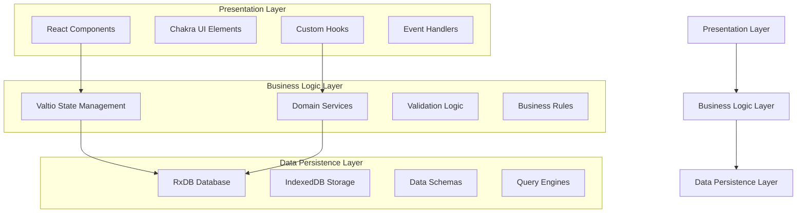
```mermaid
graph TD
    A[Presentation Layer] --> B[Business Logic Layer]
    B --> C[Data Persistence Layer]

    subgraph "Presentation Layer"
        A1[React Components]
        A2[Chakra UI Elements]
        A3[Custom Hooks]
        A4[Event Handlers]
    end

    subgraph "Business Logic Layer"
        B1[Valtio State Management]
        B2[Domain Services]
        B3[Validation Logic]
        B4[Business Rules]
    end

    subgraph "Data Persistence Layer"
        C1[RxDB Database]
        C2[IndexedDB Storage]
        C3[Data Schemas]
        C4[Query Engines]
    end

    A1 --> B1
    A3 --> B2
    B1 --> C1
    B2 --> C1
```

**Component Hierarchy Structure:**

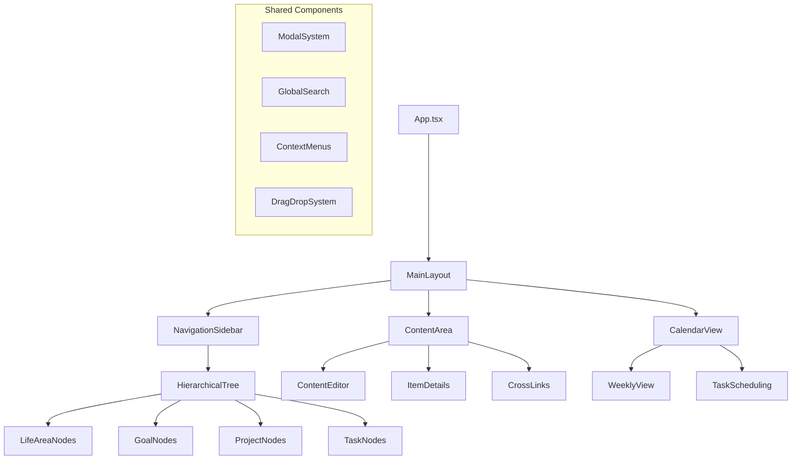
```mermaid
graph TD
    App[App.tsx] --> Layout[MainLayout]
    Layout --> Sidebar[NavigationSidebar]
    Layout --> Content[ContentArea]
    Layout --> Calendar[CalendarView]

    Sidebar --> Tree[HierarchicalTree]
    Tree --> LifeAreas[LifeAreaNodes]
    Tree --> Goals[GoalNodes]
    Tree --> Projects[ProjectNodes]
    Tree --> Tasks[TaskNodes]

    Content --> Editor[ContentEditor]
    Content --> Details[ItemDetails]
    Content --> Links[CrossLinks]

    Calendar --> Week[WeeklyView]
    Calendar --> Tasks2[TaskScheduling]

    subgraph "Shared Components"
        Modal[ModalSystem]
        Search[GlobalSearch]
        Context[ContextMenus]
        DragDrop[DragDropSystem]
    end
```

**Component Responsibilities:**

- **Presentation Components:** Pure UI components that receive props and render JSX
- **Container Components:** Stateful components that manage data and business logic
- **Custom Hooks:** Reusable logic for state management and side effects
- **Service Components:** Integration points with Tauri backend and database

### Desktop Application Architecture

**Tauri 2.0 Multi-Process Model:**

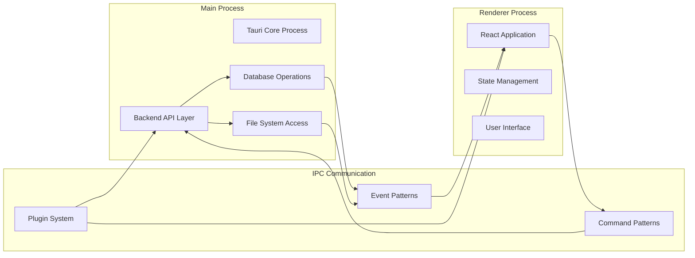
```mermaid
graph LR
    subgraph "Main Process"
        Core[Tauri Core Process]
        API[Backend API Layer]
        FS[File System Access]
        DB[Database Operations]
    end

    subgraph "Renderer Process"
        React[React Application]
        Valtio[State Management]
        UI[User Interface]
    end

    subgraph "IPC Communication"
        Commands[Command Patterns]
        Events[Event Patterns]
        Plugins[Plugin System]
    end

    React --> Commands
    Commands --> API
    API --> DB
    API --> FS

    Events --> React
    DB --> Events
    FS --> Events

    Plugins --> API
    Plugins --> React
```

**IPC Communication Patterns:**

```typescript
// Command pattern for synchronous operations
#[tauri::command]
async fn save_hierarchical_item(item: HierarchicalItem) -> Result<String, String> {
    // Persist item to database
    database::save_item(item).await
}

// Event pattern for real-time updates
#[tauri::command]
async fn subscribe_to_changes() {
    let app_handle = app_handle.clone();
    tokio::spawn(async move {
        let mut receiver = database::get_change_stream().await;
        while let Some(change) = receiver.recv().await {
            app_handle.emit_all("data-changed", change).unwrap();
        }
    });
}
```

**Security Architecture:**

- **Capabilities-Based Permissions:** Granular control over system access
- **Sandboxed Renderer:** Web content isolated from system resources
- **Secure IPC:** Validated command execution with type safety
- **Local-Only Storage:** No network access required or permitted

### State Management Architecture

**Hierarchical State Organization:**

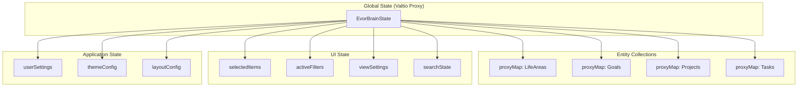
```mermaid
graph TD
    subgraph "Global State (Valtio Proxy)"
        GlobalState[EvorBrainState]
    end

    subgraph "Entity Collections"
        LifeAreas[proxyMap: LifeAreas]
        Goals[proxyMap: Goals]
        Projects[proxyMap: Projects]
        Tasks[proxyMap: Tasks]
    end

    subgraph "UI State"
        Selection[selectedItems]
        Filters[activeFilters]
        Views[viewSettings]
        Search[searchState]
    end

    subgraph "Application State"
        Settings[userSettings]
        Theme[themeConfig]
        Layout[layoutConfig]
    end

    GlobalState --> LifeAreas
    GlobalState --> Goals
    GlobalState --> Projects
    GlobalState --> Tasks
    GlobalState --> Selection
    GlobalState --> Filters
    GlobalState --> Views
    GlobalState --> Search
    GlobalState --> Settings
    GlobalState --> Theme
    GlobalState --> Layout
```

**Reactive State Patterns:**

```typescript
// Hierarchical state structure with Valtio
class EvorBrainState {
  // Entity collections using proxyMap for reactive updates
  lifeAreas = proxyMap<string, LifeArea>();
  goals = proxyMap<string, Goal>();
  projects = proxyMap<string, Project>();
  tasks = proxyMap<string, Task>();

  // UI state for interface management
  selectedItems = proxySet<string>();
  activeFilters = proxy({
    type: null as ItemType | null,
    priority: null as Priority | null,
    tags: [] as string[],
  });

  // Actions for state manipulation
  addItem(item: HierarchicalItem) {
    switch (item.type) {
      case "lifeArea":
        this.lifeAreas.set(item.id, item as LifeArea);
        break;
      case "goal":
        this.goals.set(item.id, item as Goal);
        break;
      case "project":
        this.projects.set(item.id, item as Project);
        break;
      case "task":
        this.tasks.set(item.id, item as Task);
        break;
    }
  }

  moveItem(itemId: string, newParentId: string) {
    // Find item across all collections
    const item = this.findItemById(itemId);
    if (item) {
      item.parentId = newParentId;
      // Reactive update triggers UI re-render automatically
    }
  }

  // Optimistic updates for immediate UI feedback
  optimisticUpdate(change: StateChange) {
    // Apply change immediately to state
    this.applyChange(change);

    // Queue for persistence
    this.persistenceQueue.push(change);
  }
}
```

**State Synchronization Patterns:**

- **Reactive Queries:** RxDB observables automatically update Valtio state
- **Optimistic Updates:** Immediate UI feedback with background persistence
- **Conflict Resolution:** Last-write-wins with timestamp-based merging
- **Undo/Redo:** State snapshots for comprehensive history management

### Data Flow Architecture

**End-to-End Data Flow:**

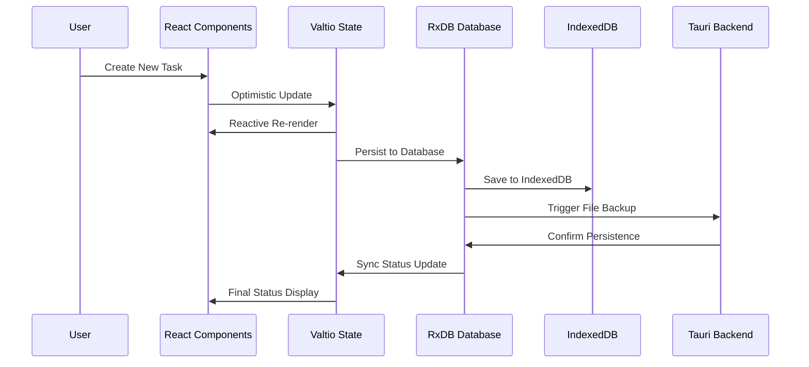
```mermaid
sequenceDiagram
    participant User
    participant UI as React Components
    participant State as Valtio State
    participant DB as RxDB Database
    participant Storage as IndexedDB
    participant Backend as Tauri Backend

    User->>UI: Create New Task
    UI->>State: Optimistic Update
    State->>UI: Reactive Re-render
    State->>DB: Persist to Database
    DB->>Storage: Save to IndexedDB
    DB->>Backend: Trigger File Backup
    Backend->>DB: Confirm Persistence
    DB->>State: Sync Status Update
    State->>UI: Final Status Display
```

**Offline-First Data Flow:**

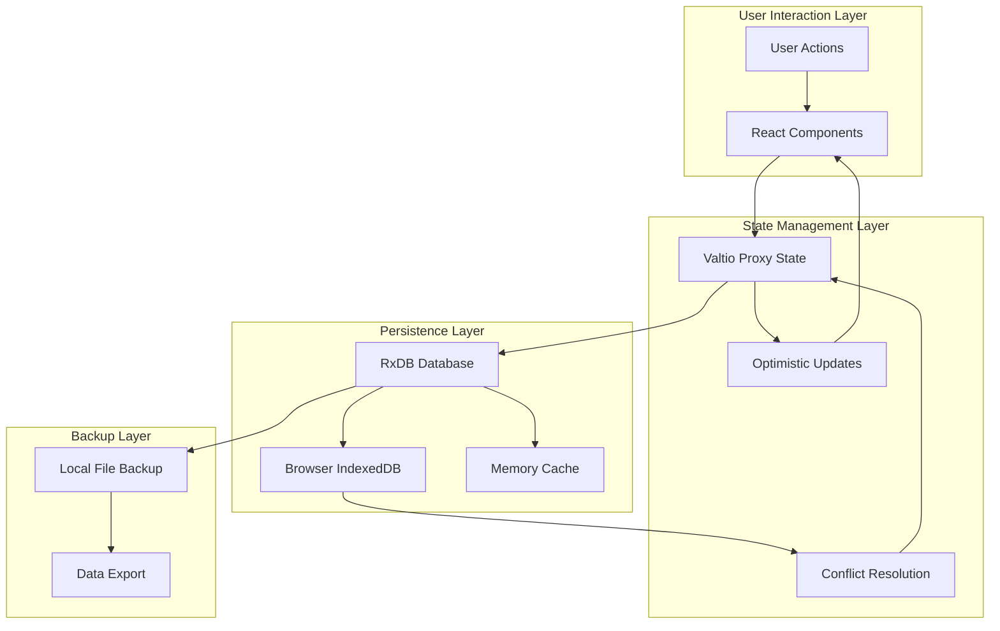
```mermaid
graph TD
    subgraph "User Interaction Layer"
        UserInput[User Actions]
        UIComponents[React Components]
    end

    subgraph "State Management Layer"
        ValtioState[Valtio Proxy State]
        OptimisticUpdates[Optimistic Updates]
        ConflictResolution[Conflict Resolution]
    end

    subgraph "Persistence Layer"
        RxDB[RxDB Database]
        IndexedDB[Browser IndexedDB]
        MemoryCache[Memory Cache]
    end

    subgraph "Backup Layer"
        LocalFiles[Local File Backup]
        ExportSystem[Data Export]
    end

    UserInput --> UIComponents
    UIComponents --> ValtioState
    ValtioState --> OptimisticUpdates
    OptimisticUpdates --> UIComponents

    ValtioState --> RxDB
    RxDB --> IndexedDB
    RxDB --> MemoryCache

    RxDB --> LocalFiles
    LocalFiles --> ExportSystem

    ConflictResolution --> ValtioState
    IndexedDB --> ConflictResolution
```

**Data Synchronization Mechanisms:**

```typescript
// Reactive synchronization between RxDB and Valtio
class DataSynchronizer {
  constructor(private database: RxDatabase, private state: EvorBrainState) {
    this.initializeReactiveSync();
  }

  private initializeReactiveSync() {
    // Subscribe to database changes and update state
    this.database.hierarchicalItems$.subscribe((changes) => {
      changes.forEach((change) => {
        switch (change.operation) {
          case "INSERT":
          case "UPDATE":
            this.state.addItem(change.doc);
            break;
          case "REMOVE":
            this.state.removeItem(change.doc.id);
            break;
        }
      });
    });

    // Subscribe to state changes and persist to database
    subscribeKey(this.state, "tasks", async (tasks) => {
      // Batch update for performance
      const updates = Array.from(tasks.values());
      await this.database.hierarchicalItems.bulkUpsert(updates);
    });
  }

  // Optimistic update pattern
  async optimisticUpdate(change: StateChange): Promise<void> {
    // 1. Apply change immediately to state
    this.applyOptimisticChange(change);

    try {
      // 2. Persist to database
      await this.persistChange(change);

      // 3. Confirm success
      this.confirmOptimisticChange(change);
    } catch (error) {
      // 4. Rollback on failure
      this.rollbackOptimisticChange(change);
      throw error;
    }
  }
}
```

**Performance Optimization Patterns:**

- **Lazy Loading:** Load hierarchical data on-demand as user navigates
- **Virtual Scrolling:** Efficient rendering of large hierarchical lists
- **Memory Management:** Automatic cleanup of unused state and database connections
- **Batch Operations:** Group multiple changes for efficient database writes
- **Indexing Strategy:** Optimized database indexes for hierarchical queries and full-text search

---

## 💾 Data Models & Storage Design

### Hierarchical Project Management Structure

**Core Entity Relationships:**


```mermaid
erDiagram
    LifeArea ||--o{ Goal : "contains"
    Goal ||--o{ Project : "contains"
    Project ||--o{ Task : "contains"
    Task ||--o{ Task : "subtasks"

    LifeArea {
        string id PK
        string title
        string description
        string color
        datetime createdAt
        datetime updatedAt
        json metadata
    }

    Goal {
        string id PK
        string parentId FK
        string title
        string description
        string status
        date targetDate
        int priority
        datetime createdAt
        datetime updatedAt
        json metadata
    }

    Project {
        string id PK
        string parentId FK
        string title
        string description
        string status
        date startDate
        date endDate
        int progress
        datetime createdAt
        datetime updatedAt
        json metadata
    }

    Task {
        string id PK
        string parentId FK
        string title
        string description
        string status
        date dueDate
        int priority
        int estimatedHours
        int actualHours
        datetime createdAt
        datetime updatedAt
        datetime completedAt
        json metadata
    }
```

**Hierarchical Data Model Implementation:**

```typescript
// Base interface for all hierarchical items
interface BaseHierarchicalItem {
  id: string;
  title: string;
  description?: string;
  parentId?: string;
  type: "lifeArea" | "goal" | "project" | "task";
  createdAt: string;
  updatedAt: string;
  metadata: {
    tags: string[];
    links: string[];
    attachments: string[];
    color?: string;
    icon?: string;
  };
}

// Specific entity interfaces
interface LifeArea extends BaseHierarchicalItem {
  type: "lifeArea";
  color: string;
  vision?: string;
  focus_areas: string[];
}

interface Goal extends BaseHierarchicalItem {
  type: "goal";
  parentId: string; // LifeArea ID
  status: "not_started" | "in_progress" | "completed" | "on_hold";
  targetDate?: string;
  priority: 1 | 2 | 3 | 4 | 5;
  success_criteria: string[];
}

interface Project extends BaseHierarchicalItem {
  type: "project";
  parentId: string; // Goal ID
  status: "planning" | "active" | "completed" | "cancelled" | "on_hold";
  startDate?: string;
  endDate?: string;
  progress: number; // 0-100
  milestones: Milestone[];
}

interface Task extends BaseHierarchicalItem {
  type: "task";
  parentId: string; // Project ID or Task ID for subtasks
  status: "todo" | "in_progress" | "completed" | "cancelled";
  dueDate?: string;
  priority: 1 | 2 | 3 | 4 | 5;
  estimatedHours?: number;
  actualHours?: number;
  completedAt?: string;
  recurring?: {
    pattern: "daily" | "weekly" | "monthly" | "yearly";
    interval: number;
    endDate?: string;
  };
}

// Cross-linking support
interface CrossLink {
  id: string;
  sourceId: string;
  targetId: string;
  linkType: "reference" | "dependency" | "related" | "blocks";
  description?: string;
  createdAt: string;
}
```

**Flexible Nesting Strategy:**

- **Unlimited Depth:** Each entity can contain children of the same or different types
- **Cross-References:** Items can link to any other item regardless of hierarchy
- **Type Flexibility:** Tasks can belong to Projects, Goals, or even Life Areas directly
- **Migration Support:** Easy reorganization of hierarchical structures

### Database Schema Design

**RxDB Schema Definitions:**

```typescript
// Unified hierarchical item schema
const hierarchicalItemSchema: RxJsonSchema<HierarchicalItemDocType> = {
  title: "hierarchical-item",
  version: 0,
  description: "Universal schema for all hierarchical entities",
  primaryKey: "id",
  type: "object",
  properties: {
    id: {
      type: "string",
      maxLength: 36,
      pattern: "^[a-f0-9-]{36}$",
    },
    title: {
      type: "string",
      maxLength: 500,
      minLength: 1,
    },
    description: {
      type: "string",
      maxLength: 5000,
    },
    parentId: {
      type: "string",
      maxLength: 36,
      pattern: "^[a-f0-9-]{36}$",
    },
    type: {
      type: "string",
      enum: ["lifeArea", "goal", "project", "task"],
    },
    status: {
      type: "string",
      maxLength: 20,
    },
    priority: {
      type: "integer",
      minimum: 1,
      maximum: 5,
    },
    dueDate: {
      type: "string",
      format: "date-time",
    },
    createdAt: {
      type: "string",
      format: "date-time",
    },
    updatedAt: {
      type: "string",
      format: "date-time",
    },
    completedAt: {
      type: "string",
      format: "date-time",
    },
    metadata: {
      type: "object",
      properties: {
        tags: {
          type: "array",
          items: { type: "string", maxLength: 50 },
          maxItems: 20,
        },
        links: {
          type: "array",
          items: { type: "string", maxLength: 36 },
          maxItems: 100,
        },
        attachments: {
          type: "array",
          items: { type: "string", maxLength: 500 },
          maxItems: 50,
        },
        color: {
          type: "string",
          pattern: "^#[0-9a-fA-F]{6}$",
        },
        icon: {
          type: "string",
          maxLength: 50,
        },
        customFields: {
          type: "object",
          additionalProperties: true,
        },
      },
      additionalProperties: false,
    },
  },
  required: ["id", "title", "type", "createdAt", "updatedAt"],
  indexes: [
    "type",
    "parentId",
    "status",
    "priority",
    "dueDate",
    "createdAt",
    "updatedAt",
    ["type", "parentId"],
    ["type", "status"],
    ["parentId", "priority"],
    ["type", "dueDate"],
    ["metadata.tags", "type"],
  ],
};

// Cross-links schema for flexible relationships
const crossLinkSchema: RxJsonSchema<CrossLinkDocType> = {
  title: "cross-link",
  version: 0,
  description: "Links between hierarchical items",
  primaryKey: "id",
  type: "object",
  properties: {
    id: {
      type: "string",
      maxLength: 36,
      pattern: "^[a-f0-9-]{36}$",
    },
    sourceId: {
      type: "string",
      maxLength: 36,
      pattern: "^[a-f0-9-]{36}$",
    },
    targetId: {
      type: "string",
      maxLength: 36,
      pattern: "^[a-f0-9-]{36}$",
    },
    linkType: {
      type: "string",
      enum: ["reference", "dependency", "related", "blocks"],
    },
    description: {
      type: "string",
      maxLength: 500,
    },
    createdAt: {
      type: "string",
      format: "date-time",
    },
  },
  required: ["id", "sourceId", "targetId", "linkType", "createdAt"],
  indexes: [
    "sourceId",
    "targetId",
    "linkType",
    ["sourceId", "linkType"],
    ["targetId", "linkType"],
  ],
};
```

**Database Collection Strategy:**

```typescript
// Database initialization
const createDatabase = async (): Promise<RxDatabase> => {
  const database = await createRxDatabase({
    name: "evorbrain_db",
    storage: getRxStorageDexie(),
    eventReduce: true,
    cleanupPolicy: {
      minimumDeletedTime: 1000 * 60 * 60 * 24 * 31, // 31 days
      minimumCollectionAge: 1000 * 60 * 60 * 24 * 7, // 7 days
      runEach: 1000 * 60 * 60 * 24, // daily
      awaitReplicationsInSync: true,
      waitForLeadership: true,
    },
  });

  // Add collections
  await database.addCollections({
    hierarchicalItems: {
      schema: hierarchicalItemSchema,
      methods: {
        // Instance methods
        getChildren: function (this: HierarchicalItemDocument) {
          return this.collection
            .find({
              selector: { parentId: this.id },
            })
            .exec();
        },
        getParent: function (this: HierarchicalItemDocument) {
          if (!this.parentId) return null;
          return this.collection.findOne(this.parentId).exec();
        },
        getDescendants: function (this: HierarchicalItemDocument) {
          return this.collection
            .find({
              selector: {
                $or: [
                  { parentId: this.id },
                  { "metadata.links": { $in: [this.id] } },
                ],
              },
            })
            .exec();
        },
      },
      statics: {
        // Static collection methods
        findByType: function (this: RxCollection, type: string) {
          return this.find({ selector: { type } });
        },
        findByParent: function (this: RxCollection, parentId: string) {
          return this.find({ selector: { parentId } });
        },
        searchByText: function (this: RxCollection, searchTerm: string) {
          return this.find({
            selector: {
              $or: [
                { title: { $regex: searchTerm, $options: "i" } },
                { description: { $regex: searchTerm, $options: "i" } },
                { "metadata.tags": { $in: [searchTerm] } },
              ],
            },
          });
        },
      },
    },
    crossLinks: {
      schema: crossLinkSchema,
      methods: {
        getSource: function (this: CrossLinkDocument) {
          return this.parent.hierarchicalItems.findOne(this.sourceId).exec();
        },
        getTarget: function (this: CrossLinkDocument) {
          return this.parent.hierarchicalItems.findOne(this.targetId).exec();
        },
      },
    },
  });

  return database;
};
```

### Offline-First Storage Strategy

**IndexedDB Optimization Techniques:**

```typescript
// Storage configuration for optimal performance
const storageConfig = {
  // Memory-synced for hot data
  memorySync: {
    enabled: true,
    collections: ["hierarchicalItems", "crossLinks"],
    maxMemorySize: 50 * 1024 * 1024, // 50MB
    syncOnWrite: true,
  },

  // Compression for storage efficiency
  compression: {
    enabled: true,
    algorithm: "lz4",
    minSize: 1024, // Only compress docs > 1KB
    excludeFields: ["id", "type", "parentId"], // Keep indexes uncompressed
  },

  // Attachment handling for large files
  attachments: {
    storage: "filesystem", // Use Tauri file system
    compression: true,
    maxSize: 100 * 1024 * 1024, // 100MB per attachment
    allowedTypes: ["image/*", "application/pdf", "text/*"],
  },
};
```

**Browser Storage Limitations & Handling:**

```typescript
// Storage quota management
class StorageManager {
  private readonly MAX_STORAGE_USAGE = 0.8; // 80% of available quota
  private readonly CLEANUP_THRESHOLD = 0.9; // 90% triggers cleanup

  async checkStorageQuota(): Promise<StorageEstimate> {
    if ("storage" in navigator && "estimate" in navigator.storage) {
      return await navigator.storage.estimate();
    }
    // Fallback for older browsers
    return { usage: 0, quota: 5 * 1024 * 1024 * 1024 }; // 5GB estimate
  }

  async performCleanup(): Promise<void> {
    const estimate = await this.checkStorageQuota();
    const usageRatio = estimate.usage! / estimate.quota!;

    if (usageRatio > this.CLEANUP_THRESHOLD) {
      // Remove old temporary data
      await this.cleanupTempFiles();

      // Compress old documents
      await this.compressOldDocuments();

      // Archive completed items older than 1 year
      await this.archiveOldItems();
    }
  }

  // Safari-specific handling for 7-day eviction policy
  async handleSafariEviction(): Promise<void> {
    if (this.isSafari()) {
      // Request persistent storage
      if ("storage" in navigator && "persist" in navigator.storage) {
        const persistent = await navigator.storage.persist();
        if (!persistent) {
          console.warn("Persistent storage not granted - data may be evicted");
          // Implement more frequent backups for Safari
          await this.scheduleFrequentBackups();
        }
      }
    }
  }

  private isSafari(): boolean {
    return /^((?!chrome|android).)*safari/i.test(navigator.userAgent);
  }
}
```

### Data Synchronization Patterns

**Local-First Architecture Implementation:**

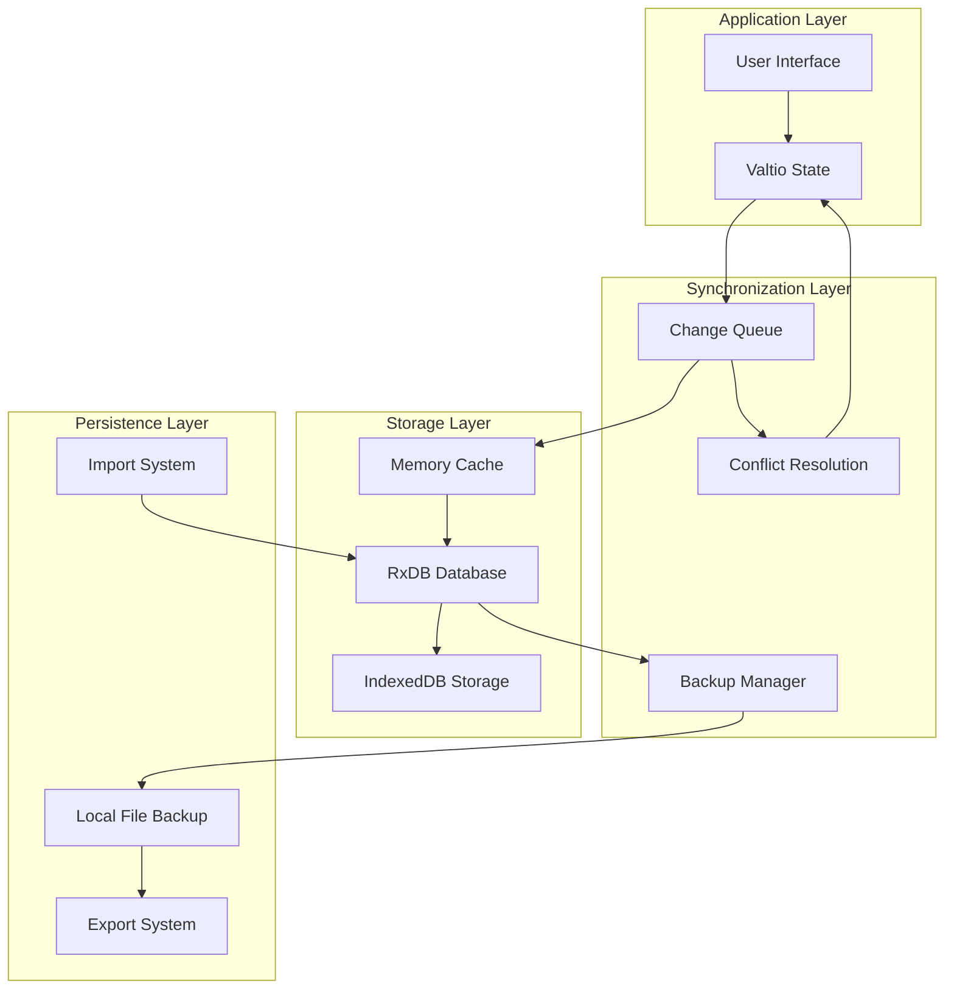
```mermaid
graph TD
    subgraph "Application Layer"
        UI[User Interface]
        State[Valtio State]
    end

    subgraph "Synchronization Layer"
        Queue[Change Queue]
        Conflict[Conflict Resolution]
        Backup[Backup Manager]
    end

    subgraph "Storage Layer"
        Memory[Memory Cache]
        RxDB[RxDB Database]
        IndexedDB[IndexedDB Storage]
    end

    subgraph "Persistence Layer"
        LocalFiles[Local File Backup]
        Export[Export System]
        Import[Import System]
    end

    UI --> State
    State --> Queue
    Queue --> Memory
    Memory --> RxDB
    RxDB --> IndexedDB

    Queue --> Conflict
    Conflict --> State

    RxDB --> Backup
    Backup --> LocalFiles
    LocalFiles --> Export
    Import --> RxDB
```

**Synchronization Strategy:**

```typescript
class DataSynchronizer {
  private changeQueue: ChangeEvent[] = [];
  private isProcessing = false;

  constructor(private database: RxDatabase, private state: EvorBrainState) {
    this.initializeSync();
  }

  private initializeSync(): void {
    // Listen for database changes
    this.database.hierarchicalItems$.subscribe((change) => {
      this.handleDatabaseChange(change);
    });

    // Listen for state changes
    subscribeKey(this.state, "hierarchicalItems", (items) => {
      this.handleStateChange(items);
    });

    // Process queue every 100ms
    setInterval(() => this.processQueue(), 100);
  }

  private async processQueue(): Promise<void> {
    if (this.isProcessing || this.changeQueue.length === 0) return;

    this.isProcessing = true;
    try {
      const batch = this.changeQueue.splice(0, 50); // Process 50 at a time
      await this.processBatch(batch);
    } finally {
      this.isProcessing = false;
    }
  }

  private async processBatch(changes: ChangeEvent[]): Promise<void> {
    const grouped = this.groupChangesByType(changes);

    // Process in order: creates, updates, deletes
    for (const [operation, items] of Object.entries(grouped)) {
      switch (operation) {
        case "create":
          await this.database.hierarchicalItems.bulkInsert(items);
          break;
        case "update":
          await this.database.hierarchicalItems.bulkUpsert(items);
          break;
        case "delete":
          await this.database.hierarchicalItems.bulkRemove(
            items.map((i) => i.id)
          );
          break;
      }
    }
  }

  // Conflict resolution using "last-write-wins" with timestamps
  private resolveConflict(
    local: HierarchicalItem,
    incoming: HierarchicalItem
  ): HierarchicalItem {
    const localTime = new Date(local.updatedAt).getTime();
    const incomingTime = new Date(incoming.updatedAt).getTime();

    if (incomingTime > localTime) {
      return incoming;
    } else if (localTime > incomingTime) {
      return local;
    } else {
      // Same timestamp - merge metadata
      return {
        ...incoming,
        metadata: {
          ...local.metadata,
          ...incoming.metadata,
          tags: [
            ...new Set([...local.metadata.tags, ...incoming.metadata.tags]),
          ],
        },
      };
    }
  }
}
```

**Backup and Recovery Strategy:**

```typescript
class BackupManager {
  constructor(private database: RxDatabase) {}

  // Export complete database to JSON
  async exportDatabase(): Promise<ExportData> {
    const [items, links] = await Promise.all([
      this.database.hierarchicalItems.find().exec(),
      this.database.crossLinks.find().exec(),
    ]);

    return {
      version: "1.0",
      exportDate: new Date().toISOString(),
      data: {
        hierarchicalItems: items.map((doc) => doc.toJSON()),
        crossLinks: links.map((doc) => doc.toJSON()),
      },
      metadata: {
        totalItems: items.length,
        totalLinks: links.length,
        checksum: this.calculateChecksum(items, links),
      },
    };
  }

  // Import database from JSON
  async importDatabase(exportData: ExportData): Promise<void> {
    // Validate data integrity
    if (!this.validateImport(exportData)) {
      throw new Error("Invalid import data");
    }

    // Clear existing data
    await Promise.all([
      this.database.hierarchicalItems.remove(),
      this.database.crossLinks.remove(),
    ]);

    // Import new data
    await Promise.all([
      this.database.hierarchicalItems.bulkInsert(
        exportData.data.hierarchicalItems
      ),
      this.database.crossLinks.bulkInsert(exportData.data.crossLinks),
    ]);
  }

  // Automatic backup scheduling
  scheduleBackups(): void {
    // Daily full backup
    setInterval(async () => {
      const backup = await this.exportDatabase();
      await this.saveBackupToFile(`backup-${Date.now()}.json`, backup);
    }, 24 * 60 * 60 * 1000);

    // Hourly incremental backup
    setInterval(async () => {
      const changes = await this.getRecentChanges();
      if (changes.length > 0) {
        await this.saveIncrementalBackup(changes);
      }
    }, 60 * 60 * 1000);
  }
}
```

**Performance Optimization:**

- **Lazy Loading:** Load hierarchical children on-demand
- **Virtual Scrolling:** Efficient rendering of large lists
- **Debounced Writes:** Batch multiple changes for better performance
- **Index Optimization:** Strategic indexing for common query patterns
- **Memory Management:** Automatic cleanup of unused documents and attachments

---

## 🎨 User Interface & Experience Design

### Design System Architecture

**Chakra UI v3 Theming System:**

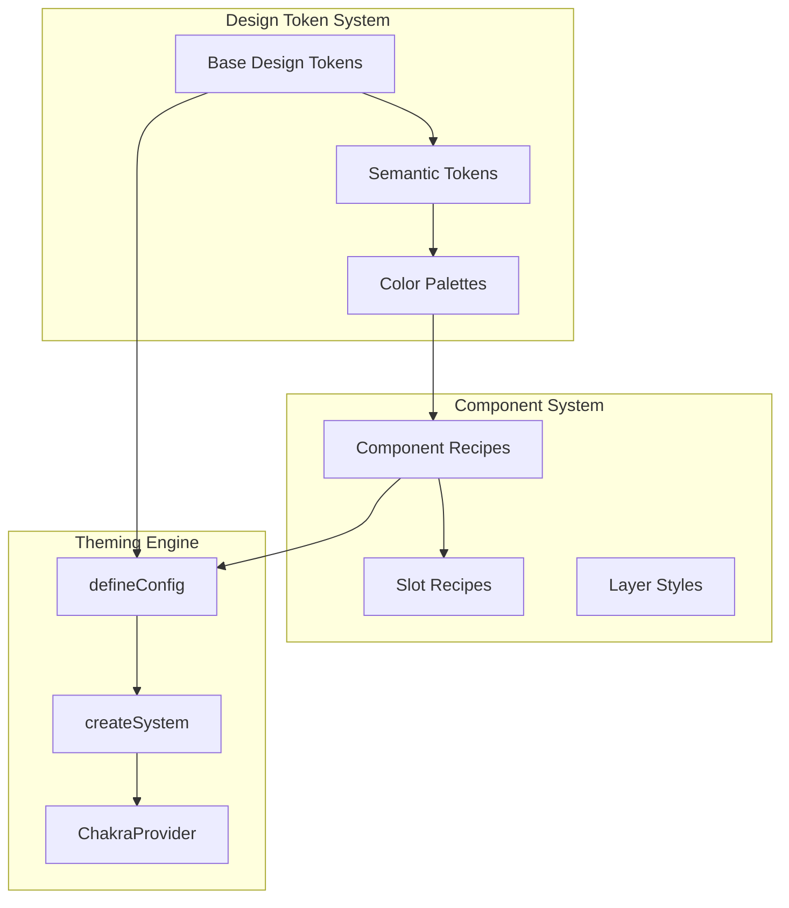
```mermaid
graph TD
    subgraph "Design Token System"
        BaseTokens[Base Design Tokens]
        SemanticTokens[Semantic Tokens]
        ColorPalettes[Color Palettes]
    end

    subgraph "Component System"
        ComponentRecipes[Component Recipes]
        SlotRecipes[Slot Recipes]
        LayerStyles[Layer Styles]
    end

    subgraph "Theming Engine"
        DefineConfig[defineConfig]
        CreateSystem[createSystem]
        ChakraProvider[ChakraProvider]
    end

    BaseTokens --> SemanticTokens
    SemanticTokens --> ColorPalettes
    ColorPalettes --> ComponentRecipes
    ComponentRecipes --> SlotRecipes

    DefineConfig --> CreateSystem
    CreateSystem --> ChakraProvider

    BaseTokens --> DefineConfig
    ComponentRecipes --> DefineConfig
```

**EvorBrain Design System Configuration:**

```typescript
// theme/design-tokens.ts
import { defineConfig, createSystem, defaultConfig } from "@chakra-ui/react";

const evorBrainConfig = defineConfig({
  theme: {
    // Base design tokens
    tokens: {
      colors: {
        // Primary brand colors for life areas
        brand: {
          50: { value: "#f0f9ff" },
          100: { value: "#e0f2fe" },
          200: { value: "#bae6fd" },
          300: { value: "#7dd3fc" },
          400: { value: "#38bdf8" },
          500: { value: "#0ea5e9" }, // Primary brand
          600: { value: "#0284c7" },
          700: { value: "#0369a1" },
          800: { value: "#075985" },
          900: { value: "#0c4a6e" },
          950: { value: "#082f49" },
        },

        // Hierarchical colors for different entity types
        hierarchy: {
          lifeArea: { value: "#6366f1" }, // Indigo for Life Areas
          goal: { value: "#8b5cf6" }, // Purple for Goals
          project: { value: "#06b6d4" }, // Cyan for Projects
          task: { value: "#10b981" }, // Emerald for Tasks
        },

        // Status colors
        status: {
          notStarted: { value: "#6b7280" }, // Gray
          inProgress: { value: "#f59e0b" }, // Amber
          completed: { value: "#10b981" }, // Emerald
          onHold: { value: "#f97316" }, // Orange
          cancelled: { value: "#ef4444" }, // Red
        },

        // Priority colors
        priority: {
          critical: { value: "#dc2626" }, // Red-600
          high: { value: "#ea580c" }, // Orange-600
          medium: { value: "#ca8a04" }, // Yellow-600
          low: { value: "#65a30d" }, // Lime-600
          minimal: { value: "#16a34a" }, // Green-600
        },
      },

      fonts: {
        heading: {
          value: "Inter, -apple-system, BlinkMacSystemFont, sans-serif",
        },
        body: { value: "Inter, -apple-system, BlinkMacSystemFont, sans-serif" },
        mono: {
          value: "JetBrains Mono, Fira Code, Monaco, Consolas, monospace",
        },
      },

      spacing: {
        hierarchy: {
          indent: { value: "24px" }, // Standard indent for hierarchy
          compact: { value: "16px" }, // Compact view indent
          expanded: { value: "32px" }, // Expanded view indent
        },
      },

      sizes: {
        sidebar: {
          collapsed: { value: "64px" },
          expanded: { value: "320px" },
          mobile: { value: "100vw" },
        },
        content: {
          maxWidth: { value: "1200px" },
          minHeight: { value: "100vh" },
        },
      },
    },

    // Semantic tokens for contextual theming
    semanticTokens: {
      colors: {
        // Hierarchical semantic colors
        "hierarchy.lifeArea": {
          solid: { value: "{colors.hierarchy.lifeArea}" },
          subtle: { value: "{colors.hierarchy.lifeArea}20" },
          fg: { value: "{colors.hierarchy.lifeArea}" },
          contrast: { value: "white" },
        },
        "hierarchy.goal": {
          solid: { value: "{colors.hierarchy.goal}" },
          subtle: { value: "{colors.hierarchy.goal}20" },
          fg: { value: "{colors.hierarchy.goal}" },
          contrast: { value: "white" },
        },
        "hierarchy.project": {
          solid: { value: "{colors.hierarchy.project}" },
          subtle: { value: "{colors.hierarchy.project}20" },
          fg: { value: "{colors.hierarchy.project}" },
          contrast: { value: "white" },
        },
        "hierarchy.task": {
          solid: { value: "{colors.hierarchy.task}" },
          subtle: { value: "{colors.hierarchy.task}20" },
          fg: { value: "{colors.hierarchy.task}" },
          contrast: { value: "white" },
        },

        // Dark mode adaptations
        bg: {
          canvas: {
            value: { _light: "white", _dark: "gray.900" },
          },
          subtle: {
            value: { _light: "gray.50", _dark: "gray.800" },
          },
          surface: {
            value: { _light: "white", _dark: "gray.800" },
          },
        },

        border: {
          default: {
            value: { _light: "gray.200", _dark: "gray.700" },
          },
          subtle: {
            value: { _light: "gray.100", _dark: "gray.800" },
          },
        },
      },
    },

    // Custom breakpoints for desktop-first design
    breakpoints: {
      xs: "320px", // Mobile portrait
      sm: "480px", // Mobile landscape
      md: "768px", // Tablet portrait
      lg: "1024px", // Tablet landscape / Small desktop
      xl: "1280px", // Desktop
      "2xl": "1440px", // Large desktop
    },
  },
});

export const system = createSystem(defaultConfig, evorBrainConfig);
```

**Component Recipe System:**

```typescript
// theme/component-recipes.ts
import { defineRecipe, defineSlotRecipe } from "@chakra-ui/react";

// Hierarchical Item Recipe
export const hierarchicalItemRecipe = defineRecipe({
  base: {
    display: "flex",
    alignItems: "center",
    padding: "8px 12px",
    borderRadius: "md",
    cursor: "pointer",
    transition: "all 0.2s",
    _hover: { bg: "bg.subtle" },
    _focus: {
      outline: "2px solid",
      outlineColor: "brand.500",
      outlineOffset: "2px",
    },
  },
  variants: {
    type: {
      lifeArea: {
        borderLeft: "4px solid",
        borderColor: "hierarchy.lifeArea",
        bg: "hierarchy.lifeArea.subtle",
      },
      goal: {
        borderLeft: "4px solid",
        borderColor: "hierarchy.goal",
        bg: "hierarchy.goal.subtle",
        ml: "hierarchy.indent",
      },
      project: {
        borderLeft: "4px solid",
        borderColor: "hierarchy.project",
        bg: "hierarchy.project.subtle",
        ml: "calc({spacing.hierarchy.indent} * 2)",
      },
      task: {
        borderLeft: "4px solid",
        borderColor: "hierarchy.task",
        bg: "hierarchy.task.subtle",
        ml: "calc({spacing.hierarchy.indent} * 3)",
      },
    },
    status: {
      notStarted: { opacity: 0.7 },
      inProgress: {
        boxShadow: "inset 3px 0 0 {colors.status.inProgress}",
      },
      completed: {
        opacity: 0.6,
        textDecoration: "line-through",
        boxShadow: "inset 3px 0 0 {colors.status.completed}",
      },
      onHold: {
        boxShadow: "inset 3px 0 0 {colors.status.onHold}",
      },
    },
    priority: {
      critical: {
        borderRightColor: "priority.critical",
        borderRightWidth: "3px",
      },
      high: { borderRightColor: "priority.high", borderRightWidth: "2px" },
      medium: { borderRightColor: "priority.medium", borderRightWidth: "1px" },
      low: { opacity: 0.8 },
      minimal: { opacity: 0.6 },
    },
  },
  compoundVariants: [
    {
      type: "task",
      status: "completed",
      css: {
        ml: "calc({spacing.hierarchy.indent} * 3)",
        opacity: 0.5,
      },
    },
  ],
});

// Calendar View Recipe
export const calendarSlotRecipe = defineSlotRecipe({
  slots: ["container", "header", "grid", "day", "task"],
  base: {
    container: {
      bg: "bg.surface",
      borderRadius: "lg",
      border: "1px solid",
      borderColor: "border.default",
      overflow: "hidden",
    },
    header: {
      bg: "bg.subtle",
      p: 4,
      borderBottom: "1px solid",
      borderColor: "border.default",
    },
    grid: {
      display: "grid",
      gridTemplateColumns: "repeat(7, 1fr)",
      gap: 1,
    },
    day: {
      minHeight: "120px",
      p: 2,
      bg: "bg.canvas",
      borderRight: "1px solid",
      borderColor: "border.subtle",
      _last: { borderRight: "none" },
    },
    task: {
      fontSize: "xs",
      p: 1,
      mb: 1,
      borderRadius: "sm",
      cursor: "pointer",
      _hover: { transform: "translateY(-1px)" },
    },
  },
  variants: {
    view: {
      week: {
        grid: { gridTemplateColumns: "repeat(7, 1fr)" },
        day: { minHeight: "160px" },
      },
      month: {
        grid: { gridTemplateColumns: "repeat(7, 1fr)" },
        day: { minHeight: "100px" },
      },
    },
  },
});
```

### Responsive Layout Strategy

**Desktop-First Responsive Design:**

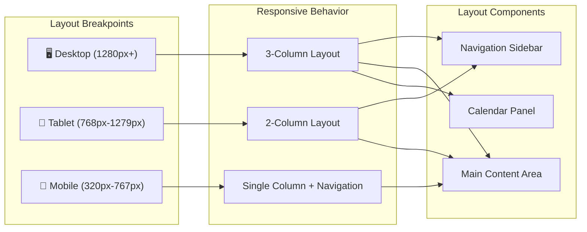
```mermaid
graph LR
    subgraph "Layout Breakpoints"
        Desktop["🖥️ Desktop (1280px+)"]
        Tablet["📱 Tablet (768px-1279px)"]
        Mobile["📱 Mobile (320px-767px)"]
    end

    subgraph "Layout Components"
        Sidebar["Navigation Sidebar"]
        Content["Main Content Area"]
        Calendar["Calendar Panel"]
    end

    subgraph "Responsive Behavior"
        DesktopLayout["3-Column Layout"]
        TabletLayout["2-Column Layout"]
        MobileLayout["Single Column + Navigation"]
    end

    Desktop --> DesktopLayout
    Tablet --> TabletLayout
    Mobile --> MobileLayout

    DesktopLayout --> Sidebar
    DesktopLayout --> Content
    DesktopLayout --> Calendar

    TabletLayout --> Sidebar
    TabletLayout --> Content

    MobileLayout --> Content
```

**Responsive Layout Implementation:**

```typescript
// components/layout/MainLayout.tsx
import { Box, Container, Flex } from "@chakra-ui/react";
import { useState } from "react";

interface MainLayoutProps {
  children: React.ReactNode;
}

export const MainLayout: React.FC<MainLayoutProps> = ({ children }) => {
  const [sidebarCollapsed, setSidebarCollapsed] = useState(false);

  return (
    <Flex h="100vh" overflow="hidden">
      {/* Navigation Sidebar */}
      <Box
        w={{
          base: sidebarCollapsed ? "0" : "100vw",
          md: sidebarCollapsed
            ? "sizes.sidebar.collapsed"
            : "sizes.sidebar.expanded",
          xl: "sizes.sidebar.expanded",
        }}
        bg="bg.surface"
        borderRight="1px solid"
        borderColor="border.default"
        transition="width 0.3s ease"
        overflow="hidden"
        position={{ base: "fixed", md: "relative" }}
        zIndex={{ base: 1000, md: "auto" }}
      >
        <NavigationSidebar
          collapsed={sidebarCollapsed}
          onToggle={() => setSidebarCollapsed(!sidebarCollapsed)}
        />
      </Box>

      {/* Main Content Area */}
      <Flex flex="1" direction="column" overflow="hidden">
        <Box flex="1" overflow="auto">
          {children}
        </Box>
      </Flex>

      {/* Calendar Panel (Desktop only) */}
      <Box
        w="400px"
        bg="bg.surface"
        borderLeft="1px solid"
        borderColor="border.default"
        display={{ base: "none", xl: "block" }}
        overflow="auto"
      >
        <CalendarPanel />
      </Box>
    </Flex>
  );
};
```

**Responsive Design Patterns:**

```typescript
// Responsive component patterns
export const ResponsiveCard = () => (
  <Box
    p={{ base: 4, md: 6, lg: 8 }}
    bg="bg.surface"
    borderRadius={{ base: "md", md: "lg" }}
    boxShadow={{ base: "sm", md: "md" }}
    maxW={{ base: "full", md: "container.md", lg: "container.lg" }}
  >
    Content
  </Box>
);

// Responsive typography scale
export const ResponsiveHeading = ({ children, ...props }) => (
  <Heading
    size={{ base: "md", md: "lg", lg: "xl" }}
    mb={{ base: 2, md: 4 }}
    lineHeight={{ base: "tight", md: "short" }}
    {...props}
  >
    {children}
  </Heading>
);

// Responsive grid system
export const ResponsiveGrid = ({ children }) => (
  <SimpleGrid
    columns={{ base: 1, md: 2, lg: 3, xl: 4 }}
    spacing={{ base: 4, md: 6, lg: 8 }}
  >
    {children}
  </SimpleGrid>
);
```

### Accessibility Considerations

**WCAG 2.1 AA Compliance Implementation:**

```typescript
// accessibility/aria-patterns.ts
export const accessibilityPatterns = {
  // Hierarchical tree navigation
  hierarchicalTree: {
    role: "tree",
    "aria-label": "Project hierarchy navigation",
    "aria-multiselectable": "false",
    "aria-orientation": "vertical",
  },

  treeItem: {
    role: "treeitem",
    tabIndex: -1, // Managed focus
    "aria-level": "dynamic", // Based on hierarchy depth
    "aria-expanded": "dynamic", // Based on collapsed state
    "aria-selected": "dynamic", // Based on selection state
  },

  // Calendar accessibility
  calendar: {
    role: "grid",
    "aria-label": "Weekly task calendar",
    "aria-readonly": "false",
  },

  calendarDay: {
    role: "gridcell",
    tabIndex: -1,
    "aria-label": "dynamic", // Date and task count
    "aria-selected": "dynamic",
  },

  // Modal and dialog accessibility
  modal: {
    role: "dialog",
    "aria-modal": "true",
    "aria-labelledby": "modal-title",
    "aria-describedby": "modal-description",
  },
};
```

**Keyboard Navigation Implementation:**

```typescript
// hooks/useKeyboardNavigation.ts
export const useKeyboardNavigation = (items: HierarchicalItem[]) => {
  const [focusedIndex, setFocusedIndex] = useState(0);
  const [expandedItems, setExpandedItems] = useState<Set<string>>(new Set());

  const handleKeyDown = useCallback(
    (event: KeyboardEvent) => {
      switch (event.key) {
        case "ArrowDown":
          event.preventDefault();
          setFocusedIndex((prev) => Math.min(prev + 1, items.length - 1));
          break;

        case "ArrowUp":
          event.preventDefault();
          setFocusedIndex((prev) => Math.max(prev - 1, 0));
          break;

        case "ArrowRight":
          event.preventDefault();
          const currentItem = items[focusedIndex];
          if (currentItem && !expandedItems.has(currentItem.id)) {
            setExpandedItems((prev) => new Set([...prev, currentItem.id]));
          }
          break;

        case "ArrowLeft":
          event.preventDefault();
          const focusedItem = items[focusedIndex];
          if (focusedItem && expandedItems.has(focusedItem.id)) {
            setExpandedItems((prev) => {
              const newSet = new Set(prev);
              newSet.delete(focusedItem.id);
              return newSet;
            });
          }
          break;

        case "Enter":
        case " ":
          event.preventDefault();
          // Handle selection or activation
          break;

        case "Home":
          event.preventDefault();
          setFocusedIndex(0);
          break;

        case "End":
          event.preventDefault();
          setFocusedIndex(items.length - 1);
          break;
      }
    },
    [items, focusedIndex, expandedItems]
  );

  return {
    focusedIndex,
    expandedItems,
    handleKeyDown,
    setFocusedIndex,
    setExpandedItems,
  };
};
```

**Color Contrast and Visual Accessibility:**

```typescript
// accessibility/color-contrast.ts
export const accessibleColorPairs = {
  // WCAG AA compliant color combinations
  textOnBackground: {
    light: {
      primary: "gray.900", // 15.4:1 contrast
      secondary: "gray.700", // 9.8:1 contrast
      muted: "gray.600", // 7.2:1 contrast
    },
    dark: {
      primary: "gray.50", // 18.1:1 contrast
      secondary: "gray.200", // 12.6:1 contrast
      muted: "gray.400", // 8.1:1 contrast
    },
  },

  // Status colors with sufficient contrast
  statusColors: {
    error: { bg: "red.50", text: "red.800", border: "red.200" },
    warning: { bg: "orange.50", text: "orange.800", border: "orange.200" },
    success: { bg: "green.50", text: "green.800", border: "green.200" },
    info: { bg: "blue.50", text: "blue.800", border: "blue.200" },
  },

  // Focus indicators
  focusRing: {
    color: "brand.500",
    width: "2px",
    offset: "2px",
    style: "solid",
  },
};
```

### User Experience Flows

**Core User Journey Mapping:**

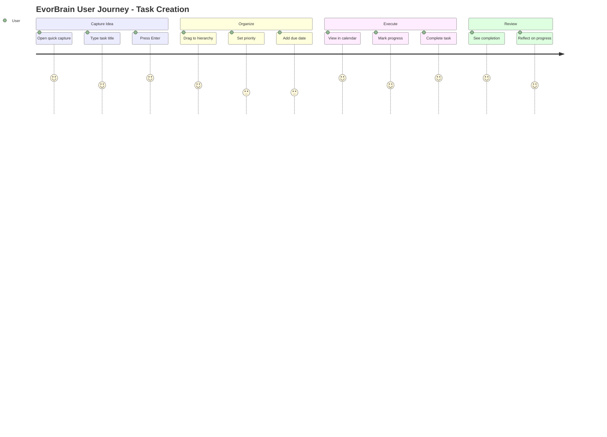
```mermaid
journey
    title EvorBrain User Journey - Task Creation
    section Capture Idea
      Open quick capture: 5: User
      Type task title: 4: User
      Press Enter: 5: User
    section Organize
      Drag to hierarchy: 4: User
      Set priority: 3: User
      Add due date: 3: User
    section Execute
      View in calendar: 5: User
      Mark progress: 4: User
      Complete task: 5: User
    section Review
      See completion: 5: User
      Reflect on progress: 4: User
```

**Interaction Design Patterns:**

```typescript
// ux/interaction-patterns.ts
export const interactionPatterns = {
  // Quick capture workflow
  quickCapture: {
    trigger: "Ctrl+N", // Global shortcut
    workflow: [
      "Show overlay input",
      "Focus on title field",
      "Allow immediate typing",
      "Smart categorization suggestion",
      "One-click to add to hierarchy",
    ],
    success: "Visual confirmation + auto-focus next",
  },

  // Drag and drop hierarchy reorganization
  dragAndDrop: {
    visual: {
      dragPreview: "Semi-transparent item with hierarchy indication",
      dropZones: "Highlighted valid drop targets",
      animations: "Smooth 300ms transitions",
    },
    feedback: {
      valid: "Green highlight + check icon",
      invalid: "Red highlight + X icon",
      success: "Brief scale animation on drop",
    },
  },

  // Progressive disclosure
  progressiveDisclosure: {
    hierarchyExpansion: "Click to expand/collapse with rotation icon",
    detailsPanels: "Slide-in side panel for full item details",
    contextMenus: "Right-click for advanced actions",
  },

  // Optimistic UI updates
  optimisticUpdates: {
    taskCompletion: "Immediate check animation + background sync",
    statusChanges: "Instant visual feedback + server confirmation",
    reordering: "Immediate reposition + background persistence",
  },
};
```

**Mobile-First Touch Interactions:**

```typescript
// ux/touch-interactions.ts
export const touchInteractions = {
  // Gesture mappings
  gestures: {
    swipeRight: "Mark task complete",
    swipeLeft: "Show quick actions menu",
    longPress: "Show context menu",
    pinchZoom: "Adjust calendar view scale",
    pullToRefresh: "Sync data (mobile only)",
  },

  // Touch targets (minimum 44px per Apple/Google guidelines)
  touchTargets: {
    minSize: "44px",
    spacing: "8px",
    iconButtons: "48px",
    textLinks: "44px minimum height",
  },

  // Haptic feedback patterns
  hapticFeedback: {
    taskComplete: "light impact",
    dragStart: "medium impact",
    dragEnd: "heavy impact",
    error: "notification feedback",
    success: "success feedback",
  },
};
```

**Information Architecture:**

```mermaid
sitemap
    title EvorBrain Information Architecture

    root[Main Application]
        navigation[Navigation Sidebar]
            lifeAreas[Life Areas]
                goals[Goals]
                    projects[Projects]
                        tasks[Tasks]
            search[Global Search]
            settings[Settings]

        content[Main Content Area]
            editor[Content Editor]
            details[Item Details]
            links[Cross-References]

        calendar[Calendar Panel]
            weekView[Weekly View]
            monthView[Monthly View]
            taskScheduling[Task Scheduling]

        modals[Modal System]
            quickCapture[Quick Capture]
            confirmations[Confirmations]
            preferences[Preferences]
```

**Performance-Optimized UI Patterns:**

```typescript
// performance/ui-optimization.ts
export const performancePatterns = {
  // Virtual scrolling for large hierarchies
  virtualScrolling: {
    itemHeight: 40, // Fixed height for consistent scrolling
    overscan: 10, // Render extra items for smooth scrolling
    threshold: 100, // Enable virtual scrolling after 100 items
  },

  // Lazy loading strategies
  lazyLoading: {
    images: "Intersection Observer API",
    hierarchyChildren: "Load on expand",
    calendarEvents: "Load current month + 1 month buffer",
    search: "Debounced 300ms",
  },

  // Memoization patterns
  memoization: {
    hierarchyTree: "React.memo with deep comparison",
    calendarDays: "useMemo with date dependency",
    searchResults: "useMemo with query dependency",
    computedStyles: "CSS custom properties for dynamic theming",
  },

  // Loading states
  loadingStates: {
    skeleton: "Placeholder components during data loading",
    progressive: "Show cached content + update indicators",
    optimistic: "Show expected state + rollback on error",
  },
};
```

---

## 🛠️ Development Approach

### Development Methodology

**Agile Development Process with SPARC Integration:**

EvorBrain follows an agile development methodology that integrates the SPARC (Specification, Pseudocode, Architecture, Refinement, Completion) framework for systematic feature development. This approach ensures thorough planning while maintaining development velocity and iterative improvement.

**Development Cycle Structure:**

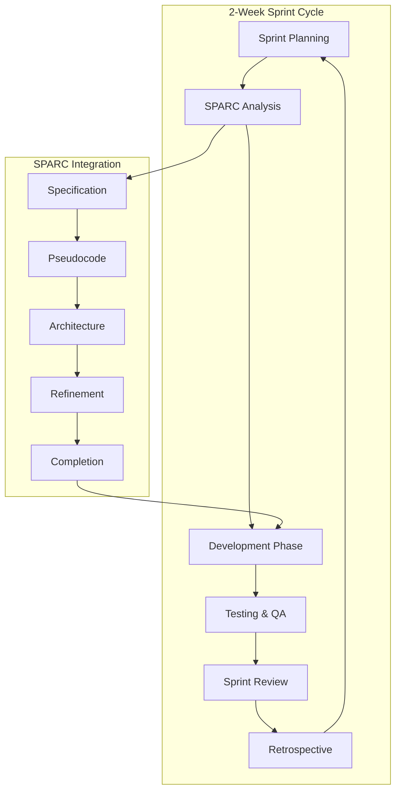
```mermaid
graph TD
    subgraph "2-Week Sprint Cycle"
        Planning[Sprint Planning]
        SPARC[SPARC Analysis]
        Development[Development Phase]
        Testing[Testing & QA]
        Review[Sprint Review]
        Retrospective[Retrospective]
    end

    subgraph "SPARC Integration"
        Spec[Specification]
        Pseudo[Pseudocode]
        Arch[Architecture]
        Refine[Refinement]
        Complete[Completion]
    end

    Planning --> SPARC
    SPARC --> Development
    Development --> Testing
    Testing --> Review
    Review --> Retrospective
    Retrospective --> Planning

    SPARC --> Spec
    Spec --> Pseudo
    Pseudo --> Arch
    Arch --> Refine
    Refine --> Complete
    Complete --> Development
```

**Sprint Planning Process:**

```typescript
// Sprint planning workflow
interface SprintPlanning {
  backlogRefinement: {
    userStoryAnalysis: "SPARC methodology application";
    acceptanceCriteria: "Clear, testable requirements";
    effortEstimation: "Story point estimation with planning poker";
    dependencyMapping: "Technical and business dependencies";
  };

  sprintGoals: {
    primaryObjective: "Single, focused sprint outcome";
    successMetrics: "Quantifiable measures of completion";
    riskAssessment: "Potential blockers and mitigation plans";
  };

  capacityPlanning: {
    teamVelocity: "Historical velocity tracking";
    availableCapacity: "Team member availability and focus time";
    bufferTime: "20% buffer for technical debt and discovery";
  };
}
```

**SPARC Application in Feature Development:**

- **Specification Phase:** Detailed requirements gathering with user story mapping
- **Pseudocode Phase:** High-level algorithm design and data flow planning
- **Architecture Phase:** Component design and integration planning
- **Refinement Phase:** Technical reviews and optimization planning
- **Completion Phase:** Implementation with continuous testing and validation

**Development Workflow:**

```typescript
// Git workflow and branching strategy
const developmentWorkflow = {
  branchStrategy: {
    main: "Production-ready code only",
    develop: "Integration branch for features",
    feature: "feature/SPARC-{phase}-{feature-name}",
    hotfix: "hotfix/{issue-number}-{description}",
  },

  commitConventions: {
    format: "{type}({scope}): {description}",
    types: ["feat", "fix", "docs", "style", "refactor", "test", "chore"],
    scopes: ["ui", "data", "api", "config", "test"],
  },

  codeReview: {
    required: "All code requires peer review",
    criteria: ["Functionality", "Performance", "Security", "Maintainability"],
    tools: ["ESLint", "TypeScript compiler", "Vitest coverage"],
  },
};
```

### Code Organization Strategy

**Modular Architecture with Feature-Based Organization:**

EvorBrain follows a clean, modular architecture that promotes code reusability, testability, and maintainability. The codebase is organized using feature-based modules with clear separation of concerns.

**Project Structure:**

```
src/
├── app/                          # Application entry point
│   ├── App.tsx                   # Main app component
│   ├── app.config.ts            # App-level configuration
│   └── providers/               # Global providers
│       ├── StateProvider.tsx    # Valtio state provider
│       ├── DatabaseProvider.tsx # RxDB database provider
│       └── ThemeProvider.tsx    # Chakra UI theme provider
│
├── features/                    # Feature-based modules
│   ├── hierarchy/               # Hierarchical data management
│   │   ├── components/          # React components
│   │   ├── hooks/              # Custom hooks
│   │   ├── services/           # Business logic services
│   │   ├── types/              # TypeScript interfaces
│   │   └── __tests__/          # Feature-specific tests
│   │
│   ├── calendar/               # Calendar and scheduling
│   ├── search/                 # Global search functionality
│   ├── editor/                 # Content editing
│   └── settings/               # Application settings
│
├── shared/                     # Shared utilities and components
│   ├── components/             # Reusable UI components
│   │   ├── ui/                 # Basic UI primitives
│   │   ├── forms/              # Form components
│   │   └── layout/             # Layout components
│   │
│   ├── hooks/                  # Shared custom hooks
│   ├── utils/                  # Utility functions
│   ├── types/                  # Global TypeScript types
│   ├── constants/              # Application constants
│   └── services/               # Shared services
│
├── data/                       # Data layer
│   ├── database/               # RxDB database configuration
│   ├── schemas/                # Database schemas
│   ├── migrations/             # Database migrations
│   └── repositories/           # Data access repositories
│
└── assets/                     # Static assets
    ├── icons/                  # SVG icons
    ├── images/                 # Images and graphics
    └── fonts/                  # Custom fonts
```

**Dependency Injection Pattern:**

```typescript
// Dependency injection for service layer
interface ServiceContainer {
  database: DatabaseService;
  hierarchyService: HierarchyService;
  searchService: SearchService;
  backupService: BackupService;
}

class ServiceRegistry {
  private services: Map<string, any> = new Map();

  register<T>(name: string, service: T): void {
    this.services.set(name, service);
  }

  get<T>(name: string): T {
    const service = this.services.get(name);
    if (!service) {
      throw new Error(`Service ${name} not found`);
    }
    return service;
  }

  // Automatic dependency resolution
  resolve<T>(constructor: new (...args: any[]) => T): T {
    const dependencies = this.getDependencies(constructor);
    const resolvedDeps = dependencies.map((dep) => this.get(dep));
    return new constructor(...resolvedDeps);
  }
}

// Usage in feature modules
export const useHierarchyService = () => {
  const serviceRegistry = useContext(ServiceRegistryContext);
  return serviceRegistry.get<HierarchyService>("hierarchyService");
};
```

**Feature Module Pattern:**

```typescript
// Example feature module structure
export interface FeatureModule {
  // Public API for the feature
  components: {
    [key: string]: React.ComponentType<any>;
  };

  // Feature-specific hooks
  hooks: {
    [key: string]: (...args: any[]) => any;
  };

  // Business logic services
  services: {
    [key: string]: any;
  };

  // Type definitions
  types: {
    [key: string]: any;
  };
}

// Hierarchy feature module
export const HierarchyModule: FeatureModule = {
  components: {
    HierarchicalTree,
    ItemCard,
    CreateItemModal,
  },

  hooks: {
    useHierarchyNavigation,
    useItemOperations,
    useDragAndDrop,
  },

  services: {
    HierarchyService,
    ItemValidationService,
  },

  types: {
    HierarchicalItem,
    ItemType,
    ItemOperations,
  },
};
```

**Cross-Cutting Concerns:**

```typescript
// Shared patterns for cross-cutting concerns
export const crossCuttingPatterns = {
  // Error handling wrapper
  errorBoundary: {
    component: "ErrorBoundary",
    logging: "Automatic error reporting",
    recovery: "Graceful fallback UI",
  },

  // Loading states
  loadingStates: {
    skeleton: "Consistent skeleton components",
    suspense: "React Suspense boundaries",
    progressive: "Progressive loading patterns",
  },

  // Accessibility
  accessibility: {
    keyboardNavigation: "Consistent keyboard shortcuts",
    ariaLabels: "Comprehensive ARIA support",
    focusManagement: "Proper focus flow",
  },

  // Performance
  performance: {
    memoization: "React.memo and useMemo patterns",
    virtualization: "Virtual scrolling for large lists",
    lazyLoading: "Code splitting and lazy imports",
  },
};
```

### Testing Strategy

**Comprehensive Testing Framework with Vitest + React Testing Library:**

EvorBrain implements a multi-layered testing strategy that ensures code quality, functionality, and user experience. The testing approach covers unit tests, integration tests, and end-to-end scenarios using modern testing tools.

**Testing Architecture:**

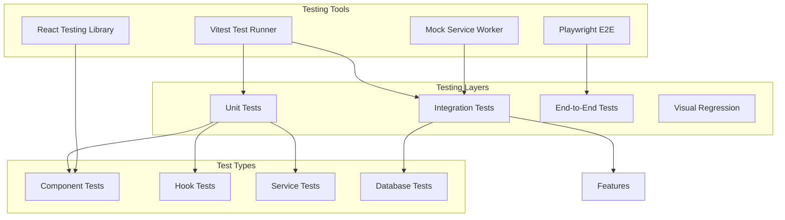
```mermaid
graph TD
    subgraph "Testing Layers"
        Unit[Unit Tests]
        Integration[Integration Tests]
        E2E[End-to-End Tests]
        Visual[Visual Regression]
    end

    subgraph "Testing Tools"
        Vitest[Vitest Test Runner]
        RTL[React Testing Library]
        MSW[Mock Service Worker]
        Playwright[Playwright E2E]
    end

    subgraph "Test Types"
        Components[Component Tests]
        Hooks[Hook Tests]
        Services[Service Tests]
        Database[Database Tests]
    end

    Unit --> Components
    Unit --> Hooks
    Unit --> Services

    Integration --> Database
    Integration --> Features

    Vitest --> Unit
    Vitest --> Integration
    RTL --> Components
    MSW --> Integration
    Playwright --> E2E
```

**Vitest Multi-Environment Configuration:**

```typescript
// vitest.config.ts - Multi-environment testing setup
import { defineConfig } from "vitest/config";
import react from "@vitejs/plugin-react";

export default defineConfig({
  plugins: [react()],
  test: {
    // Multi-project configuration for different test types
    projects: [
      {
        name: "unit",
        test: {
          include: ["**/*.{test,spec}.{ts,tsx}"],
          environment: "node",
          coverage: {
            provider: "v8",
            thresholds: {
              functions: 80,
              lines: 80,
              branches: 75,
              statements: 80,
            },
          },
        },
      },
      {
        name: "browser",
        test: {
          include: ["**/*.browser.test.{ts,tsx}"],
          environment: "happy-dom",
          setupFiles: ["./test-setup/browser-setup.ts"],
        },
      },
      {
        name: "integration",
        test: {
          include: ["**/*.integration.test.{ts,tsx}"],
          environment: "jsdom",
          setupFiles: ["./test-setup/integration-setup.ts"],
          testTimeout: 10000, // Longer timeout for integration tests
        },
      },
      {
        name: "database",
        test: {
          include: ["**/*.database.test.{ts,tsx}"],
          environment: "node",
          setupFiles: ["./test-setup/database-setup.ts"],
          pool: "forks", // Isolate database tests
        },
      },
    ],

    // Global test configuration
    globals: true,
    setupFiles: ["./test-setup/global-setup.ts"],

    // Performance monitoring
    slowTestThreshold: 300,
    bail: 5, // Stop after 5 failures in CI

    // Reporting
    reporters: [
      "default",
      ["html", { outputFile: "coverage/index.html" }],
      ["json", { outputFile: "coverage/coverage.json" }],
    ],
  },
});
```

**React Testing Library Integration:**

```typescript
// test-utils/render.tsx - Enhanced render utility
import React from "react";
import { render as rtlRender, RenderOptions } from "@testing-library/react";
import { ChakraProvider } from "@chakra-ui/react";
import { system } from "../theme/theme-config";
import { DatabaseProvider } from "../providers/DatabaseProvider";
import { StateProvider } from "../providers/StateProvider";

interface CustomRenderOptions extends RenderOptions {
  initialState?: Partial<AppState>;
  dbMock?: Partial<DatabaseService>;
  themeConfig?: typeof system;
}

// Custom render function with all providers
function render(ui: React.ReactElement, options: CustomRenderOptions = {}) {
  const {
    initialState,
    dbMock,
    themeConfig = system,
    ...renderOptions
  } = options;

  function Wrapper({ children }: { children: React.ReactNode }) {
    return (
      <ChakraProvider value={themeConfig}>
        <DatabaseProvider mock={dbMock}>
          <StateProvider initialState={initialState}>{children}</StateProvider>
        </DatabaseProvider>
      </ChakraProvider>
    );
  }

  return rtlRender(ui, { wrapper: Wrapper, ...renderOptions });
}

// Re-export everything
export * from "@testing-library/react";
export { render };
```

**Component Testing Patterns:**

```typescript
// Example component test with user-centric approach
import { render, screen, userEvent } from "../test-utils";
import { HierarchicalTree } from "../features/hierarchy/components/HierarchicalTree";

describe("HierarchicalTree", () => {
  const mockData = [
    {
      id: "1",
      title: "Life Area 1",
      type: "lifeArea",
      children: [{ id: "2", title: "Goal 1", type: "goal", parentId: "1" }],
    },
  ];

  test("renders hierarchical structure correctly", async () => {
    render(<HierarchicalTree data={mockData} />);

    // Test visibility and accessibility
    expect(screen.getByRole("tree")).toBeInTheDocument();
    expect(
      screen.getByRole("treeitem", { name: /life area 1/i })
    ).toBeVisible();

    // Test keyboard navigation
    const lifeAreaItem = screen.getByRole("treeitem", { name: /life area 1/i });
    lifeAreaItem.focus();

    await userEvent.keyboard("{ArrowRight}");
    expect(screen.getByRole("treeitem", { name: /goal 1/i })).toBeVisible();
  });

  test("handles drag and drop operations", async () => {
    const onMove = vi.fn();
    render(<HierarchicalTree data={mockData} onMove={onMove} />);

    const goalItem = screen.getByRole("treeitem", { name: /goal 1/i });

    // Simulate drag and drop
    await userEvent.drag(goalItem, screen.getByTestId("drop-zone-2"));

    expect(onMove).toHaveBeenCalledWith("2", "new-parent-id");
  });

  test("supports accessibility features", () => {
    render(<HierarchicalTree data={mockData} />);

    const tree = screen.getByRole("tree");
    expect(tree).toHaveAttribute("aria-label", "Project hierarchy navigation");
    expect(tree).toHaveAttribute("aria-multiselectable", "false");

    const items = screen.getAllByRole("treeitem");
    items.forEach((item) => {
      expect(item).toHaveAttribute("aria-level");
      expect(item).toHaveAttribute("tabIndex");
    });
  });
});
```

**Service Layer Testing:**

```typescript
// Service testing with dependency injection
import { describe, test, expect, vi, beforeEach } from "vitest";
import { HierarchyService } from "../features/hierarchy/services/HierarchyService";
import { mockDatabase } from "../test-utils/database-mocks";

describe("HierarchyService", () => {
  let service: HierarchyService;
  let mockDb: ReturnType<typeof mockDatabase>;

  beforeEach(() => {
    mockDb = mockDatabase();
    service = new HierarchyService(mockDb);
  });

  test("creates hierarchical item with proper validation", async () => {
    const newItem = {
      title: "New Project",
      type: "project" as const,
      parentId: "goal-1",
    };

    const result = await service.createItem(newItem);

    expect(result).toMatchObject({
      id: expect.any(String),
      title: "New Project",
      type: "project",
      parentId: "goal-1",
      createdAt: expect.any(String),
      updatedAt: expect.any(String),
    });

    expect(mockDb.hierarchicalItems.upsert).toHaveBeenCalledOnce();
  });

  test("handles validation errors correctly", async () => {
    const invalidItem = {
      title: "", // Invalid: empty title
      type: "invalid" as any,
    };

    await expect(service.createItem(invalidItem)).rejects.toThrow(
      "Validation failed: title is required"
    );
  });

  test("optimistic updates work correctly", async () => {
    const item = { id: "1", title: "Test Item", type: "task" as const };

    // Should update state immediately
    const updatePromise = service.updateItem("1", { title: "Updated Title" });

    // State should be updated optimistically
    expect(service.getItem("1")).toMatchObject({
      title: "Updated Title",
    });

    // Wait for persistence
    await updatePromise;

    expect(mockDb.hierarchicalItems.upsert).toHaveBeenCalled();
  });
});
```

**Integration Testing with Mock Service Worker:**

```typescript
// Integration tests with MSW for external services
import { setupServer } from "msw/node";
import { rest } from "msw";
import { render, screen, waitFor } from "../test-utils";
import { SearchFeature } from "../features/search/SearchFeature";

const server = setupServer(
  rest.post("/api/search", (req, res, ctx) => {
    return res(
      ctx.json({
        results: [{ id: "1", title: "Test Result", type: "task" }],
      })
    );
  })
);

beforeAll(() => server.listen());
afterEach(() => server.resetHandlers());
afterAll(() => server.close());

describe("Search Integration", () => {
  test("performs full-text search across hierarchy", async () => {
    render(<SearchFeature />);

    const searchInput = screen.getByRole("searchbox");
    await userEvent.type(searchInput, "test query");

    await waitFor(() => {
      expect(screen.getByText("Test Result")).toBeInTheDocument();
    });

    expect(screen.getByText("1 result found")).toBeInTheDocument();
  });
});
```

**Performance Testing:**

```typescript
// Performance benchmarks for critical operations
import { test, expect } from "vitest";
import { performance } from "perf_hooks";
import { HierarchyService } from "../features/hierarchy/services/HierarchyService";

test("hierarchy operations perform within acceptable limits", async () => {
  const service = new HierarchyService(mockDatabase());

  // Generate large dataset
  const items = Array.from({ length: 10000 }, (_, i) => ({
    id: `item-${i}`,
    title: `Item ${i}`,
    type: "task" as const,
  }));

  // Test bulk operations performance
  const startTime = performance.now();
  await service.bulkCreate(items);
  const endTime = performance.now();

  const duration = endTime - startTime;
  expect(duration).toBeLessThan(1000); // Should complete within 1 second

  // Test search performance
  const searchStart = performance.now();
  const results = await service.search("Item 5000");
  const searchEnd = performance.now();

  expect(searchEnd - searchStart).toBeLessThan(100); // Sub-100ms search
  expect(results.length).toBeGreaterThan(0);
});
```

### Performance Optimization

**Comprehensive Performance Strategy for Desktop Application:**

EvorBrain implements multiple layers of performance optimization to ensure smooth user experience with large datasets and complex hierarchical structures. The optimization strategy covers bundle size, runtime performance, memory management, and database operations.

**Bundle Optimization Strategy:**

```typescript
// vite.config.ts - Production optimization
import { defineConfig } from "vite";
import react from "@vitejs/plugin-react";
import { resolve } from "path";

export default defineConfig({
  plugins: [
    react({
      // Enable SWC for faster compilation
      jsxRuntime: "automatic",
      babel: {
        plugins: [
          // Remove prop-types in production
          [
            "babel-plugin-transform-remove-console",
            { exclude: ["error", "warn"] },
          ],
        ],
      },
    }),
  ],

  build: {
    // Optimize bundle splitting
    rollupOptions: {
      output: {
        manualChunks: {
          // Vendor chunks
          vendor: ["react", "react-dom"],
          ui: ["@chakra-ui/react"],
          state: ["valtio"],
          database: ["rxdb", "rxjs"],

          // Feature-based chunks
          hierarchy: ["./src/features/hierarchy"],
          calendar: ["./src/features/calendar"],
          search: ["./src/features/search"],
          editor: ["./src/features/editor"],
        },
      },
    },

    // Enable advanced optimizations
    target: "esnext",
    minify: "esbuild",
    sourcemap: true,

    // Chunk size warnings
    chunkSizeWarningLimit: 1000,
  },

  // Dependency optimization
  optimizeDeps: {
    include: ["react", "react-dom", "@chakra-ui/react", "valtio", "rxdb"],
  },
});
```

**Runtime Performance Patterns:**

```typescript
// Performance optimization patterns
export const performancePatterns = {
  // Virtual scrolling for large hierarchies
  virtualScrolling: {
    implementation: `
      import { FixedSizeList as List } from 'react-window';
      
      const VirtualizedHierarchy = ({ items }) => (
        <List
          height={600}
          itemCount={items.length}
          itemSize={40}
          overscanCount={10}
        >
          {({ index, style }) => (
            <div style={style}>
              <HierarchyItem item={items[index]} />
            </div>
          )}
        </List>
      );
    `,
    benefits: [
      "Render only visible items",
      "Constant memory usage regardless of dataset size",
      "Smooth scrolling performance",
    ],
  },

  // Memoization strategies
  memoization: {
    componentMemo: `
      const HierarchyItem = React.memo(({ item, onSelect }) => {
        return <div onClick={() => onSelect(item.id)}>{item.title}</div>;
      }, (prevProps, nextProps) => {
        // Custom comparison for deep equality
        return (
          prevProps.item.id === nextProps.item.id &&
          prevProps.item.updatedAt === nextProps.item.updatedAt
        );
      });
    `,

    computedValues: `
      const useHierarchyStats = (items) => {
        return useMemo(() => {
          return {
            totalCount: items.length,
            completedCount: items.filter(item => item.status === 'completed').length,
            byType: items.reduce((acc, item) => {
              acc[item.type] = (acc[item.type] || 0) + 1;
              return acc;
            }, {}),
          };
        }, [items]);
      };
    `,
  },

  // Debounced operations
  debouncedOperations: {
    search: `
      const useDebounceSearch = (searchTerm, delay = 300) => {
        const [debouncedTerm, setDebouncedTerm] = useState(searchTerm);
        
        useEffect(() => {
          const timer = setTimeout(() => setDebouncedTerm(searchTerm), delay);
          return () => clearTimeout(timer);
        }, [searchTerm, delay]);
        
        return debouncedTerm;
      };
    `,

    autosave: `
      const useAutosave = (data, delay = 1000) => {
        const saveData = useCallback(
          debounce(async (dataToSave) => {
            await databaseService.save(dataToSave);
          }, delay),
          [delay]
        );
        
        useEffect(() => {
          saveData(data);
        }, [data, saveData]);
      };
    `,
  },
};
```

**Database Performance Optimization:**

```typescript
// Database performance strategies
export class DatabasePerformanceManager {
  private queryCache: Map<string, any> = new Map();
  private batchQueue: Array<DatabaseOperation> = [];
  private batchTimer: NodeJS.Timeout | null = null;

  // Query optimization with caching
  async optimizedQuery(selector: any, useCache = true): Promise<any[]> {
    const cacheKey = JSON.stringify(selector);

    if (useCache && this.queryCache.has(cacheKey)) {
      return this.queryCache.get(cacheKey);
    }

    const results = await this.database.hierarchicalItems
      .find({
        selector,
        sort: [{ createdAt: "desc" }],
      })
      .exec();

    if (useCache) {
      this.queryCache.set(cacheKey, results);
      // Auto-expire cache after 5 minutes
      setTimeout(() => this.queryCache.delete(cacheKey), 5 * 60 * 1000);
    }

    return results;
  }

  // Batch operations for better performance
  batchOperation(operation: DatabaseOperation): void {
    this.batchQueue.push(operation);

    if (this.batchTimer) {
      clearTimeout(this.batchTimer);
    }

    this.batchTimer = setTimeout(() => {
      this.processBatch();
    }, 100); // Process batch every 100ms
  }

  private async processBatch(): Promise<void> {
    if (this.batchQueue.length === 0) return;

    const operations = [...this.batchQueue];
    this.batchQueue.length = 0;

    // Group operations by type
    const grouped = operations.reduce((acc, op) => {
      acc[op.type] = acc[op.type] || [];
      acc[op.type].push(op);
      return acc;
    }, {} as Record<string, DatabaseOperation[]>);

    // Execute batched operations
    await Promise.all([
      grouped.insert?.length > 0 &&
        this.database.hierarchicalItems.bulkInsert(
          grouped.insert.map((op) => op.data)
        ),
      grouped.update?.length > 0 &&
        this.database.hierarchicalItems.bulkUpsert(
          grouped.update.map((op) => op.data)
        ),
      grouped.delete?.length > 0 &&
        this.database.hierarchicalItems.bulkRemove(
          grouped.delete.map((op) => op.id)
        ),
    ]);

    // Clear relevant caches
    this.queryCache.clear();
  }

  // Index optimization
  async optimizeIndexes(): Promise<void> {
    // Ensure compound indexes for common queries
    await this.database.hierarchicalItems.addIndexes([
      ["type", "parentId"], // Hierarchy queries
      ["type", "status"], // Status filtering
      ["parentId", "priority"], // Priority sorting within parent
      ["type", "metadata.tags"], // Tag-based filtering
      ["dueDate", "status"], // Calendar queries
    ]);
  }
}
```

**Memory Management:**

```typescript
// Memory optimization strategies
export const memoryOptimization = {
  // Lazy loading for large datasets
  lazyDataLoading: {
    hierarchyChildren: `
      const useHierarchyChildren = (parentId: string) => {
        const [children, setChildren] = useState<HierarchicalItem[]>([]);
        const [isLoaded, setIsLoaded] = useState(false);
        
        const loadChildren = useCallback(async () => {
          if (isLoaded) return;
          
          const childItems = await databaseService.findByParent(parentId);
          setChildren(childItems);
          setIsLoaded(true);
        }, [parentId, isLoaded]);
        
        return { children, loadChildren, isLoaded };
      };
    `,

    calendarEvents: `
      const useCalendarEvents = (startDate: Date, endDate: Date) => {
        return useQuery(
          ['calendar-events', startDate, endDate],
          () => databaseService.getEventsBetween(startDate, endDate),
          {
            staleTime: 5 * 60 * 1000, // 5 minutes
            cacheTime: 10 * 60 * 1000, // 10 minutes
            keepPreviousData: true,
          }
        );
      };
    `,
  },

  // Memory cleanup patterns
  memoryCleanup: {
    componentCleanup: `
      useEffect(() => {
        const subscription = databaseService.changes$.subscribe(handleChange);
        const timer = setInterval(performPeriodicTask, 60000);
        
        return () => {
          subscription.unsubscribe();
          clearInterval(timer);
          // Clear component-specific caches
          componentCache.clear();
        };
      }, []);
    `,

    weakReferences: `
      class ComponentCache {
        private cache = new WeakMap<object, any>();
        
        set(key: object, value: any): void {
          this.cache.set(key, value);
        }
        
        get(key: object): any {
          return this.cache.get(key);
        }
        
        // Automatic cleanup when objects are garbage collected
      }
    `,
  },

  // Resource monitoring
  resourceMonitoring: {
    memoryUsage: `
      const useMemoryMonitor = () => {
        const [memoryUsage, setMemoryUsage] = useState<MemoryInfo | null>(null);
        
        useEffect(() => {
          const monitor = () => {
            if ('memory' in performance) {
              setMemoryUsage({
                used: performance.memory.usedJSHeapSize,
                total: performance.memory.totalJSHeapSize,
                limit: performance.memory.jsHeapSizeLimit,
              });
            }
          };
          
          const interval = setInterval(monitor, 5000);
          return () => clearInterval(interval);
        }, []);
        
        return memoryUsage;
      };
    `,
  },
};
```

**Performance Monitoring and Analytics:**

```typescript
// Performance monitoring implementation
export class PerformanceMonitor {
  private metrics: Map<string, PerformanceMetric[]> = new Map();

  // Measure operation performance
  measure<T>(operation: string, fn: () => Promise<T>): Promise<T> {
    const start = performance.now();

    return fn().then(
      (result) => {
        this.recordMetric(operation, performance.now() - start, "success");
        return result;
      },
      (error) => {
        this.recordMetric(operation, performance.now() - start, "error");
        throw error;
      }
    );
  }

  // Component render time tracking
  useRenderTime(componentName: string): void {
    useEffect(() => {
      const start = performance.now();

      return () => {
        const renderTime = performance.now() - start;
        this.recordMetric(`render:${componentName}`, renderTime, "success");
      };
    });
  }

  // Database operation tracking
  trackDatabaseOperation(operation: string, duration: number): void {
    this.recordMetric(`db:${operation}`, duration, "success");

    // Alert on slow operations
    if (duration > 1000) {
      console.warn(`Slow database operation: ${operation} took ${duration}ms`);
    }
  }

  // Performance reporting
  generateReport(): PerformanceReport {
    const report: PerformanceReport = {
      timestamp: Date.now(),
      metrics: {},
    };

    this.metrics.forEach((metrics, operation) => {
      report.metrics[operation] = {
        count: metrics.length,
        averageTime:
          metrics.reduce((sum, m) => sum + m.duration, 0) / metrics.length,
        minTime: Math.min(...metrics.map((m) => m.duration)),
        maxTime: Math.max(...metrics.map((m) => m.duration)),
        successRate:
          metrics.filter((m) => m.status === "success").length / metrics.length,
      };
    });

    return report;
  }

  private recordMetric(
    operation: string,
    duration: number,
    status: "success" | "error"
  ): void {
    if (!this.metrics.has(operation)) {
      this.metrics.set(operation, []);
    }

    const metrics = this.metrics.get(operation)!;
    metrics.push({
      timestamp: Date.now(),
      duration,
      status,
    });

    // Keep only recent metrics (last 1000 entries)
    if (metrics.length > 1000) {
      metrics.splice(0, metrics.length - 1000);
    }
  }
}
```

---

## 🚀 Future Roadmap & Extensibility

### Phase-Based Implementation

**Strategic Development Phases with Milestone Planning:**

EvorBrain development follows a structured phase-based approach with clear milestones and deliverables:

#### Phase 1: Core Foundation (Weeks 1-8)

**MVP Implementation with Essential Features**

**Sprint 1-2: Project Structure & Core Infrastructure**

- [ ] Initialize Tauri 2.0 + Vite project with TypeScript configuration
- [ ] Set up RxDB database with schema definitions for hierarchical data
- [ ] Implement basic Chakra UI theming system with design tokens
- [ ] Create foundational state management with Valtio proxies
- [ ] Establish testing framework with Vitest multi-environment configuration

**Sprint 3-4: Hierarchical Data Management**

- [ ] Implement Life Area creation, editing, and organization
- [ ] Build Goal management system with Life Area associations
- [ ] Create Project structure with Goal relationships and progress tracking
- [ ] Develop Task system with project associations and status management
- [ ] Add basic CRUD operations for all hierarchical entities

**Sprint 5-6: Core User Interface**

- [ ] Design and implement main navigation with hierarchical sidebar
- [ ] Create Life Area overview dashboard with goal progress indicators
- [ ] Build Goal detail view with project listings and completion metrics
- [ ] Develop Project management interface with task organization
- [ ] Implement Task creation, editing, and status update functionality

**Sprint 7-8: Basic Calendar Integration**

- [ ] Implement weekly calendar view with task scheduling
- [ ] Add task drag-and-drop functionality for calendar assignment
- [ ] Create date-based filtering and task organization
- [ ] Build basic time allocation and schedule management features

**Phase 1 Deliverables:**

- Functional desktop application with hierarchical project management
- Basic calendar integration for task scheduling
- Local-only data storage with offline capability
- Essential CRUD operations for all data entities
- Foundational UI/UX with responsive design

#### Phase 2: Enhanced Functionality (Weeks 9-16)

**Advanced Features and User Experience Optimization**

**Sprint 9-10: Advanced Calendar Features**

- [ ] Implement multiple calendar view modes (day, week, month)
- [ ] Add recurring task scheduling and management
- [ ] Create calendar event conflict detection and resolution
- [ ] Build time blocking and focus session planning features
- [ ] Implement deadline tracking and notification system

**Sprint 11-12: Linking and Relationship System**

- [ ] Develop flexible cross-entity linking mechanism
- [ ] Implement tag system for categorization and organization
- [ ] Create dependency tracking between projects and tasks
- [ ] Add reference system for external documents and resources
- [ ] Build relationship visualization and navigation features

**Sprint 13-14: Search and Organization**

- [ ] Implement full-text search across all entities
- [ ] Add advanced filtering and sorting capabilities
- [ ] Create saved search and smart folder functionality
- [ ] Build context-aware suggestions and recommendations
- [ ] Implement bulk operations for task and project management

**Sprint 15-16: Data Export and Backup**

- [ ] Create comprehensive data export functionality (JSON, CSV, Markdown)
- [ ] Implement automated backup and restore capabilities
- [ ] Add data migration tools for upgrades and transfers
- [ ] Build data integrity validation and repair tools

**Phase 2 Deliverables:**

- Advanced calendar management with multiple view modes
- Comprehensive linking and relationship system
- Powerful search and organization capabilities
- Robust data export and backup functionality
- Enhanced user experience with intelligent features

#### Phase 3: Extensibility and Polish (Weeks 17-24)

**Plugin Architecture and Advanced Customization**

**Sprint 17-18: Plugin Framework**

- [ ] Design and implement core plugin architecture
- [ ] Create plugin API with standardized interfaces
- [ ] Build plugin manager with installation and configuration
- [ ] Develop example plugins for common use cases
- [ ] Implement plugin security sandbox and validation

**Sprint 19-20: Customization and Theming**

- [ ] Expand theming system with user-customizable design tokens
- [ ] Implement layout customization and workspace configuration
- [ ] Add keyboard shortcut customization and command palette
- [ ] Create user preference management with profile export/import
- [ ] Build accessibility enhancements and compliance features

**Sprint 21-22: Performance Optimization**

- [ ] Implement virtual scrolling for large data sets
- [ ] Add progressive data loading and caching strategies
- [ ] Optimize database queries and indexing performance
- [ ] Build performance monitoring and profiling tools
- [ ] Implement memory management and garbage collection optimization

**Sprint 23-24: Documentation and Distribution**

- [ ] Create comprehensive user documentation and tutorials
- [ ] Build developer documentation for plugin development
- [ ] Implement auto-update mechanism for application distribution
- [ ] Add crash reporting and error tracking capabilities
- [ ] Prepare cross-platform packaging and distribution pipeline

**Phase 3 Deliverables:**

- Extensible plugin architecture with example implementations
- Advanced customization and theming capabilities
- Optimized performance for large-scale data management
- Comprehensive documentation and distribution system
- Production-ready application with professional polish

### Extensibility Architecture

**Plugin System Design for Maximum Flexibility:**

#### Core Plugin Framework

```typescript
interface PluginManifest {
  id: string;
  name: string;
  version: string;
  description: string;
  author: string;
  permissions: PluginPermission[];
  entryPoint: string;
  dependencies?: string[];
}

interface PluginAPI {
  // Data Access Layer
  database: {
    read: (collection: string, query: object) => Promise<any[]>;
    write: (collection: string, data: object) => Promise<string>;
    subscribe: (collection: string, callback: Function) => Subscription;
  };

  // UI Extension Points
  ui: {
    registerView: (location: ViewLocation, component: Component) => void;
    registerCommand: (command: Command) => void;
    showNotification: (message: string, type: NotificationType) => void;
  };

  // State Management
  state: {
    getGlobalState: () => Readonly<GlobalState>;
    updateState: (path: string, value: any) => void;
    subscribeToState: (path: string, callback: Function) => Subscription;
  };

  // Utility Functions
  utils: {
    storage: LocalStorage;
    http: HttpClient;
    crypto: CryptoUtils;
    dates: DateUtils;
  };
}
```

#### Extension Points and Hooks

**Strategic Plugin Integration Opportunities:**

1. **View Extensions:**

   - Custom dashboard widgets and cards
   - Alternative calendar view implementations
   - Specialized project and task visualization
   - Custom report and analytics views

2. **Data Processing Plugins:**

   - Import/export format converters
   - Data synchronization with external services
   - Automated task generation from external sources
   - Advanced analytics and reporting engines

3. **Workflow Automation:**

   - Custom automation rules and triggers
   - Integration with external productivity tools
   - Notification and reminder systems
   - Time tracking and productivity analysis

4. **Theming and Customization:**
   - Custom theme packages with design systems
   - Layout templates and workspace configurations
   - Icon packs and visual customizations
   - Accessibility enhancement plugins

#### Plugin Security and Sandboxing

```typescript
enum PluginPermission {
  READ_DATA = "read:data",
  WRITE_DATA = "write:data",
  NETWORK_ACCESS = "network:access",
  FILE_SYSTEM = "fs:access",
  NOTIFICATIONS = "notifications:show",
  UI_MODIFY = "ui:modify",
}

interface PluginSandbox {
  permissions: PluginPermission[];
  memoryLimit: number;
  networkAllowlist: string[];
  fileSystemPaths: string[];
  apiCallLimit: number;
}
```

### Scaling Considerations

**Performance Optimization for Growth and Scale:**

#### Data Volume Scaling

**Strategies for Large-Scale Data Management:**

1. **Database Optimization:**

   - Implement data archiving for completed projects (>6 months old)
   - Add database compression for historical data storage
   - Create selective synchronization for active vs. archived data
   - Implement incremental backup strategies for large datasets

2. **Query Performance:**

   - Add compound indexes for common query patterns
   - Implement query result caching with invalidation strategies
   - Use pagination for large result sets in UI components
   - Add background data processing for expensive operations

3. **Memory Management:**
   - Implement lazy loading for hierarchical data structures
   - Add data virtualization for large lists and calendars
   - Use memory pooling for frequently created/destroyed objects
   - Implement garbage collection monitoring and optimization

#### User Interface Scaling

**Responsive Design for Complex Data Hierarchies:**

1. **Virtual Scrolling Implementation:**

   ```typescript
   interface VirtualScrollConfig {
     itemHeight: number;
     overscan: number;
     estimatedItemCount: number;
     renderThreshold: number;
   }

   class VirtualListManager {
     private visibleRange: { start: number; end: number };
     private renderBuffer: Map<number, React.ReactElement>;

     updateVisibleItems(scrollTop: number, containerHeight: number): void;
     renderVisibleItems(): React.ReactElement[];
     handleDataUpdates(newData: any[]): void;
   }
   ```

2. **Progressive Loading Strategies:**

   - Load hierarchical data incrementally (Life Areas → Goals → Projects → Tasks)
   - Implement skeleton loading for improved perceived performance
   - Add background data prefetching for anticipated user navigation
   - Use intersection observers for on-demand data loading

3. **State Management Optimization:**
   - Implement selective state updates for performance-critical components
   - Add state normalization for complex hierarchical relationships
   - Use memo hooks and React optimization patterns strategically
   - Implement state persistence with compression for large datasets

#### Feature Complexity Management

**Architectural Patterns for Sustainable Growth:**

1. **Modular Feature Architecture:**

   ```typescript
   interface FeatureModule {
     id: string;
     name: string;
     dependencies: string[];
     components: ComponentRegistry;
     services: ServiceRegistry;
     routes: RouteDefinition[];
     initialize: (context: ApplicationContext) => Promise<void>;
     cleanup: () => Promise<void>;
   }

   class FeatureManager {
     private modules: Map<string, FeatureModule>;

     loadFeature(moduleId: string): Promise<void>;
     unloadFeature(moduleId: string): Promise<void>;
     getFeatureDependencies(moduleId: string): string[];
   }
   ```

2. **Service Layer Scaling:**
   - Implement service worker for background processing
   - Add request queuing and batching for database operations
   - Use worker threads for CPU-intensive operations
   - Implement circuit breaker pattern for external integrations

### Technology Evolution

**Future Technology Adoption and Migration Strategies:**

#### Technology Upgrade Pathways

**Planned Technology Evolution Timeline:**

1. **Short-term (6-12 months):**

   - **React 19 Migration:** Leverage new concurrent features and automatic batching
   - **Tauri 2.1+:** Adopt enhanced security features and performance improvements
   - **Chakra UI v3 Stable:** Implement stable design system patterns
   - **TypeScript 5.5+:** Utilize improved type inference and performance

2. **Medium-term (12-24 months):**

   - **React Server Components:** Explore adoption for improved performance
   - **WebAssembly Integration:** Consider WASM for performance-critical operations
   - **IndexedDB Evolution:** Migrate to newer storage APIs as they become available
   - **CSS Container Queries:** Implement advanced responsive design patterns

3. **Long-term (24+ months):**
   - **Web Standards Evolution:** Adopt new web platform capabilities
   - **Cross-platform Expansion:** Evaluate mobile app development strategies
   - **AI/ML Integration:** Explore intelligent task management and recommendations
   - **Cloud Synchronization:** Optional cloud sync while maintaining local-first approach

#### Migration Strategy Framework

```typescript
interface MigrationPlan {
  fromVersion: string;
  toVersion: string;
  breakingChanges: BreakingChange[];
  migrationSteps: MigrationStep[];
  rollbackStrategy: RollbackPlan;
  validationRules: ValidationRule[];
}

interface BreakingChange {
  component: string;
  description: string;
  impact: "low" | "medium" | "high";
  mitigationStrategy: string;
}

class MigrationManager {
  executeMigration(plan: MigrationPlan): Promise<MigrationResult>;
  validateMigration(plan: MigrationPlan): Promise<ValidationResult>;
  rollbackMigration(plan: MigrationPlan): Promise<RollbackResult>;
}
```

#### Technology Risk Mitigation

**Strategies for Managing Technology Dependencies:**

1. **Dependency Management:**

   - Maintain dependency update schedule with security patches
   - Use automated dependency scanning for vulnerability detection
   - Implement gradual rollout strategy for major dependency updates
   - Maintain fork strategy for critical dependencies with modification needs

2. **Backwards Compatibility:**

   - Design APIs with versioning strategy from the beginning
   - Implement feature flags for gradual rollout of new functionality
   - Maintain data format compatibility across application versions
   - Create automated testing for upgrade/downgrade scenarios

3. **Platform Evolution:**
   - Monitor Tauri roadmap for breaking changes and new capabilities
   - Track React ecosystem evolution for performance and feature opportunities
   - Evaluate alternative technologies periodically for strategic advantages
   - Maintain proof-of-concept implementations for technology evaluation

**Technology Decision Matrix:**
| Technology | Current Status | Upgrade Timeline | Risk Level | Business Impact |
|------------|---------------|------------------|------------|-----------------|
| React 19 | Stable | Q1 2025 | Low | High Performance |
| Tauri 2.0 | Stable | Current | Low | Core Platform |
| TypeScript 5.4+ | Stable | Q2 2025 | Low | Developer Experience |
| Chakra UI v3 | Beta | Q1 2025 | Medium | UI Consistency |
| RxDB 15+ | Stable | Q3 2025 | Medium | Data Management |
| Valtio 2.0+ | Stable | Q2 2025 | Low | State Management |

This roadmap ensures EvorBrain remains technologically current while maintaining stability and providing clear upgrade paths for future enhancements.

---

## ⚠️ Risk Assessment & Mitigation

### Technical Risks

**Technology Stack Specific Risks and Mitigation Strategies:**

#### Tauri 2.0 Platform Risks

**Risk Level: Medium**

**Risk Factors:**

- Tauri ecosystem is relatively newer compared to Electron alternatives
- Potential for breaking changes in major version updates
- Limited community resources and troubleshooting documentation
- Cross-platform compatibility issues with specific OS versions

**Mitigation Strategies:**

```typescript
// Risk Mitigation Implementation
interface PlatformCompatibility {
  supportedVersions: {
    windows: string[];
    macos: string[];
    linux: string[];
  };
  fallbackMechanisms: FallbackStrategy[];
  testingMatrix: PlatformTestConfig[];
}

class PlatformRiskManager {
  private supportMatrix: PlatformCompatibility;

  validatePlatformSupport(platform: string, version: string): boolean;
  implementFallback(feature: string, platform: string): void;
  monitorPlatformCompatibility(): void;
}
```

**Specific Mitigation Actions:**

- Maintain comprehensive testing matrix across Windows 10/11, macOS 12+, Ubuntu 20.04+
- Implement feature detection with graceful degradation for unsupported capabilities
- Establish regular monitoring of Tauri release cycle and breaking change notifications
- Create automated compatibility testing pipeline for each platform target
- Maintain fallback UI implementations for platform-specific features

#### RxDB + IndexedDB Storage Risks

**Risk Level: Medium-High**

**Risk Factors:**

- IndexedDB browser storage limitations (typically 50% of available disk space)
- Potential data corruption during unexpected application shutdown
- Complex migration scenarios for schema changes across versions
- Performance degradation with large datasets (>100,000 records)

**Mitigation Strategies:**

```typescript
interface StorageRiskMitigation {
  quotaManagement: {
    maxStoragePercentage: number;
    warningThresholds: number[];
    cleanupStrategies: CleanupStrategy[];
  };
  dataIntegrity: {
    checksumValidation: boolean;
    transactionLogging: boolean;
    automaticBackups: BackupConfig;
  };
  performanceOptimization: {
    indexingStrategy: IndexConfig[];
    paginationLimits: number;
    backgroundProcessing: ProcessingConfig;
  };
}

class StorageRiskManager {
  private config: StorageRiskMitigation;

  monitorStorageQuota(): Promise<StorageQuotaStatus>;
  validateDataIntegrity(): Promise<IntegrityReport>;
  optimizePerformance(): Promise<OptimizationResult>;
  handleCorruption(): Promise<RecoveryResult>;
}
```

**Specific Mitigation Actions:**

- Implement progressive data archiving for projects older than 6 months
- Add automated data integrity checks with checksums and validation
- Create incremental backup system with configurable retention policies
- Design schema migration tools with rollback capabilities
- Implement storage quota monitoring with user warnings at 80% capacity

#### React 19 + TypeScript Integration Risks

**Risk Level: Low-Medium**

**Risk Factors:**

- React 19 is relatively new with potential undiscovered edge cases
- TypeScript type inference changes may break existing patterns
- Server Components integration complexity if adopted later
- Concurrent features may introduce subtle race conditions

**Mitigation Strategies:**

```typescript
interface ReactRiskMitigation {
  versionLocking: {
    reactVersion: string;
    typescriptVersion: string;
    testingFrameworkVersions: Record<string, string>;
  };
  gradualAdoption: {
    featureFlags: FeatureFlag[];
    rolloutStrategy: RolloutPhase[];
    fallbackComponents: ComponentFallback[];
  };
  concurrencyHandling: {
    raceConditionDetection: boolean;
    stateConsistencyValidation: boolean;
    errorBoundaryStrategy: ErrorBoundaryConfig;
  };
}
```

**Specific Mitigation Actions:**

- Lock React and TypeScript versions during development phase
- Implement comprehensive integration testing for React 19 specific features
- Create error boundaries for concurrent feature edge cases
- Maintain backwards compatibility layers for critical components
- Establish automated testing for TypeScript type checking across all components

### Performance Risks

**Storage, Memory, and Database Performance Bottlenecks:**

#### Large Dataset Performance Risks

**Risk Level: High**

**Risk Factors:**

- UI responsiveness degradation with >10,000 tasks or >1,000 projects
- Memory consumption growth with hierarchical data expansion
- Database query performance degradation without proper indexing
- Calendar view performance with dense task scheduling

**Mitigation Strategies:**

```typescript
interface PerformanceRiskMitigation {
  dataVirtualization: {
    listVirtualization: VirtualScrollConfig;
    calendarVirtualization: CalendarVirtualConfig;
    hierarchyLazyLoading: LazyLoadConfig;
  };
  memoryManagement: {
    componentMemoization: MemoizationStrategy;
    stateNormalization: NormalizationConfig;
    garbageCollectionOptimization: GCConfig;
  };
  databaseOptimization: {
    indexingStrategy: DatabaseIndex[];
    queryOptimization: QueryOptimizationConfig;
    backgroundProcessing: BackgroundProcessConfig;
  };
}

class PerformanceRiskManager {
  private config: PerformanceRiskMitigation;
  private metrics: PerformanceMetrics;

  monitorMemoryUsage(): Promise<MemoryReport>;
  optimizeQueries(): Promise<QueryOptimizationResult>;
  implementVirtualization(): Promise<VirtualizationResult>;
  handlePerformanceDegradation(): Promise<OptimizationActions>;
}
```

**Specific Mitigation Actions:**

- Implement virtual scrolling for lists exceeding 100 items
- Add memory usage monitoring with automatic cleanup triggers
- Create database query optimization with automated indexing suggestions
- Design progressive loading for hierarchical data structures
- Implement performance budgets with automated alerts for degradation

#### Memory Leak Prevention

**Risk Level: Medium**

**Risk Factors:**

- React component cleanup failures leading to memory accumulation
- RxDB subscription leaks from improper cleanup
- Valtio proxy reference retention causing memory bloat
- Calendar event listeners not properly removed

**Mitigation Strategies:**

```typescript
interface MemoryLeakPrevention {
  subscriptionManagement: {
    automaticCleanup: boolean;
    subscriptionRegistry: SubscriptionRegistry;
    leakDetection: LeakDetectionConfig;
  };
  componentLifecycle: {
    cleanupValidation: boolean;
    memoryProfileIntegration: boolean;
    automaticDisposal: DisposalConfig;
  };
  proxyManagement: {
    referenceTracking: boolean;
    automaticGarbageCollection: boolean;
    weakReferenceStrategy: WeakRefConfig;
  };
}

class MemoryLeakManager {
  private subscriptions: WeakMap<Component, Subscription[]>;
  private proxies: WeakSet<ProxyObject>;

  trackSubscription(component: Component, subscription: Subscription): void;
  cleanupComponent(component: Component): void;
  detectLeaks(): Promise<LeakReport>;
  preventProxyRetention(): void;
}
```

**Specific Mitigation Actions:**

- Implement automatic subscription cleanup in component unmount hooks
- Add memory profiling integration for development environment
- Create proxy reference tracking with weak reference patterns
- Design automated leak detection with performance monitoring
- Establish memory usage baselines with regression testing

#### Database Performance Bottlenecks

**Risk Level: Medium-High**

**Risk Factors:**

- Complex hierarchical queries causing performance degradation
- Full-text search performance issues with large content volumes
- Concurrent read/write operations creating bottlenecks
- Index optimization requirements for evolving query patterns

**Mitigation Strategies:**

```typescript
interface DatabasePerformanceMitigation {
  queryOptimization: {
    indexStrategy: IndexOptimizationConfig;
    queryPlanAnalysis: QueryAnalysisConfig;
    cachingStrategy: QueryCacheConfig;
  };
  concurrencyManagement: {
    readWriteOptimization: ConcurrencyConfig;
    transactionBatching: BatchingConfig;
    lockContentionPrevention: LockConfig;
  };
  searchOptimization: {
    fullTextIndexing: SearchIndexConfig;
    searchResultCaching: SearchCacheConfig;
    incrementalIndexing: IncrementalIndexConfig;
  };
}

class DatabasePerformanceManager {
  private queryAnalyzer: QueryAnalyzer;
  private cacheManager: CacheManager;

  optimizeQuery(query: DatabaseQuery): Promise<OptimizedQuery>;
  manageConcurrency(
    operations: DatabaseOperation[]
  ): Promise<ConcurrencyResult>;
  updateIndexes(dataChanges: DataChangeLog): Promise<IndexUpdateResult>;
  monitorPerformance(): Promise<PerformanceMetrics>;
}
```

**Specific Mitigation Actions:**

- Implement compound indexes for common hierarchical query patterns
- Add query result caching with intelligent invalidation strategies
- Create background indexing for full-text search optimization
- Design transaction batching for bulk operations
- Establish query performance monitoring with automated optimization suggestions

### Security Considerations

**Local-First Architecture Security and Data Privacy Protection:**

#### Data Privacy and Encryption Risks

**Risk Level: Medium**

**Risk Factors:**

- Sensitive project data stored in plaintext in local database
- Potential data access from other applications on the system
- User data privacy concerns with local storage accessibility
- Cross-application data leakage through shared system resources

**Mitigation Strategies:**

```typescript
interface DataPrivacyProtection {
  encryptionStrategy: {
    atRestEncryption: EncryptionConfig;
    keyManagement: KeyManagementConfig;
    dataClassification: DataClassificationConfig;
  };
  accessControl: {
    filePermissions: FilePermissionConfig;
    processIsolation: IsolationConfig;
    dataSegmentation: SegmentationConfig;
  };
  privacyCompliance: {
    dataMinimization: MinimizationConfig;
    retentionPolicies: RetentionConfig;
    auditLogging: AuditConfig;
  };
}

class DataPrivacyManager {
  private encryptionService: EncryptionService;
  private accessController: AccessController;

  encryptSensitiveData(data: SensitiveData): Promise<EncryptedData>;
  validateFilePermissions(): Promise<PermissionReport>;
  auditDataAccess(): Promise<AccessAuditReport>;
  enforceRetentionPolicies(): Promise<RetentionReport>;
}
```

**Specific Mitigation Actions:**

- Implement AES-256 encryption for sensitive project data
- Add user-controlled data classification with encryption levels
- Create secure key derivation from user-provided passphrases
- Design file permission validation with restricted access patterns
- Establish data retention policies with automated cleanup

#### Application Security Risks

**Risk Level: Low-Medium**

**Risk Factors:**

- Tauri security capabilities requiring proper configuration
- Potential code injection through user input in project descriptions
- File system access vulnerabilities in plugin architecture
- Cross-site scripting risks in rich text editing features

**Mitigation Strategies:**

```typescript
interface ApplicationSecurityConfig {
  tauriSecurity: {
    cspConfiguration: CSPConfig;
    allowlistConfiguration: AllowlistConfig;
    processIsolation: ProcessIsolationConfig;
  };
  inputValidation: {
    sanitizationRules: SanitizationConfig;
    validationSchemas: ValidationSchemaConfig;
    xssProtection: XSSProtectionConfig;
  };
  pluginSecurity: {
    sandboxConfiguration: SandboxConfig;
    permissionValidation: PermissionConfig;
    codeSigningRequirement: CodeSigningConfig;
  };
}

class ApplicationSecurityManager {
  private validator: InputValidator;
  private sanitizer: ContentSanitizer;

  validateUserInput(input: UserInput): Promise<ValidationResult>;
  sanitizeContent(content: RichTextContent): Promise<SanitizedContent>;
  validatePluginSecurity(plugin: Plugin): Promise<SecurityValidationResult>;
  enforceCSP(): Promise<CSPEnforcementResult>;
}
```

**Specific Mitigation Actions:**

- Configure Tauri Content Security Policy with restrictive allowlists
- Implement comprehensive input sanitization for all user-generated content
- Add plugin code signing requirements with permission validation
- Create XSS protection for rich text editing with content sanitization
- Establish security audit pipeline with automated vulnerability scanning

#### Data Backup and Recovery Risks

**Risk Level: Medium**

**Risk Factors:**

- Data loss from application crashes or system failures
- Incomplete backup strategies leading to partial data recovery
- Backup data security and privacy concerns
- Version compatibility issues during data restoration

**Mitigation Strategies:**

```typescript
interface BackupRecoveryStrategy {
  backupConfiguration: {
    automaticBackups: AutoBackupConfig;
    incrementalBackups: IncrementalBackupConfig;
    backupEncryption: BackupEncryptionConfig;
  };
  recoveryMechanisms: {
    pointInTimeRecovery: PITRConfig;
    corruptionDetection: CorruptionDetectionConfig;
    rollbackCapabilities: RollbackConfig;
  };
  dataIntegrity: {
    checksumValidation: ChecksumConfig;
    integrityMonitoring: IntegrityMonitorConfig;
    validationSchedule: ValidationScheduleConfig;
  };
}

class BackupRecoveryManager {
  private backupService: BackupService;
  private recoveryService: RecoveryService;

  createBackup(backupType: BackupType): Promise<BackupResult>;
  validateBackupIntegrity(backup: Backup): Promise<IntegrityResult>;
  recoverFromBackup(backup: Backup): Promise<RecoveryResult>;
  scheduleAutomaticBackups(): Promise<ScheduleResult>;
}
```

**Specific Mitigation Actions:**

- Implement automated daily backups with configurable retention
- Add backup encryption matching primary data protection levels
- Create point-in-time recovery with incremental backup strategies
- Design backup integrity validation with checksum verification
- Establish recovery testing procedures with automated validation

### Dependency Management

**Third-Party Library Risks and Mitigation Strategies:**

#### Dependency Security and Maintenance Risks

**Risk Level: Medium**

**Risk Factors:**

- Security vulnerabilities in third-party dependencies
- Abandoned packages without active maintenance
- Breaking changes in major version updates
- License compatibility issues with commercial distribution

**Mitigation Strategies:**

```typescript
interface DependencyRiskManagement {
  securityMonitoring: {
    vulnerabilityScanning: SecurityScanConfig;
    automaticUpdates: UpdateConfig;
    riskAssessment: RiskAssessmentConfig;
  };
  maintenanceTracking: {
    packageHealthMetrics: HealthMetricConfig;
    updateScheduling: UpdateScheduleConfig;
    alternativeEvaluation: AlternativeEvalConfig;
  };
  licenseCompliance: {
    licenseTracking: LicenseTrackingConfig;
    complianceValidation: ComplianceConfig;
    distributionCompatibility: DistributionConfig;
  };
}

class DependencyRiskManager {
  private securityScanner: SecurityScanner;
  private licenseAnalyzer: LicenseAnalyzer;

  scanForVulnerabilities(): Promise<VulnerabilityReport>;
  assessPackageHealth(): Promise<HealthReport>;
  validateLicenseCompliance(): Promise<ComplianceReport>;
  recommendAlternatives(packageName: string): Promise<AlternativeReport>;
}
```

**Specific Mitigation Actions:**

- Implement automated dependency vulnerability scanning with Snyk/GitHub Dependabot
- Add package health monitoring with maintenance status tracking
- Create license compatibility validation for all dependencies
- Design dependency update strategy with security priority classification
- Establish alternative package evaluation criteria for critical dependencies

#### Technology Lock-in Risks

**Risk Level: Low-Medium**

**Risk Factors:**

- Heavy coupling to specific technology stack components
- Vendor lock-in with proprietary or niche technologies
- Migration complexity for future technology evolution
- Performance optimization dependencies on specific libraries

**Mitigation Strategies:**

```typescript
interface TechnologyLockInMitigation {
  abstractionLayers: {
    databaseAbstraction: DatabaseAbstractionConfig;
    uiComponentAbstraction: UIAbstractionConfig;
    stateManagementAbstraction: StateAbstractionConfig;
  };
  migrationPreparation: {
    dataExportCapabilities: ExportConfig;
    componentPortability: PortabilityConfig;
    standardsCompliance: StandardsConfig;
  };
  alternativeEvaluation: {
    technologyRoadmapping: RoadmapConfig;
    prototypeImplementations: PrototypeConfig;
    migrationCostAssessment: CostAssessmentConfig;
  };
}

class TechnologyLockInManager {
  private abstractionLayer: AbstractionLayer;
  private migrationPlanner: MigrationPlanner;

  createAbstractionLayer(technology: Technology): Promise<AbstractionResult>;
  assessMigrationComplexity(
    targetTechnology: Technology
  ): Promise<ComplexityReport>;
  evaluateAlternatives(): Promise<AlternativeEvaluationReport>;
  planMigrationStrategy(migration: MigrationPlan): Promise<StrategyReport>;
}
```

**Specific Mitigation Actions:**

- Design abstraction layers for database, UI components, and state management
- Implement standard data export formats (JSON, CSV, Markdown) for portability
- Create technology evaluation framework with migration cost assessment
- Maintain prototype implementations for alternative technology stacks
- Establish technology roadmap review process with regular alternative evaluation

#### Version Compatibility and Breaking Changes

**Risk Level: Medium**

**Risk Factors:**

- React 19 ecosystem compatibility with third-party libraries
- Tauri version compatibility across desktop platforms
- TypeScript version updates causing compilation issues
- Chakra UI migration to v3 breaking existing component patterns

**Mitigation Strategies:**

```typescript
interface VersionCompatibilityManagement {
  versionLocking: {
    dependencyPinning: PinningStrategy;
    compatibilityTesting: CompatibilityTestConfig;
    gradualUpgradeStrategy: UpgradeStrategyConfig;
  };
  breakingChangeHandling: {
    changelogMonitoring: ChangelogMonitorConfig;
    impactAssessment: ImpactAssessmentConfig;
    migrationAutomation: MigrationAutomationConfig;
  };
  compatibilityValidation: {
    crossVersionTesting: CrossVersionTestConfig;
    regressionTesting: RegressionTestConfig;
    performanceValidation: PerformanceValidationConfig;
  };
}

class VersionCompatibilityManager {
  private versionTracker: VersionTracker;
  private compatibilityValidator: CompatibilityValidator;

  validateCompatibility(versions: VersionMatrix): Promise<CompatibilityReport>;
  assessBreakingChanges(changes: BreakingChange[]): Promise<ImpactReport>;
  planGradualUpgrade(targetVersions: VersionTargets): Promise<UpgradePlan>;
  automateUpgradeTasks(upgradePlan: UpgradePlan): Promise<AutomationResult>;
}
```

**Specific Mitigation Actions:**

- Implement dependency version pinning with controlled upgrade windows
- Add automated compatibility testing across dependency version matrices
- Create breaking change impact assessment with migration planning
- Design gradual upgrade strategy with feature flag controls
- Establish automated migration tools for common breaking change patterns

**Risk Monitoring Dashboard:**
| Risk Category | Risk Level | Monitoring Frequency | Mitigation Status | Next Review |
|---------------|------------|---------------------|-------------------|-------------|
| Platform Compatibility | Medium | Weekly | Active | 2025-01-15 |
| Storage Performance | Medium-High | Daily | Active | 2025-01-08 |
| Memory Management | Medium | Daily | Active | 2025-01-10 |
| Data Privacy | Medium | Monthly | Planned | 2025-02-01 |
| Dependency Security | Medium | Weekly | Active | 2025-01-15 |
| Version Compatibility | Medium | Bi-weekly | Active | 2025-01-22 |

This comprehensive risk assessment ensures proactive identification and mitigation of potential challenges throughout the EvorBrain development lifecycle.

---

## ⚙️ Setup & Configuration Requirements

### Development Environment

**Prerequisites and Local Development Setup:**

#### System Requirements

**Primary Development Environment (Windows 11):**

- Windows 11 (22H2 or later) with Windows Subsystem for Linux (WSL2) optional
- Minimum 16GB RAM (32GB recommended for large datasets)
- 500GB available storage (SSD recommended for optimal performance)
- Intel i7 or AMD Ryzen 7 processor (or equivalent) with 8+ cores

**Cross-Platform Support:**

- **Windows:** Windows 10 (version 1909 or later), Windows 11
- **macOS:** macOS 10.15 (Catalina) or later, Apple Silicon and Intel support
- **Linux:** Ubuntu 20.04+, Debian 11+, Fedora 35+, Arch Linux (latest)

#### Required Development Tools

**Core Development Stack:**

```bash
# Node.js and Package Management
Node.js >= 18.17.0 LTS (recommend 20.x LTS)
npm >= 9.6.0 or yarn >= 3.6.0 or pnpm >= 8.6.0

# Rust Toolchain for Tauri
rustc >= 1.70.0
cargo >= 1.70.0

# Git Version Control
git >= 2.30.0
```

**Platform-Specific Dependencies:**

**Windows Development Setup:**

```powershell
# Install via winget (Windows Package Manager)
winget install Microsoft.VisualStudio.2022.BuildTools
winget install Microsoft.WindowsSDK
winget install OpenJS.NodeJS.LTS
winget install Rustlang.Rustup

# Alternative: Chocolatey installation
choco install nodejs-lts
choco install rust
choco install git

# WebView2 Runtime (usually pre-installed on Windows 11)
winget install Microsoft.EdgeWebView2Runtime
```

**macOS Development Setup:**

```bash
# Install Xcode Command Line Tools
xcode-select --install

# Install Homebrew package manager
/bin/bash -c "$(curl -fsSL https://raw.githubusercontent.com/Homebrew/install/HEAD/install.sh)"

# Install development dependencies
brew install node@20
brew install rust
brew install git
```

**Linux Development Setup (Ubuntu/Debian):**

```bash
# Update package lists
sudo apt update && sudo apt upgrade -y

# Install system dependencies
sudo apt install -y webkit2gtk-4.0-dev build-essential curl wget file libssl-dev libgtk-3-dev libayatana-appindicator3-dev librsvg2-dev

# Install Node.js via NodeSource
curl -fsSL https://deb.nodesource.com/setup_20.x | sudo -E bash -
sudo apt install -y nodejs

# Install Rust via rustup
curl --proto '=https' --tlsv1.2 -sSf https://sh.rustup.rs | sh
source ~/.bashrc
```

#### IDE and Editor Configuration

**Recommended Primary IDE: Visual Studio Code**

```json
// .vscode/settings.json
{
  "typescript.preferences.importModuleSpecifier": "relative",
  "editor.formatOnSave": true,
  "editor.codeActionsOnSave": {
    "source.fixAll.eslint": true,
    "source.organizeImports": true
  },
  "files.associations": {
    "*.tsx": "typescriptreact",
    "*.ts": "typescript"
  },
  "rust-analyzer.cargo.features": "all",
  "rust-analyzer.check.command": "clippy"
}
```

**Essential VSCode Extensions:**

```json
// .vscode/extensions.json
{
  "recommendations": [
    "rust-lang.rust-analyzer",
    "tauri-apps.tauri-vscode",
    "bradlc.vscode-tailwindcss",
    "esbenp.prettier-vscode",
    "dbaeumer.vscode-eslint",
    "ms-vscode.vscode-typescript-next",
    "vitest.explorer",
    "chakra-ui.chakra-ui-vscode"
  ]
}
```

#### Environment Configuration

**Development Environment Variables:**

```bash
# .env.development
VITE_APP_NAME=EvorBrain
VITE_APP_VERSION=1.0.0
VITE_DEV_MODE=true
VITE_ENABLE_DEVTOOLS=true
VITE_LOG_LEVEL=debug

# Tauri Development Configuration
TAURI_DEBUG=true
TAURI_CLI_NO_DEV_SERVER_WAIT=false

# Database Configuration
RXDB_LOG_LEVEL=debug
INDEXEDDB_QUOTA_MB=1000
```

**Development Workspace Setup:**

```typescript
// workspace-setup.ts
interface DevelopmentWorkspace {
  projectStructure: {
    src: "Application source code";
    "src-tauri": "Tauri Rust backend";
    tests: "Test suites and utilities";
    docs: "Project documentation";
    scripts: "Development and build scripts";
  };

  developmentPorts: {
    viteDevServer: 1420;
    tauriDevServer: 1421;
    testServer: 1422;
    storybookServer: 6006;
  };

  developmentCommands: {
    dev: "npm run tauri dev";
    build: "npm run tauri build";
    test: "npm run test";
    "test:watch": "npm run test:watch";
    lint: "npm run lint";
    "type-check": "npm run type-check";
  };
}
```

### Build Configuration

**Vite Development and Production Configuration:**

#### Vite Configuration for Tauri Integration

```typescript
// vite.config.ts
import { defineConfig } from "vite";
import react from "@vitejs/plugin-react";
import { resolve } from "path";

export default defineConfig(async () => ({
  plugins: [
    react({
      // Enable React Fast Refresh
      fastRefresh: true,
      // SWC optimization for faster builds
      jsxRuntime: "automatic",
    }),
  ],

  // Development server configuration
  server: {
    port: 1420,
    strictPort: true,
    host: "localhost",
    hmr: {
      port: 1421,
    },
  },

  // Environment variable prefixes
  envPrefix: ["VITE_", "TAURI_"],

  // Build optimization
  build: {
    // Modern target for better performance
    target: "esnext",

    // Source maps for debugging
    sourcemap: true,

    // Minimize bundle size
    minify: "esbuild",

    // Rollup options for advanced bundling
    rollupOptions: {
      input: {
        main: resolve(__dirname, "index.html"),
      },
      output: {
        manualChunks: {
          vendor: ["react", "react-dom"],
          ui: ["@chakra-ui/react"],
          state: ["valtio"],
          database: ["rxdb", "rxjs"],
        },
      },
    },

    // Chunk size warning threshold
    chunkSizeWarningLimit: 1000,
  },

  // Path resolution
  resolve: {
    alias: {
      "@": resolve(__dirname, "./src"),
      "@components": resolve(__dirname, "./src/components"),
      "@features": resolve(__dirname, "./src/features"),
      "@utils": resolve(__dirname, "./src/utils"),
      "@types": resolve(__dirname, "./src/types"),
    },
  },

  // CSS preprocessing
  css: {
    preprocessorOptions: {
      scss: {
        additionalData: `@import "@/styles/variables.scss";`,
      },
    },
  },

  // Dependency optimization
  optimizeDeps: {
    include: [
      "react",
      "react-dom",
      "@chakra-ui/react",
      "valtio",
      "rxdb",
      "date-fns",
    ],
    exclude: ["@tauri-apps/api"],
  },

  // Development options
  define: {
    __DEV__: JSON.stringify(process.env.NODE_ENV === "development"),
    __VERSION__: JSON.stringify(process.env.npm_package_version),
  },
}));
```

#### Tauri Configuration

```json
// src-tauri/tauri.conf.json
{
  "build": {
    "beforeDevCommand": "npm run dev",
    "beforeBuildCommand": "npm run build",
    "devPath": "http://localhost:1420",
    "distDir": "../dist"
  },
  "package": {
    "productName": "EvorBrain",
    "version": "1.0.0"
  },
  "tauri": {
    "allowlist": {
      "all": false,
      "shell": {
        "all": false,
        "open": true
      },
      "fs": {
        "all": true,
        "scope": ["$APPDATA/evorbrain/*", "$DOCUMENT/EvorBrain/*"]
      },
      "dialog": {
        "all": false,
        "open": true,
        "save": true
      },
      "window": {
        "all": false,
        "create": false,
        "center": true,
        "requestUserAttention": true,
        "setResizable": true,
        "setTitle": true,
        "maximize": true,
        "unmaximize": true,
        "minimize": true,
        "unminimize": true,
        "show": true,
        "hide": true,
        "close": true,
        "setDecorations": true,
        "setAlwaysOnTop": true,
        "setSize": true,
        "setMinSize": true,
        "setMaxSize": true,
        "setPosition": true,
        "setFullscreen": true,
        "setFocus": true,
        "setIcon": true,
        "setSkipTaskbar": true,
        "setCursorGrab": true,
        "setCursorVisible": true,
        "setCursorIcon": true,
        "setCursorPosition": true,
        "setIgnoreCursorEvents": true,
        "startDragging": true
      }
    },
    "bundle": {
      "active": true,
      "category": "Productivity",
      "copyright": "© 2025 EvorBrain",
      "deb": {
        "depends": ["webkit2gtk-4.0"]
      },
      "externalBin": [],
      "icon": [
        "icons/32x32.png",
        "icons/128x128.png",
        "icons/128x128@2x.png",
        "icons/icon.icns",
        "icons/icon.ico"
      ],
      "identifier": "com.evorbrain.app",
      "longDescription": "A comprehensive digital garden & second brain application with hierarchical project management.",
      "macOS": {
        "entitlements": null,
        "exceptionDomain": "",
        "frameworks": [],
        "providerShortName": null,
        "signingIdentity": null
      },
      "resources": [],
      "shortDescription": "Digital garden & second brain application",
      "targets": "all",
      "windows": {
        "certificateThumbprint": null,
        "digestAlgorithm": "sha256",
        "timestampUrl": ""
      }
    },
    "security": {
      "csp": "default-src 'self'; script-src 'self' 'unsafe-inline'; style-src 'self' 'unsafe-inline'; img-src 'self' data: blob:; font-src 'self'; connect-src 'self' tauri:"
    },
    "updater": {
      "active": false
    },
    "windows": [
      {
        "fullscreen": false,
        "height": 800,
        "resizable": true,
        "title": "EvorBrain",
        "width": 1200,
        "minWidth": 800,
        "minHeight": 600,
        "center": true,
        "decorations": true,
        "transparent": false,
        "maximized": false,
        "visible": true,
        "skipTaskbar": false,
        "alwaysOnTop": false
      }
    ]
  }
}
```

### Testing Environment

**Comprehensive Testing Setup with Vitest Multi-Environment Configuration:**

#### Vitest Configuration

```typescript
// vitest.config.ts
import { defineConfig } from "vitest/config";
import react from "@vitejs/plugin-react";
import { resolve } from "path";

export default defineConfig({
  plugins: [react()],

  test: {
    // Global test configuration
    globals: true,
    environment: "happy-dom",
    setupFiles: ["./tests/setup.ts"],

    // Multi-project configuration for different test types
    projects: [
      // Unit tests for utilities and services
      {
        name: "unit",
        test: {
          include: ["**/*.{test,spec}.{ts,tsx}"],
          exclude: [
            "**/*.integration.test.{ts,tsx}",
            "**/*.e2e.test.{ts,tsx}",
            "**/*.browser.test.{ts,tsx}",
          ],
          environment: "node",
        },
      },

      // Component tests with DOM environment
      {
        name: "components",
        test: {
          include: ["**/*.component.test.{ts,tsx}"],
          environment: "happy-dom",
          setupFiles: ["./tests/component-setup.ts"],
        },
      },

      // Integration tests
      {
        name: "integration",
        test: {
          include: ["**/*.integration.test.{ts,tsx}"],
          environment: "node",
          setupFiles: ["./tests/integration-setup.ts"],
          testTimeout: 10000,
        },
      },

      // Database tests with isolated environment
      {
        name: "database",
        test: {
          include: ["**/*.database.test.{ts,tsx}"],
          environment: "node",
          setupFiles: ["./tests/database-setup.ts"],
          pool: "forks",
          testTimeout: 15000,
        },
      },
    ],

    // Coverage configuration
    coverage: {
      provider: "v8",
      reporter: ["text", "json", "html", "lcov"],
      reportsDirectory: "./coverage",
      thresholds: {
        global: {
          functions: 80,
          lines: 80,
          branches: 75,
          statements: 80,
        },
      },
      exclude: [
        "**/*.d.ts",
        "**/*.test.{ts,tsx}",
        "**/*.spec.{ts,tsx}",
        "**/node_modules/**",
        "**/dist/**",
        "**/.tauri/**",
        "**/tests/**",
      ],
    },

    // Performance and reliability
    slowTestThreshold: 300,
    bail: 5,
    retry: 2,

    // Reporting
    reporters: [
      "default",
      ["html", { outputFile: "./coverage/index.html" }],
      ["json", { outputFile: "./coverage/results.json" }],
      ["junit", { outputFile: "./coverage/junit.xml" }],
    ],
  },

  // Path resolution for tests
  resolve: {
    alias: {
      "@": resolve(__dirname, "./src"),
      "@tests": resolve(__dirname, "./tests"),
      "@mocks": resolve(__dirname, "./tests/mocks"),
    },
  },
});
```

#### Test Setup Files

```typescript
// tests/setup.ts - Global test setup
import { expect, afterEach, vi } from "vitest";
import { cleanup } from "@testing-library/react";
import matchers from "@testing-library/jest-dom/matchers";

// Extend Vitest's expect with jest-dom matchers
expect.extend(matchers);

// Cleanup after each test
afterEach(() => {
  cleanup();
  vi.clearAllMocks();
});

// Mock Tauri API for testing
vi.mock("@tauri-apps/api/tauri", () => ({
  invoke: vi.fn(),
}));

// Mock IndexedDB for testing
Object.defineProperty(window, "indexedDB", {
  value: require("fake-indexeddb"),
});

// Setup console error suppression for expected errors
const originalError = console.error;
beforeAll(() => {
  console.error = (...args: any[]) => {
    if (
      typeof args[0] === "string" &&
      args[0].includes("Warning: ReactDOM.render is deprecated")
    ) {
      return;
    }
    originalError.call(console, ...args);
  };
});

afterAll(() => {
  console.error = originalError;
});
```

```typescript
// tests/component-setup.ts - Component testing utilities
import React from "react";
import { render, RenderOptions } from "@testing-library/react";
import { ChakraProvider } from "@chakra-ui/react";
import { system } from "../src/theme/theme-config";

// Custom render function with providers
interface CustomRenderOptions extends RenderOptions {
  theme?: typeof system;
}

const customRender = (
  ui: React.ReactElement,
  options: CustomRenderOptions = {}
) => {
  const { theme = system, ...renderOptions } = options;

  function Wrapper({ children }: { children: React.ReactNode }) {
    return <ChakraProvider value={theme}>{children}</ChakraProvider>;
  }

  return render(ui, { wrapper: Wrapper, ...renderOptions });
};

// Re-export everything
export * from "@testing-library/react";
export { customRender as render };
```

#### Testing Scripts Configuration

```json
// package.json testing scripts
{
  "scripts": {
    "test": "vitest",
    "test:ui": "vitest --ui",
    "test:run": "vitest run",
    "test:watch": "vitest watch",
    "test:coverage": "vitest run --coverage",
    "test:unit": "vitest run --project unit",
    "test:components": "vitest run --project components",
    "test:integration": "vitest run --project integration",
    "test:database": "vitest run --project database",
    "test:e2e": "playwright test",
    "test:ci": "vitest run --coverage --reporter=junit"
  }
}
```

### Deployment Requirements

**Cross-Platform Packaging and Distribution Strategy:**

#### Build Scripts and Automation

```json
// package.json build and deployment scripts
{
  "scripts": {
    "dev": "vite",
    "build": "tsc && vite build",
    "preview": "vite preview",
    "tauri": "tauri",
    "tauri:dev": "tauri dev",
    "tauri:build": "tauri build",
    "tauri:build:debug": "tauri build --debug",
    "build:windows": "tauri build --target x86_64-pc-windows-msvc",
    "build:macos": "tauri build --target universal-apple-darwin",
    "build:linux": "tauri build --target x86_64-unknown-linux-gnu",
    "build:all": "npm run build:windows && npm run build:macos && npm run build:linux",
    "package": "npm run build && npm run tauri:build",
    "release": "npm run test:ci && npm run build && npm run tauri:build --release"
  }
}
```

#### GitHub Actions CI/CD Pipeline

```yaml
# .github/workflows/build-and-release.yml
name: Build and Release

on:
  push:
    tags: ["v*"]
  pull_request:
    branches: [main]

jobs:
  test:
    runs-on: ubuntu-latest
    steps:
      - uses: actions/checkout@v3
      - uses: actions/setup-node@v3
        with:
          node-version: 20
          cache: "npm"
      - run: npm ci
      - run: npm run test:ci
      - run: npm run type-check
      - run: npm run lint

  build:
    needs: test
    strategy:
      matrix:
        platform: [ubuntu-20.04, windows-latest, macos-latest]

    runs-on: ${{ matrix.platform }}

    steps:
      - uses: actions/checkout@v3

      - uses: actions/setup-node@v3
        with:
          node-version: 20
          cache: "npm"

      - uses: dtolnay/rust-toolchain@stable

      - uses: Swatinem/rust-cache@v2
        with:
          workspaces: "./src-tauri -> target"

      - name: Install dependencies (Ubuntu)
        if: matrix.platform == 'ubuntu-20.04'
        run: |
          sudo apt update
          sudo apt install -y webkit2gtk-4.0-dev build-essential curl wget file libssl-dev libgtk-3-dev libayatana-appindicator3-dev librsvg2-dev

      - run: npm ci

      - name: Build application
        run: npm run tauri:build

      - name: Upload artifacts
        uses: actions/upload-artifact@v3
        with:
          name: release-${{ matrix.platform }}
          path: |
            src-tauri/target/release/bundle/**/*
```

#### Cross-Platform Distribution

**Windows Distribution:**

```powershell
# Windows packaging configuration
$MSIConfig = @{
  ProductName = "EvorBrain"
  Version = "1.0.0"
  Manufacturer = "EvorBrain"
  InstallScope = "perUser"  # or "perMachine"
  UpgradeCode = "{GUID}"
  SignTool = "signtool.exe"
  Certificate = "certificate.p12"
}
```

**macOS Distribution:**

```bash
# macOS codesigning and notarization
codesign --deep --force --verify --verbose --sign "Developer ID Application: Your Name" EvorBrain.app
xcrun notarytool submit EvorBrain.dmg --keychain-profile "AC_PASSWORD" --wait
xcrun stapler staple EvorBrain.dmg
```

**Linux Distribution:**

```bash
# AppImage configuration
# Desktop entry for Linux systems
cat > EvorBrain.desktop << EOF
[Desktop Entry]
Name=EvorBrain
Comment=Digital garden & second brain application
Exec=evorbrain
Icon=evorbrain
Type=Application
Categories=Office;Productivity;
EOF
```

#### Release Management

```typescript
// scripts/release.ts - Automated release management
interface ReleaseConfig {
  version: string;
  platforms: ("windows" | "macos" | "linux")[];
  buildType: "debug" | "release";
  distributionChannels: ("github" | "website" | "store")[];
  signingRequired: boolean;
  notarizationRequired: boolean;
}

class ReleaseManager {
  async buildForPlatforms(config: ReleaseConfig): Promise<BuildResult[]>;
  async signAndNotarize(artifacts: BuildArtifact[]): Promise<SigningResult>;
  async uploadToChannels(artifacts: BuildArtifact[]): Promise<UploadResult>;
  async createGitHubRelease(
    tag: string,
    artifacts: BuildArtifact[]
  ): Promise<ReleaseResult>;
}
```

**Installation Requirements by Platform:**

| Platform | Minimum OS Version | Dependencies     | Storage Required | Memory Required |
| -------- | ------------------ | ---------------- | ---------------- | --------------- |
| Windows  | Windows 10 (1909+) | WebView2 Runtime | 200MB            | 4GB RAM         |
| macOS    | macOS 10.15+       | None (bundled)   | 150MB            | 4GB RAM         |
| Linux    | Ubuntu 20.04+      | webkit2gtk-4.0   | 180MB            | 4GB RAM         |

This comprehensive setup ensures efficient development, testing, and deployment across all target platforms while maintaining code quality and security standards.

---

## Document Conventions

- **SPARC Methodology:** Each section follows Specification → Pseudocode → Architecture → Refinement → Completion phases
- **Technology Justification:** All technology choices include detailed rationale based on research
- **Hierarchical Organization:** Content organized to support Life Areas → Goals → Projects → Tasks structure
- **Windows-First Development:** Local storage only, optimized for Windows 11 environment
- **Offline-First Architecture:** All features designed to work without internet connectivity

---

_This document will be iteratively refined as development progresses, following SPARC methodology principles._
