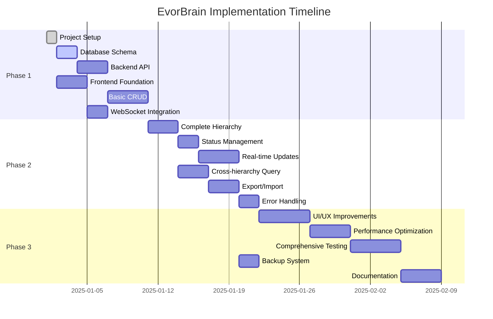

> **Generated by**: Claude 4 (Anthropic) - AI-Assisted Task Planning  
> **Generated on**: December 29, 2025  
> **Purpose**: Detailed implementation roadmap for EvorBrain second brain application

# EvorBrain - Implementation Tasks

## 📋 Task Progress Overview

### Phase 1: Foundation (Weeks 1-2)

- [x] **1.1** Project Setup & Environment Configuration ✅ **COMPLETED**
  - **Completed on**: June 29, 2025 at 11:12 PM CET
  - **Summary**: Full monorepo structure implemented with Bun backend (port 8080) and React frontend (port 5173). WebSocket real-time communication established, SQLite database configured, and development workflow with ESLint/Prettier/git hooks fully operational. Both servers running successfully.
- [ ] **1.2** Database Design & Schema Implementation ⭐ **NEXT PRIORITY**
- [ ] **1.3** Basic Backend API Structure
- [ ] **1.4** Frontend Foundation & Basic Components
- [ ] **1.5** Basic CRUD Operations
- [ ] **1.6** Initial WebSocket Integration

### Phase 2: Core Features (Weeks 3-4)

- [ ] **2.1** Complete Hierarchy CRUD Operations
- [ ] **2.2** Status Management & Workflows
- [ ] **2.3** Real-time Updates Implementation
- [ ] **2.4** Cross-hierarchy Querying
- [ ] **2.5** Data Export/Import Functionality
- [ ] **2.6** Basic Error Handling & Validation

### Phase 3: Polish & Performance (Weeks 5-6)

- [ ] **3.1** UI/UX Improvements with v0 Integration
- [ ] **3.2** Performance Optimization
- [ ] **3.3** Comprehensive Error Handling
- [ ] **3.4** Testing Implementation
- [ ] **3.5** Backup & Recovery System
- [ ] **3.6** Documentation & Deployment Guide

### Phase 4: Future Extensions (Post-MVP)

- [ ] **4.1** Note-taking Capabilities
- [ ] **4.2** File Attachments System
- [ ] **4.3** Advanced Search Implementation
- [ ] **4.4** Knowledge Graph Features
- [ ] **4.5** Multi-user Authentication
- [ ] **4.6** Mobile Responsiveness

---

## 🚀 Phase 1: Foundation (Weeks 1-2)

### Task 1.1: Project Setup & Environment Configuration

**Priority**: Critical | **Estimated Time**: 4-6 hours

#### Subtasks:

- [x] Initialize project structure with frontend/backend separation ✅
- [x] Setup Bun environment and TypeScript configuration ✅
- [x] Configure Vite for frontend development ✅
- [x] Setup ESLint, Prettier, and git hooks ✅
- [x] Create environment configuration files ✅
- [x] Initialize Git repository with proper .gitignore ✅ **UPDATED** - Comprehensive .gitignore created for Bun/TypeScript/React/SQLite tech stack

#### Acceptance Criteria:

- [x] Project structure matches planned file organization ✅
- [x] Bun runtime working for backend development ✅
- [x] Frontend development server running with hot reload ✅
- [x] TypeScript strict mode enabled and working ✅
- [x] Code quality tools functioning correctly ✅

#### Dependencies:

- Bun runtime installed
- Node.js for frontend tooling
- Git for version control

---

### Task 1.2: Database Design & Schema Implementation

**Priority**: Critical | **Estimated Time**: 6-8 hours

#### Subtasks:

- [ ] Create SQLite database schema with migration system
- [ ] Implement all entity tables (life_areas, goals, projects, tasks)
- [ ] Setup relationships and metadata tables
- [ ] Create database indexes for performance
- [ ] Implement database connection and basic utilities
- [ ] Add sample data seeding for development

#### Acceptance Criteria:

- [ ] All tables created with proper constraints
- [ ] Foreign key relationships working correctly
- [ ] Indexes implemented for performance optimization
- [ ] Migration system allows schema updates
- [ ] Sample data available for testing

#### Dependencies:

- Project setup completed (Task 1.1)
- SQLite database understanding

---

### Task 1.3: Basic Backend API Structure

**Priority**: Critical | **Estimated Time**: 8-10 hours

#### Subtasks:

- [ ] Setup Bun HTTP server with basic routing
- [ ] Implement Hono.js middleware for request handling
- [ ] Create basic API route structure
- [ ] Setup CORS and basic security headers
- [ ] Implement request/response logging
- [ ] Create Zod schemas for API validation
- [ ] Setup basic error handling middleware

#### Acceptance Criteria:

- [ ] HTTP server running on specified port
- [ ] Route structure matches API design
- [ ] CORS configured for frontend development
- [ ] Request validation working with Zod
- [ ] Error responses in standardized format
- [ ] API accessible from frontend application

#### Dependencies:

- Database schema implemented (Task 1.2)
- Project setup completed (Task 1.1)

---

### Task 1.4: Frontend Foundation & Basic Components

**Priority**: Critical | **Estimated Time**: 8-10 hours

#### Subtasks:

- [ ] Setup React application with TypeScript
- [ ] Configure Tailwind CSS and Shadcn/ui components
- [ ] Implement basic layout components (Header, Sidebar, AppShell)
- [ ] Setup Zustand store for state management
- [ ] Configure TanStack Query for API integration
- [ ] Create basic routing structure
- [ ] Implement utility functions and API client

#### Acceptance Criteria:

- [ ] React application running with TypeScript
- [ ] Tailwind CSS styling system working
- [ ] Basic app layout displaying correctly
- [ ] State management store initialized
- [ ] API client connecting to backend
- [ ] Routing navigation functional

#### Dependencies:

- Backend API structure completed (Task 1.3)
- Project setup completed (Task 1.1)

---

### Task 1.5: Basic CRUD Operations

**Priority**: High | **Estimated Time**: 12-16 hours

#### Subtasks:

- [ ] Implement Life Area CRUD endpoints and frontend
- [ ] Implement Goal CRUD endpoints and frontend
- [ ] Implement Project CRUD endpoints and frontend
- [ ] Implement Task CRUD endpoints and frontend
- [ ] Create forms for creating/editing entities
- [ ] Implement basic list views for each entity type
- [ ] Add basic hierarchy navigation

#### Acceptance Criteria:

- [ ] All entity types can be created, read, updated, deleted
- [ ] Forms validate data before submission
- [ ] List views display entities correctly
- [ ] Navigation between hierarchy levels works
- [ ] Data persists correctly in database
- [ ] UI updates reflect backend changes

#### Dependencies:

- Backend API structure completed (Task 1.3)
- Frontend foundation completed (Task 1.4)
- Database schema implemented (Task 1.2)

---

### Task 1.6: Initial WebSocket Integration

**Priority**: Medium | **Estimated Time**: 6-8 hours

#### Subtasks:

- [ ] Setup WebSocket server in Bun backend
- [ ] Implement basic connection management
- [ ] Create WebSocket client in React frontend
- [ ] Setup connection state management in Zustand
- [ ] Implement basic event broadcasting
- [ ] Add connection status indicators in UI

#### Acceptance Criteria:

- [ ] WebSocket connection established between frontend/backend
- [ ] Connection status visible in UI
- [ ] Basic events can be sent and received
- [ ] Multiple browser tabs can connect simultaneously
- [ ] Connection gracefully handles disconnects

#### Dependencies:

- Backend API structure completed (Task 1.3)
- Frontend foundation completed (Task 1.4)

---

## 🎯 Phase 2: Core Features (Weeks 3-4)

### Task 2.1: Complete Hierarchy CRUD Operations

**Priority**: Critical | **Estimated Time**: 10-12 hours

#### Subtasks:

- [ ] Implement hierarchical parent-child relationships
- [ ] Add bulk operations (multi-select, bulk delete)
- [ ] Implement drag-and-drop reordering
- [ ] Add archive/unarchive functionality
- [ ] Create hierarchy tree navigation component
- [ ] Implement search within hierarchy levels

#### Acceptance Criteria:

- [ ] Parent-child relationships maintained correctly
- [ ] Reordering updates sort_order fields
- [ ] Bulk operations work across multiple items
- [ ] Archived items hidden from normal views
- [ ] Tree navigation shows proper hierarchy structure

#### Dependencies:

- Basic CRUD operations completed (Task 1.5)

---

### Task 2.2: Status Management & Workflows

**Priority**: High | **Estimated Time**: 8-10 hours

#### Subtasks:

- [ ] Implement status transitions for all entity types
- [ ] Create status badge components with colors
- [ ] Add status filtering and sorting
- [ ] Implement progress tracking (completed/total counts)
- [ ] Create status change workflows
- [ ] Add status-based dashboard views

#### Acceptance Criteria:

- [ ] Status changes update correctly in database
- [ ] Visual status indicators display properly
- [ ] Filtering by status works for all entity types
- [ ] Progress calculations are accurate
- [ ] Dashboard shows meaningful status summaries

#### Dependencies:

- Complete hierarchy CRUD completed (Task 2.1)

---

### Task 2.3: Real-time Updates Implementation

**Priority**: High | **Estimated Time**: 12-16 hours

#### Subtasks:

- [ ] Implement WebSocket event types for all operations
- [ ] Add optimistic updates to frontend
- [ ] Create conflict resolution for concurrent edits
- [ ] Implement automatic reconnection with backoff
- [ ] Add real-time status change notifications
- [ ] Create real-time reordering synchronization

#### Acceptance Criteria:

- [ ] Changes appear instantly across all connected tabs
- [ ] Optimistic updates revert properly on errors
- [ ] Connection automatically recovers from drops
- [ ] Concurrent editing conflicts resolved gracefully
- [ ] Real-time updates don't cause UI performance issues

#### Dependencies:

- Initial WebSocket integration completed (Task 1.6)
- Status management completed (Task 2.2)

---

### Task 2.4: Cross-hierarchy Querying

**Priority**: Medium | **Estimated Time**: 8-10 hours

#### Subtasks:

- [ ] Implement relationship system for cross-references
- [ ] Create advanced search across all entity types
- [ ] Add filtering by multiple criteria
- [ ] Implement "Show all tasks for Life Area" views
- [ ] Create breadcrumb navigation
- [ ] Add related items suggestions

#### Acceptance Criteria:

- [ ] Search finds results across all entity types
- [ ] Filters can be combined (status + date + text)
- [ ] Cross-hierarchy views show proper relationships
- [ ] Breadcrumbs show current hierarchy position
- [ ] Performance remains good with large datasets

#### Dependencies:

- Complete hierarchy CRUD completed (Task 2.1)
- Status management completed (Task 2.2)

---

### Task 2.5: Data Export/Import Functionality

**Priority**: Medium | **Estimated Time**: 10-12 hours

#### Subtasks:

- [ ] Implement JSON export with full hierarchy
- [ ] Create CSV export for each entity type
- [ ] Add import validation and error handling
- [ ] Implement data format conversion utilities
- [ ] Create backup scheduling system
- [ ] Add export progress indicators

#### Acceptance Criteria:

- [ ] Exported data includes all relationships
- [ ] Import validates data integrity before processing
- [ ] Large exports don't block the UI
- [ ] Backup system runs automatically
- [ ] Import errors are clearly communicated

#### Dependencies:

- Cross-hierarchy querying completed (Task 2.4)

---

### Task 2.6: Basic Error Handling & Validation

**Priority**: High | **Estimated Time**: 8-10 hours

#### Subtasks:

- [ ] Implement comprehensive Zod validation schemas
- [ ] Add client-side form validation with error display
- [ ] Create error boundary components for React
- [ ] Implement API error handling with retry logic
- [ ] Add user-friendly error messages
- [ ] Create error logging system

#### Acceptance Criteria:

- [ ] All inputs validated before submission
- [ ] Error messages are clear and actionable
- [ ] Application gracefully handles API failures
- [ ] Errors are logged for debugging
- [ ] UI remains stable during error conditions

#### Dependencies:

- Real-time updates completed (Task 2.3)

---

## ✨ Phase 3: Polish & Performance (Weeks 5-6)

### Task 3.1: UI/UX Improvements with v0 Integration

**Priority**: High | **Estimated Time**: 16-20 hours

#### Subtasks:

- [ ] Generate improved components using v0
- [ ] Implement responsive design for mobile devices
- [ ] Add keyboard shortcuts for power users
- [ ] Create loading states and skeleton screens
- [ ] Implement smooth animations and transitions
- [ ] Add accessibility features (ARIA labels, focus management)
- [ ] Create dark/light theme support

#### Acceptance Criteria:

- [ ] Application works well on mobile devices
- [ ] Keyboard shortcuts improve productivity
- [ ] Loading states provide good user feedback
- [ ] Animations enhance user experience
- [ ] Application meets accessibility standards
- [ ] Theme switching works correctly

#### Dependencies:

- All Phase 2 tasks completed

---

### Task 3.2: Performance Optimization

**Priority**: High | **Estimated Time**: 12-16 hours

#### Subtasks:

- [ ] Implement virtual scrolling for large lists
- [ ] Add React.memo for expensive components
- [ ] Optimize database queries with proper indexes
- [ ] Implement component lazy loading
- [ ] Add request debouncing for search
- [ ] Create performance monitoring dashboard

#### Acceptance Criteria:

- [ ] Large lists (1000+ items) scroll smoothly
- [ ] Application startup time < 2 seconds
- [ ] API responses consistently < 100ms
- [ ] Memory usage remains stable during long sessions
- [ ] Performance metrics are tracked and visible

#### Dependencies:

- UI/UX improvements completed (Task 3.1)

---

### Task 3.3: Comprehensive Error Handling

**Priority**: Medium | **Estimated Time**: 8-10 hours

#### Subtasks:

- [ ] Implement global error boundary with recovery options
- [ ] Add offline state detection and handling
- [ ] Create retry mechanisms for failed operations
- [ ] Implement graceful degradation for missing features
- [ ] Add error reporting system
- [ ] Create diagnostic tools for troubleshooting

#### Acceptance Criteria:

- [ ] Application recovers gracefully from errors
- [ ] Offline mode provides basic functionality
- [ ] Failed operations can be retried automatically
- [ ] Error reports include useful debugging information
- [ ] Users can continue working after errors

#### Dependencies:

- Basic error handling completed (Task 2.6)

---

### Task 3.4: Testing Implementation

**Priority**: High | **Estimated Time**: 16-20 hours

#### Subtasks:

- [ ] Setup Bun test runner for backend testing
- [ ] Create unit tests for all API endpoints
- [ ] Implement React Testing Library for frontend tests
- [ ] Add integration tests for critical user flows
- [ ] Create test data factories and utilities
- [ ] Setup CI/CD pipeline with automated testing
- [ ] Add test coverage reporting

#### Acceptance Criteria:

- [ ] Backend test coverage > 80% for critical paths
- [ ] Frontend test coverage > 70% for components
- [ ] All critical user flows have integration tests
- [ ] Tests run automatically on commit
- [ ] Test failures prevent deployment

#### Dependencies:

- Performance optimization completed (Task 3.2)

---

### Task 3.5: Backup & Recovery System

**Priority**: Medium | **Estimated Time**: 8-10 hours

#### Subtasks:

- [ ] Implement automated backup scheduling
- [ ] Create backup verification system
- [ ] Add point-in-time recovery capabilities
- [ ] Implement backup compression and rotation
- [ ] Create backup restoration interface
- [ ] Add backup integrity checking

#### Acceptance Criteria:

- [ ] Backups run automatically without user intervention
- [ ] Backup files are verified for completeness
- [ ] Recovery can restore to any backup point
- [ ] Old backups are automatically cleaned up
- [ ] Restoration process is user-friendly

#### Dependencies:

- Data export/import completed (Task 2.5)

---

### Task 3.6: Documentation & Deployment Guide

**Priority**: Medium | **Estimated Time**: 12-16 hours

#### Subtasks:

- [ ] Create comprehensive API documentation
- [ ] Write user guide with screenshots
- [ ] Create development setup instructions
- [ ] Write deployment guide for various platforms
- [ ] Create troubleshooting documentation
- [ ] Add inline code documentation

#### Acceptance Criteria:

- [ ] API documentation is complete and accurate
- [ ] New developers can setup project from documentation
- [ ] Users can accomplish all tasks using the guide
- [ ] Deployment process is clearly documented
- [ ] Common issues have documented solutions

#### Dependencies:

- All other Phase 3 tasks completed

---

## 🔮 Phase 4: Future Extensions (Post-MVP)

### Task 4.1: Note-taking Capabilities

**Priority**: Low | **Estimated Time**: 20-24 hours

#### Subtasks:

- [ ] Integrate markdown editor component
- [ ] Add note linking to hierarchy entities
- [ ] Implement note search and tagging
- [ ] Create note templates system
- [ ] Add collaborative note editing
- [ ] Implement note version history

#### Acceptance Criteria:

- [ ] Rich text editing with markdown support
- [ ] Notes can be linked to any hierarchy item
- [ ] Full-text search includes note content
- [ ] Template system speeds up note creation

---

### Task 4.2: File Attachments System

**Priority**: Low | **Estimated Time**: 16-20 hours

#### Subtasks:

- [ ] Implement local file storage system
- [ ] Add file upload/download capabilities
- [ ] Create file type detection and icons
- [ ] Implement file search and filtering
- [ ] Add file versioning system
- [ ] Create file sharing capabilities

#### Acceptance Criteria:

- [ ] Files can be attached to any hierarchy item
- [ ] File uploads are progress-tracked
- [ ] File search includes metadata
- [ ] File versions are tracked automatically

---

### Task 4.3: Advanced Search Implementation

**Priority**: Low | **Estimated Time**: 12-16 hours

#### Subtasks:

- [ ] Implement SQLite FTS5 full-text search
- [ ] Add saved search functionality
- [ ] Create advanced search filters UI
- [ ] Implement search suggestions
- [ ] Add search analytics
- [ ] Create search result highlighting

#### Acceptance Criteria:

- [ ] Search includes all text content
- [ ] Complex queries can be saved and reused
- [ ] Search suggestions help users find content
- [ ] Results are ranked by relevance

---

### Task 4.4: Knowledge Graph Features

**Priority**: Low | **Estimated Time**: 24-30 hours

#### Subtasks:

- [ ] Implement relationship visualization
- [ ] Add graph navigation interface
- [ ] Create relationship types system
- [ ] Implement graph algorithms (shortest path, clustering)
- [ ] Add graph export capabilities
- [ ] Create graph-based insights

#### Acceptance Criteria:

- [ ] Relationships are visually represented
- [ ] Graph navigation reveals connections
- [ ] Different relationship types are supported
- [ ] Graph provides actionable insights

---

### Task 4.5: Multi-user Authentication

**Priority**: Low | **Estimated Time**: 20-24 hours

#### Subtasks:

- [ ] Implement JWT authentication system
- [ ] Add user registration and login
- [ ] Create role-based access control
- [ ] Implement data isolation between users
- [ ] Add user management interface
- [ ] Create sharing and collaboration features

#### Acceptance Criteria:

- [ ] Secure user authentication
- [ ] Data is properly isolated between users
- [ ] Role permissions are enforced
- [ ] Users can collaborate on shared items

---

### Task 4.6: Mobile Responsiveness

**Priority**: Low | **Estimated Time**: 16-20 hours

#### Subtasks:

- [ ] Optimize UI for mobile devices
- [ ] Implement touch gestures
- [ ] Add mobile-specific navigation
- [ ] Create offline mobile capabilities
- [ ] Implement mobile push notifications
- [ ] Add mobile app consideration

#### Acceptance Criteria:

- [ ] Application works well on all mobile devices
- [ ] Touch interactions are intuitive
- [ ] Mobile performance is optimized
- [ ] Offline functionality available on mobile

---

## 🎯 Success Criteria & Milestones

### Phase 1 Complete When:

- [ ] Basic hierarchy management works end-to-end
- [ ] Real-time updates function across browser tabs
- [ ] Data persists correctly in SQLite database
- [ ] Application is ready for core feature development

### Phase 2 Complete When:

- [ ] All CRUD operations fully functional
- [ ] Status management and workflows implemented
- [ ] Export/import system working
- [ ] Application ready for production use

### Phase 3 Complete When:

- [ ] Performance optimized for large datasets
- [ ] Comprehensive testing implemented
- [ ] Error handling robust and user-friendly
- [ ] Application ready for deployment

### Phase 4 Complete When:

- [ ] Extended features enhance user productivity
- [ ] Multi-user capabilities available
- [ ] Mobile experience optimized
- [ ] Application suitable for wider distribution

---

## 📊 Task Dependencies Matrix

This task breakdown provides a clear roadmap for implementing EvorBrain according to the architectural plan, with realistic time estimates and clear dependencies between tasks.
